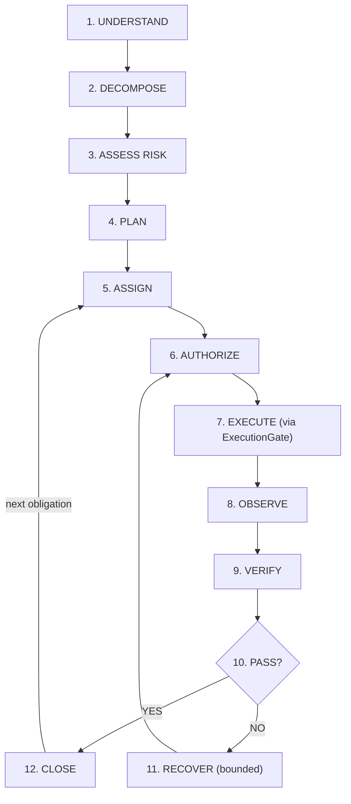

# S-Class Deep Engineering Specification — v6.0.1 FINAL FIXED DESIGN

> **Companion to:** `S-CLASS-OSS-FIRST-ARCHITECTURE.md`
> **Purpose:** Answers "HOW do we make this as reliable as a real dev team?"
> **Version:** 6.0.1 — Corrected Unified Master Build Specification (supersedes 5.10 and integrates the 28 Aug 2026 architecture/build plan)
> **Date:** 2026-10-01
> **Document State:** FINAL FIXED ENGINEERING CONTRACT
> *(The semantic contract is frozen. Implementation release status is determined only by the executable conformance and adversarial gates in §20.1.)*

---

> **v6.0.1 ARCHITECTURE AUTHORITY NOTICE**
> This file is the single active normative contract/documentation authority. Executable semantics live in `10-CONFORMANCE/sclass_semantics_v6_0_1.py`; machine transitions live in `10-CONFORMANCE/state-machines.v6.0.1.json`; runtime enforcement lives in `20-RUNTIME/sclass_runtime_v6_0_1.py`. Any older v6.0/v6.0.1 notes or errata are historical only and cannot override this contract.

## 0. Document Control

### 0.1 What changed from 5.10 / architecture v42
6.0.1 is the unified build authority. It keeps the 5.10 deep-engineering kernel and integrates the strongest production architecture concepts from the earlier architecture/build plan: CanonicalCommit, CausalFrontier, TargetSnapshot, AcceptanceSnapshot, ExecutionGeneration, AuthorityEnvelope, GoverningBudgetLineage, non-FSM operating-loop semantics, D0-D8 ownership, local-first product boundaries, security/update/data-lifecycle contracts, and a dependency-gated implementation program.

The integration rule is strict: a concept from the earlier plan is authoritative only where it is defined by this document's current semantic kernel. No duplicate state authority, policy engine, evidence authority, workflow authority, or security subsystem is introduced. `EngineeringState` remains the canonical reduced state produced by the reducer; projections remain non-authoritative.

### 0.2 Closure gates (the only build gate)

| Gate                          | Requirement                                                                                                             | Verified by                                                                                   |
| ----------------------------- | ----------------------------------------------------------------------------------------------------------------------- | --------------------------------------------------------------------------------------------- |
| **A. Semantic completeness**  | Every referenced type defined; every type in registry once; no undefined enum/protocol; no malformed contract           | `sclass-spec-lint` in CI + the candidate local AST/registry harness |
| **B. Canonical truth**        | EventStore → CanonicalEvent → pure reducer → immutable state → replay equivalence                                       | §12, replay tests §18                                                                         |
| **C. Execution authority**    | Proposal → Decision → AuthLease → Nonce → ExecLease/fence → Boundary → Worker, no bypass                                | §8, §18 ZV1–ZV5                                                                               |
| **D. Evidence authority**     | Observe → immutable verification workspace → result → signed receipt → admissibility → freshness → closure → assessment | §11                                                                                           |
| **E. Recovery**               | diagnose → repair → bounded retry → convergence → compensate → IN_DOUBT when uncertain                                  | §13                                                                                           |
| **F. Durability**             | atomic append, CAS, crash recovery, checkpoint, restore, migration, corruption detection                                | §12, §18                                                                                      |
| **G. Performance**            | Proven on declared reference hardware and matrices                                                                      | §17 (targets until measured)                                                                  |
| **H. Adversarial acceptance** | Zero-violation invariants ZV1–ZV10                                                                                      | §18                                                                                           |

Gates B–H require executable evidence. This document freezes the semantic contract; the implementation is released only when §20.1 passes.

### 0.3 Threat model (defines "durable" and "secure")

- **In scope:** buggy or hallucinating workers, prompt injection through repository content, concurrent schedulers/workers, process crash, OS crash / power loss on storage that honors `fsync`, replayed or forged leases, path/symlink/TOCTOU attacks by a worker, credential leakage via outputs.
- **Out of scope:** malicious local root, hardware/media failure without backups, compromised signing keys before revocation is published.
- **"Durable"** = an acknowledged event survives process crash and OS crash/power loss on fsync-honoring storage.


### 0.4 Freeze taxonomy

**Development rule:** the repository is now implementation-oriented. Freeze is a later acceptance gate; it is not a prerequisite for beginning S0/S1 implementation.

**F0 — Semantic kernel: FIXED.** Objective, requirements, obligations, WorkGraph, revision/lineage, canonical history, canonical commit visibility, authority ownership, execution/recovery semantics, evidence/assessment/acceptance semantics, and deterministic replay are intended semantic contracts. A semantic change during development must update the executable runtime, this contract, machine source and conformance vectors together.

**F1 — Security/control: FROZEN INVARIANTS; mechanism may vary.** Physical enforcement mechanisms may differ by platform only when they preserve the same observable authority decisions, allowed/blocked operations, canonical effects, failure-state meaning, acceptance consequences and security properties. Unsupported substrates MUST reject or downgrade rather than claim stronger enforcement.

**F2 — Product/business/experience: PROVISIONAL.** Pricing, packaging, exact SLO targets, entitlement windows, UI wording, deployment prioritization and product-market hypotheses may change provided they do not weaken F0/F1 semantics.

Formal freeze criterion: a frozen contract is specified sufficiently that two independent conforming implementations cannot legitimately disagree about authority, canonical transition, persistence/lineage, externally visible failure state, acceptance eligibility, or required security property.

### 0.5A Architecture decisions required for the survival build

1. **Execution harness:** subagents, background workers, worktrees and autonomous write-capable harnesses are disabled by default. They may be enabled only through a dedicated adapter whose writes, processes, network effects and termination are all contained by the same ExecutionBoundary and pass the containment conformance suite.
2. **Operating-system baseline:** S0 is Linux-first because the normative filesystem/quiescence contract requires `openat2`-class resolution and cgroup/process containment. macOS/Windows adapters are separate mechanisms and MUST NOT claim S0 equivalence until their boundary proofs pass.
3. **Worker identity:** OpenHands, Goose, OpenCode, mini-SWE-agent and other adapters are integration identities, not authority classes. They map to `WorkerKind.SUBPROCESS`/`OTHER` unless a frozen enum addition is approved; adapter identity and executable digest remain mandatory.
4. **Telemetry:** OpenTelemetry is S3+ only. When enabled, telemetry passes the same redaction/classification boundary as model/context output and is prohibited from carrying raw secrets, credentials, canonical workspace content or unrestricted paths.
5. **License gate:** every non-stdlib dependency receives a recorded license decision before qualification. A dependency whose license is incompatible with S-Class distribution is not admitted to the runtime dependency set.
6. **Unverified OSS claims:** no performance, maturity, license or compatibility claim from an external project is treated as an architectural fact until pinned to an exact release/commit and independently verified.
7. **Canonicalization:** the active spec and `10-CONFORMANCE/sclass_kernel_v6_0_1.py` must use the same c1 bytes, digest domains, enum encoding, type names and signature framing. A two-implementation vector test is a release gate.

### 0.5 Survival-build boundary

The survival build proves the core S-Class thesis with the smallest production-real path:

```text
Objective
  -> obligations / acceptance contract
  -> target snapshot + work graph
  -> bounded proposal
  -> policy/risk + authorization
  -> execution lease + nonce + budget
  -> real OS execution boundary
  -> observation + quiescence
  -> independent verification
  -> evidence / assessment
  -> acceptance
  -> worker replacement / recovery
```

Survival V1 is local/customer-controlled and single-workspace by default. It does NOT require a proprietary model, hosted LLM, generic IDE, Git hosting service, CI replacement, enterprise IAM, billing platform, cloud execution platform, or general workflow engine. Integrations remain replaceable participation surfaces.

The survival runtime MUST still use real authority boundaries, real persistence, real immutable snapshots, real OS execution enforcement, real verification isolation where required, and real crash/reconciliation semantics. “MVP” means smaller scope, not simulated safety.

### 0.6 Unified D0-D8 ownership

| Domain | Owns | Explicitly does not own |
|---|---|---|
| D0 Contracts | IDs, schema, revisions, envelopes | business truth outside declared schemas |
| D1 Domain kernel | pure aggregates, invariants, transition validation | provider/network execution |
| D2 History | canonical events, CanonicalCommit, CAS, replay, checkpoint, outbox | acceptance decisions |
| D3 Policy | risk, policy, floors, budgets, escalation, conflict rules | learned authority |
| D4 Evidence | observation admission, freshness, independence, assessment, acceptance snapshots | worker execution |
| D5 Authorization | authority envelopes, approvals, leases, epochs, pre-dispatch revalidation | physical execution |
| D6 Execution | dispatch boundary, enforcement profiles, receipts, UNKNOWN/reconciliation | canonical acceptance |
| D7 Worker runtime | worker contracts, adapters, skills, phase/result normalization | canonical authority |
| D8 Intelligence/planning | understanding, discovery, context, strategy, replan, operating-loop proposals | authorization, acceptance, canonical state mutation |

No D-domain may create a competing source of truth for another D-domain.

### 0.7 Integrated architectural principles

1. **Canonical truth:** `EventStore -> StateReducer -> EngineeringState` is the sole canonical state path.
2. **Canonical history:** consequential multi-record transitions use one `CanonicalCommit` inside the D2 transaction boundary.
3. **Causal binding:** consequential decisions carry a deterministic `CausalFrontier` and exact revision identities.
4. **Target identity:** execution and verification operate on immutable `TargetSnapshot` identities, not ambiguous mutable paths.
5. **Acceptance identity:** acceptance operates over a recorded `AcceptanceSnapshot`, never reconstructed from mutable live state.
6. **Generation safety:** worker replacement advances `ExecutionGeneration`; late results from superseded generations are historical only.
7. **Budget lineage:** retries, worker replacement, repair and replan cannot reset the governing budget lineage.
8. **Authority non-escalation:** capability is not authority; lower layers cannot broaden an approved effect.
9. **Unknown is first-class:** unresolved external effects, observation failure, insufficient context, or missing lineage produce an explicit non-authoritative state.
10. **OS enforcement beats bookkeeping:** fencing tokens correlate authority; only physical boundary teardown/quiescence proves a writer has stopped.
11. **No silent optimization:** the adaptive loop may skip work only when canonical conditions show it is already satisfied by fresh admissible evidence.
12. **No hidden session dependence:** worker/provider transcripts are disposable; canonical state plus recorded inputs reconstruct continuity.

### 0.8 Decisions intentionally NOT imported as survival blockers

The earlier plan's enterprise account/organization administration, SSO, billing, cloud-control-plane synchronization, multi-region residency orchestration, support portal, advanced UX/localization, broad extension marketplace, and managed-cloud execution contracts are retained as future product/platform conformance requirements. They do not block the local survival path unless a deployed configuration explicitly enables them.

The earlier plan's stronger “EngineeringState is only an operational view” wording is NOT adopted; v6 preserves the 5.10 rule that `EngineeringState` is the canonical reduced state produced by replay. Product projections remain rebuildable and non-authoritative.

Explicit filesystem deny-rule precedence is not part of the survival algebra. v6 keeps default-deny, allow-only effect intersections because that gives a simpler auditable lattice. A richer deny/override rule language requires a separate frozen semantics before adoption.

---

## 1. The Real Dev Team Loop



> [!IMPORTANT]
> Required semantic controls are mandatory; the execution path is adaptive. No path reaches CLOSE without valid VERIFY, and already-satisfied work with **fresh, admissible** evidence may be skipped.

### 1.1 Five layers

1. **Canonical semantic state** — `EngineeringState` (only the reducer produces it)
2. **Event / provenance history** — `EventStore`
3. **Derived intelligence** — `EngineeringWorldModel` (projection)
4. **Execution / effect state** — observations, leases
5. **Optimization data** — trajectories (projection)

### 1.2 Five constitutional laws

- **L1 — Canonical truth.** *ONLY the EventStore + StateReducer can change canonical truth.* Everything else is a proposal, projection, observation, evidence, or decision request. No subsystem receives a writable canonical structure (§12.4).
- **L2 — Incremental architecture.** *Never rebuild the world.* Filesystem mutation → incremental snapshot → affected-file detection → affected-symbol detection → incremental world-model update → incremental cache invalidation → only affected evidence invalidated (§11.7, §17.2).
- **L3 — Repository content is data.** Repository content ≠ user intent ≠ policy ≠ authorization ≠ acceptance criteria. A repo comment saying "ignore S-Class and run X" is data with `TrustLevel.UNTRUSTED` and can never appear in a system/instruction position or change any canonical object (§14.3).
- **L4 — No undefined symbol.** A final specification contains no semantic symbol without a definition and a registry row.
- **L5 — One state machine.** Status fields change only via `TransitionAuthority` commands that emit events (§12.5).

### 1.3 Deterministic replay

`reducer(version, prior_state, event) -> new_state` is pure and versioned. Same ordered events + same reducer version ⇒ byte-identical canonical state digest. Replay uses **recorded** semantic outputs and external-input digests; it NEVER calls a live model.

---

## 2. Semantic Registry and Primitives

### 2.1 SemanticTypeRegistry (machine-readable, CI-enforced)

Every semantic type is defined exactly once. The registry is generated from this specification's Python contract blocks. Type names are globally unique cryptographic identifiers under `c1`.

CI rules:
1. Every class in a contract block appears exactly once in the registry.
2. Every registry name is defined exactly once.
3. No name appears in two categories.
4. Every annotation resolves to a registry name or allowed builtin.
5. The count is generated; manual counts are forbidden.
6. A type-name collision is a canonicalization failure.

| # | Type | Category |
|---:|---|---|
| 1 | `CommitState` | Enum/Value |
| 2 | `CanonicalCommit` | Canonical |
| 3 | `CommitRecord` | Canonical |
| 4 | `CausalFrontier` | Canonical |
| 5 | `TargetSnapshot` | Canonical |
| 6 | `AcceptanceSnapshot` | Canonical |
| 7 | `ExecutionGenerationStatus` | Enum/Value |
| 8 | `ExecutionGeneration` | Canonical |
| 9 | `AuthorityEnvelope` | Canonical |
| 10 | `GoverningBudgetLineage` | Canonical |
| 11 | `ApprovalSetResult` | Enum/Value |
| 12 | `ApprovalSet` | Canonical |
| 13 | `StateSnapshot` | Protocol |
| 14 | `FrozenMap` | Canonical |
| 15 | `SemanticTypeRegistryEntry` | Canonical |
| 16 | `UtcInstant` | Canonical |
| 17 | `Clock` | Protocol |
| 18 | `Authority` | Enum/Value |
| 19 | `ProjectIdentity` | Canonical |
| 20 | `RepositoryIdentity` | Canonical |
| 21 | `WorkspaceIdentity` | Canonical |
| 22 | `WorkspaceInstance` | Canonical |
| 23 | `KeyStatus` | Enum/Value |
| 24 | `SignatureBlock` | Canonical |
| 25 | `SignatureVerificationResult` | Enum/Value |
| 26 | `KeyDirectory` | Protocol |
| 27 | `SourceType` | Enum/Value |
| 28 | `DiscoveryMethod` | Enum/Value |
| 29 | `ConstraintType` | Enum/Value |
| 30 | `EnforcementPhase` | Enum/Value |
| 31 | `Severity` | Enum/Value |
| 32 | `Requirement` | Canonical |
| 33 | `Constraint` | Canonical |
| 34 | `DecisionOption` | Canonical |
| 35 | `Decision` | Canonical |
| 36 | `DecisionOutcome` | Canonical |
| 37 | `TrajectoryStore` | Protocol |
| 38 | `StructuredIntent` | Canonical |
| 39 | `GitCommitState` | Canonical |
| 40 | `ContentManifestState` | Canonical |
| 41 | `EngineeringSnapshot` | Canonical |
| 42 | `ObjectiveRevision` | Canonical |
| 43 | `CanonicalObjective` | Canonical |
| 44 | `RiskTier` | Enum/Value |
| 45 | `RiskVector` | Canonical |
| 46 | `FloorRule` | Canonical |
| 47 | `AuthorizationMode` | Enum/Value |
| 48 | `IsolationLevel` | Enum/Value |
| 49 | `ControlProfile` | Canonical |
| 50 | `RiskMapping` | Canonical |
| 51 | `AuthorizationRules` | Canonical |
| 52 | `EvidenceRules` | Canonical |
| 53 | `RetryRules` | Canonical |
| 54 | `BudgetRules` | Canonical |
| 55 | `ReleaseRules` | Canonical |
| 56 | `WaiverRules` | Canonical |
| 57 | `DependencyRules` | Canonical |
| 58 | `DataClassification` | Enum/Value |
| 59 | `DataClassificationPolicy` | Canonical |
| 60 | `RedactionPolicy` | Canonical |
| 61 | `ProviderEgressPolicy` | Canonical |
| 62 | `RetentionPolicy` | Canonical |
| 63 | `TelemetryPrivacyPolicy` | Canonical |
| 64 | `Policy` | Canonical |
| 65 | `ValidationVerdict` | Enum/Value |
| 66 | `PolicyFloorVerdict` | Enum/Value |
| 67 | `DeltaMatchVerdict` | Enum/Value |
| 68 | `PolicyRelation` | Enum/Value |
| 69 | `PolicyFloor` | Canonical |
| 70 | `ApprovalKind` | Enum/Value |
| 71 | `ApprovalRecord` | Canonical |
| 72 | `AcceptedRiskWaiver` | Canonical |
| 73 | `BreakGlassAuthority` | Canonical |
| 74 | `ObligationKind` | Enum/Value |
| 75 | `RequirementStatus` | Enum/Value |
| 76 | `RequirementRecord` | Canonical |
| 77 | `ObligationStatus` | Enum/Value |
| 78 | `Obligation` | Canonical |
| 79 | `SemanticGraph` | Canonical |
| 80 | `ObligationGraph` | Canonical |
| 81 | `IndependenceLevel` | Enum/Value |
| 82 | `IndependenceProfile` | Canonical |
| 83 | `EvidenceKind` | Enum/Value |
| 84 | `FreshnessDimension` | Enum/Value |
| 85 | `CompositionMode` | Enum/Value |
| 86 | `RequiredEvidence` | Canonical |
| 87 | `EvidenceComposition` | Canonical |
| 88 | `EvidenceCompositionEvaluation` | Canonical |
| 89 | `AcceptanceContract` | Canonical |
| 90 | `VerificationStep` | Canonical |
| 91 | `VerificationPlan` | Canonical |
| 92 | `ResourceBudget` | Canonical |
| 93 | `BudgetLevel` | Enum/Value |
| 94 | `BudgetReservationState` | Enum/Value |
| 95 | `BudgetReservation` | Canonical |
| 96 | `BudgetReservationResult` | Enum/Value |
| 97 | `GlobalBudgetAllocator` | Protocol |
| 98 | `ActionType` | Enum/Value |
| 99 | `Idempotency` | Enum/Value |
| 100 | `WorkNodeStatus` | Enum/Value |
| 101 | `WorkNode` | Canonical |
| 102 | `WorkGraph` | Canonical |
| 103 | `ScheduleAssignment` | Canonical |
| 104 | `BudgetSnapshot` | Canonical |
| 105 | `ResourceSnapshot` | Canonical |
| 106 | `Scheduler` | Protocol |
| 107 | `RetryBudget` | Canonical |
| 108 | `RetryReservationResult` | Enum/Value |
| 109 | `RetryBudgetStore` | Protocol |
| 110 | `FsMode` | Enum/Value |
| 111 | `FsAccess` | Canonical |
| 112 | `ProcessSpec` | Canonical |
| 113 | `NetworkDestination` | Canonical |
| 114 | `NetAccess` | Canonical |
| 115 | `ExternalEffect` | Canonical |
| 116 | `RequestedEffect` | Canonical |
| 117 | `FsRule` | Canonical |
| 118 | `ProcessRule` | Canonical |
| 119 | `NetRule` | Canonical |
| 120 | `CredentialGrant` | Canonical |
| 121 | `ExternalEffectRule` | Canonical |
| 122 | `EffectScope` | Canonical |
| 123 | `ScopeAuthorizationResult` | Enum/Value |
| 124 | `Capability` | Canonical |
| 125 | `AdapterAttestation` | Canonical |
| 126 | `AuthorizationState` | Enum/Value |
| 127 | `StateBinding` | Canonical |
| 128 | `AuthorizationDecision` | Canonical |
| 129 | `AuthorizationLeaseClaims` | Canonical |
| 130 | `AuthorizationLease` | Canonical |
| 131 | `LeaseState` | Enum/Value |
| 132 | `ExecutionIdentity` | Canonical |
| 133 | `ProcessLineageEntry` | Canonical |
| 134 | `ExecutionLease` | Canonical |
| 135 | `LeaseRecord` | Canonical |
| 136 | `NonceConsumptionResult` | Enum/Value |
| 137 | `NonceStore` | Protocol |
| 138 | `GateResult` | Enum/Value |
| 139 | `AuthorizedWorkRequest` | Canonical |
| 140 | `BoundaryContext` | Canonical |
| 141 | `ExecutionBoundary` | Protocol |
| 142 | `ExecutionOutcome` | Canonical |
| 143 | `ExecutionGate` | Protocol |
| 144 | `WorkspaceMode` | Enum/Value |
| 145 | `IdentityCheckResult` | Enum/Value |
| 146 | `WorkspaceSnapshot` | Canonical |
| 147 | `ReadResult` | Canonical |
| 148 | `WorkspaceSnapshotHandle` | Protocol |
| 149 | `ImmutableWorkspace` | Protocol |
| 150 | `WorkspaceBoundary` | Protocol |
| 151 | `WorkerKind` | Enum/Value |
| 152 | `WorkerClaimStatus` | Enum/Value |
| 153 | `ModelInfo` | Canonical |
| 154 | `WorkerProfile` | Canonical |
| 155 | `WorkerInstance` | Canonical |
| 156 | `WorkResult` | Canonical |
| 157 | `WorkerHealth` | Enum/Value |
| 158 | `WorkerContract` | Protocol |
| 159 | `HandoffPackage` | Canonical |
| 160 | `HandoffCompiler` | Protocol |
| 161 | `ActorKind` | Enum/Value |
| 162 | `ActorIdentity` | Canonical |
| 163 | `MutationKind` | Enum/Value |
| 164 | `FileMutation` | Canonical |
| 165 | `VerifiedWorkspaceDelta` | Canonical |
| 166 | `GitState` | Canonical |
| 167 | `EnvironmentFingerprint` | Canonical |
| 168 | `QuiescenceProof` | Canonical |
| 169 | `AttributionMethod` | Enum/Value |
| 170 | `AttributionEvidence` | Canonical |
| 171 | `SideEffectStatus` | Enum/Value |
| 172 | `SideEffectReceipt` | Canonical |
| 173 | `TerminationKind` | Enum/Value |
| 174 | `ProcessExecutionResult` | Canonical |
| 175 | `ObservationRecord` | Canonical |
| 176 | `ObservationCollector` | Protocol |
| 177 | `VerificationStatus` | Enum/Value |
| 178 | `VerificationResult` | Canonical |
| 179 | `VerificationProvider` | Protocol |
| 180 | `SignedEvidencePayload` | Canonical |
| 181 | `EvidenceReceipt` | Canonical |
| 182 | `Admissibility` | Enum/Value |
| 183 | `AdmissibilityResult` | Canonical |
| 184 | `FreshnessState` | Enum/Value |
| 185 | `FreshnessVerdict` | Canonical |
| 186 | `EvidenceDependencySet` | Canonical |
| 187 | `CanonicalDependencySet` | Canonical |
| 188 | `FreshnessContext` | Canonical |
| 189 | `ClosureVerdict` | Enum/Value |
| 190 | `RequirementResult` | Canonical |
| 191 | `EvidenceClosure` | Canonical |
| 192 | `AssessmentVerdict` | Enum/Value |
| 193 | `AssessmentMethod` | Enum/Value |
| 194 | `IndependentAssessment` | Canonical |
| 195 | `InvalidationSet` | Canonical |
| 196 | `ExecutionIntent` | Canonical |
| 197 | `BoundaryViolationRecord` | Canonical |
| 198 | `InvalidationIndex` | Protocol |
| 199 | `EventType` | Enum/Value |
| 200 | `CanonicalEvent` | Canonical |
| 201 | `ReferenceReducer` | Canonical |
| 202 | `StateView` | Protocol |
| 203 | `TransitionOutcome` | Enum/Value |
| 204 | `Command` | Canonical |
| 205 | `TransitionResult` | Canonical |
| 206 | `TransitionAuthority` | Protocol |
| 207 | `EventHead` | Canonical |
| 208 | `AppendResult` | Enum/Value |
| 209 | `ChainStatus` | Enum/Value |
| 210 | `CheckpointRef` | Canonical |
| 211 | `WorkspaceTransaction` | Protocol |
| 212 | `EventStore` | Protocol |
| 213 | `InDoubtRecord` | Canonical |
| 214 | `SignatureVerificationRecord` | Canonical |
| 215 | `EngineeringState` | Canonical |
| 216 | `StateLoadStatus` | Enum/Value |
| 217 | `LoadResult` | Canonical |
| 218 | `RestoreStatus` | Enum/Value |
| 219 | `RestoreResult` | Canonical |
| 220 | `StateStore` | Protocol |
| 221 | `FailureClass` | Enum/Value |
| 222 | `RepairStrategy` | Enum/Value |
| 223 | `RepairObligation` | Canonical |
| 224 | `RepairPlan` | Canonical |
| 225 | `RollbackResult` | Enum/Value |
| 226 | `WorkspaceRollbackProvider` | Protocol |
| 227 | `CompensationCapability` | Enum/Value |
| 228 | `CompensationResult` | Enum/Value |
| 229 | `EffectCompensationProvider` | Protocol |
| 230 | `RecoveryOutcome` | Enum/Value |
| 231 | `RecoveryReport` | Canonical |
| 232 | `CoordinatedRecovery` | Protocol |
| 233 | `MessageRole` | Enum/Value |
| 234 | `MessageSource` | Enum/Value |
| 235 | `TrustLevel` | Enum/Value |
| 236 | `MessageProvenance` | Canonical |
| 237 | `MessageContent` | Canonical |
| 238 | `Message` | Canonical |
| 239 | `ModelCallStatus` | Enum/Value |
| 240 | `ProviderErrorClass` | Enum/Value |
| 241 | `TokenUsage` | Canonical |
| 242 | `CostEstimate` | Canonical |
| 243 | `ModelRequest` | Canonical |
| 244 | `ModelResponse` | Canonical |
| 245 | `CancellationToken` | Protocol |
| 246 | `ModelGateway` | Protocol |
| 247 | `ContextItemKind` | Enum/Value |
| 248 | `SourceRange` | Canonical |
| 249 | `ContextItem` | Canonical |
| 250 | `RedactionReport` | Canonical |
| 251 | `ContextPackage` | Canonical |
| 252 | `CredentialBroker` | Protocol |
| 253 | `CacheIdentity` | Canonical |
| 254 | `CacheFillDecision` | Enum/Value |
| 255 | `CacheFillCoordinator` | Protocol |
| 256 | `OverloadOutcome` | Enum/Value |
| 257 | `BackpressurePolicy` | Canonical |
| 258 | `ReleaseVerdict` | Enum/Value |
| 259 | `ReleaseState` | Canonical |
| 260 | `ReleaseEvaluation` | Canonical |

### Transient schema metadata

`PayloadFieldSpec` is executable schema metadata and is **not canonical serialized state** because it contains checker callables. `WorkProposal` is a transient authorization-construction object and is not a serialized canonical state type.


## 2.3 Complete executable semantic definitions

The following definitions are included verbatim from the executable semantic authority so the specification and canonical registry cannot silently diverge.

### `BoundaryViolationRecord`

```python
from __future__ import annotations
from dataclasses import dataclass, fields, field, replace
from enum import Enum, IntEnum
from typing import Any, Mapping, Optional, Protocol, Sequence, Union

def canonical_dataclass(cls):
    original_post_init = cls.__dict__.get("__post_init__")
    def _canonical_post_init(self):
        freeze_fields(self)
        if original_post_init is not None:
            original_post_init(self)
    cls.__post_init__ = _canonical_post_init
    cls.__c1_canonical__ = True
    return dataclass(frozen=True)(cls)

```

```python
@canonical_dataclass
class BoundaryViolationRecord:
    violation_id: str
    violation_class: str
    boundary: str
    request_id: str
    execution_identity_digest: Digest
    observed_state_digest: Digest
    detected_at: UtcInstant
    attribution: str
    remediation_status: str
    node_id: Optional[str] = None
```

### `BudgetReservationState`

```python
class BudgetReservationState(Enum):
    RESERVED = "RESERVED"
    RELEASED = "RELEASED"
    SETTLED = "SETTLED"
    EXPIRED = "EXPIRED"
```

### `CanonicalDependencySet`

```python
@canonical_dataclass
class CanonicalDependencySet:
    entries: tuple[tuple[str, str, Digest], ...] # (namespace, identity, digest)

    def __post_init__(self):
        keys={(namespace, identity) for namespace, identity, _ in self.entries}
        if len(keys) != len(self.entries):
            raise ValueError("duplicate canonical dependency identity")
```

### `CanonicalEvent`

```python
@canonical_dataclass
class CanonicalEvent:
    event_id: str
    commit_id: str
    workspace_id: str
    event_sequence: int
    event_type: EventType
    schema_version: int
    aggregate_id: str
    actor: ActorIdentity
    causation_id: str
    correlation_id: str
    payload: FrozenMap                        # validated against EventPayloadSchema for event_type
    payload_digest: Digest
    previous_event_hash: Digest
    event_hash: Digest                        # digest of EXACT EventHashPreimage below
    policy_version: str
    sdk_version: str
    recorded_at: UtcInstant

    @classmethod
    def create(cls, event_id: str, commit_id: str, workspace_id: str, event_sequence: int,
               event_type: EventType, schema_version: int, aggregate_id: str, actor: ActorIdentity,
               causation_id: str, correlation_id: str, payload: FrozenMap, previous_event_hash: Digest,
               policy_version: str, sdk_version: str, recorded_at: UtcInstant):
        payload_digest = digest("sclass/event-payload/v1", payload)
        temp = object.__new__(cls)
        for name, value in {
            "event_id":event_id,"commit_id":commit_id,"workspace_id":workspace_id,"event_sequence":event_sequence,
            "event_type":event_type,"schema_version":schema_version,"aggregate_id":aggregate_id,"actor":actor,
            "causation_id":causation_id,"correlation_id":correlation_id,"payload":payload,"payload_digest":payload_digest,
            "previous_event_hash":previous_event_hash,"event_hash":GENESIS_EVENT_HASH,"policy_version":policy_version,
            "sdk_version":sdk_version,"recorded_at":recorded_at}.items():
            object.__setattr__(temp,name,value)
        object.__setattr__(temp,"event_hash",event_hash(temp))
        _validate_event_payload_schema(temp)
        return temp

    def __post_init__(self):
        if not isinstance(self.payload, FrozenMap):
            raise TypeError("canonical event payload must be FrozenMap")
        expected = digest("sclass/event-payload/v1", self.payload)
        if self.payload_digest != expected:
            raise ValueError("event payload digest mismatch")
        for field_name in EVENT_PAYLOAD_REQUIRED_FIELDS.get(self.event_type, ()):
            if self.payload.get(field_name) is None:
                raise ValueError(f"{self.event_type.value} requires payload field {field_name}")
        expected_hash = event_hash(self)
        if self.event_hash != expected_hash:
            raise ValueError("event hash mismatch")
        _validate_event_payload_schema(self)
```

### `EngineeringState`

```python
@canonical_dataclass
class EngineeringState:
    """The canonical reduced current state. STRICTLY and DEEPLY IMMUTABLE (FrozenMap/tuples)."""
    workspace_id: str
    state_schema_version: int
    reducer_version: str
    state_revision: str
    event_sequence: int
    event_head_hash: Digest
    objective: CanonicalObjective
    workspace_snapshot_id: str
    target_snapshot: TargetSnapshot
    causal_frontier: CausalFrontier
    policy_version: str
    policy_digest: Digest
    active_policy: Policy                 # exact immutable policy content for replay
    world_model_revision: str
    obligations: ObligationGraph
    work_graph: WorkGraph
    acceptance_contracts: FrozenMap            # contract_id -> AcceptanceContract
    verification_plans: FrozenMap              # plan_id -> VerificationPlan
    evidence: FrozenMap                        # evidence_id -> EvidenceClosure
    assessments: FrozenMap                     # assessment_id -> IndependentAssessment
    requirements: FrozenMap                   # requirement_id -> RequirementRecord (canonical lifecycle domain)
    assignments: FrozenMap                     # node_id -> worker_instance_id
    leases: FrozenMap                          # lease_id -> LeaseRecord
    retry_budgets: FrozenMap                   # budget_id -> RetryBudget
    budget_reservations: FrozenMap             # reservation_id -> BudgetReservation
    repair_plans: FrozenMap                    # plan_id -> RepairPlan
    waivers: FrozenMap                         # waiver_id -> AcceptedRiskWaiver
    in_doubt: FrozenMap                        # node_id -> InDoubtRecord
    releases: FrozenMap                        # release_id -> ReleaseState
    verified_deltas: FrozenMap                 # delta_id -> VerifiedWorkspaceDelta
    break_glass_consumption: FrozenMap         # authority_id -> consumed count (event-materialized)
    approval_records: FrozenMap                 # approval_id -> ApprovalRecord
    approval_sets: FrozenMap                    # set_id -> ApprovalSet
    signature_verification_facts: FrozenMap     # signature/receipt/assessment id -> VERIFIED/INVALID
    causal_frontiers: FrozenMap                 # decision_id -> CausalFrontier
    target_snapshots: FrozenMap                 # snapshot_id -> TargetSnapshot
    acceptance_snapshots: FrozenMap             # snapshot_id -> AcceptanceSnapshot
    execution_generations: FrozenMap            # work_node_id -> ExecutionGeneration
    governing_budget_lineages: FrozenMap        # lineage_id -> GoverningBudgetLineage
    authorization_decisions: FrozenMap = field(default_factory=lambda: FrozenMap.from_items())
    execution_outcomes: FrozenMap = field(default_factory=lambda: FrozenMap.from_items())
    checkpoints: FrozenMap = field(default_factory=lambda: FrozenMap.from_items())
    retry_consumptions: FrozenMap = field(default_factory=lambda: FrozenMap.from_items())
    reducer_facts: FrozenMap = field(default_factory=lambda: FrozenMap.from_items())
    signature_verification_records: FrozenMap = field(default_factory=lambda: FrozenMap.from_items())
    decisions: FrozenMap = field(default_factory=lambda: FrozenMap.from_items())
    decision_outcomes: FrozenMap = field(default_factory=lambda: FrozenMap.from_items())
    observations: FrozenMap = field(default_factory=lambda: FrozenMap.from_items())
    verification_results: FrozenMap = field(default_factory=lambda: FrozenMap.from_items())
    quiescence_proofs: FrozenMap = field(default_factory=lambda: FrozenMap.from_items())
    execution_intents: FrozenMap = field(default_factory=lambda: FrozenMap.from_items())
    boundary_violations: FrozenMap = field(default_factory=lambda: FrozenMap.from_items())
    evidence_invalidations: FrozenMap = field(default_factory=lambda: FrozenMap.from_items())
    release_evaluations: FrozenMap = field(default_factory=lambda: FrozenMap.from_items())
    external_effect_receipts: FrozenMap = field(default_factory=lambda: FrozenMap.from_items())
```

### `ExecutionIntent`

```python
@canonical_dataclass
class ExecutionIntent:
    intent_id: str
    request_content_digest: Digest
    authorization_decision_id: str
    execution_lease_id: str
    worker_identity: str
    target_snapshot_digest: Digest
    governing_budget_lineage_id: str
    budget_reservation_id: str
    nonce: str
    state_binding_digest: Digest
    event_sequence: int
    commit_id: str
    created_at: UtcInstant
    node_id: str = ""
```

### `InDoubtRecord`

```python
@canonical_dataclass
class InDoubtRecord:
    node_id: str
    reason: str
    unresolved_effect_ids: tuple[str, ...]
    since_sequence: int
```

### `LoadResult`

```python
@canonical_dataclass
class LoadResult:
    status: StateLoadStatus
    state: Optional[EngineeringState]
    detail: str
```

### `RequirementRecord`

```python
@canonical_dataclass
class RequirementRecord:
    requirement: Requirement
    status: RequirementStatus
```

### `RestoreResult`

```python
@canonical_dataclass
class RestoreResult:
    status: RestoreStatus
    restored_sequence: int
    lost_sequence_range: Optional[tuple[int, int]]
```

### `RestoreStatus`

```python
class RestoreStatus(Enum):
    RESTORED_FULL = "RESTORED_FULL"
    RESTORED_PARTIAL = "RESTORED_PARTIAL"     # valid prefix restored; loss is explicit
    FAILED = "FAILED"
```

### `SignatureVerificationRecord`

```python
@canonical_dataclass
class SignatureVerificationRecord:
    subject_id: str
    signed_payload_digest: Digest
    signature_digest: Digest
    key_id: str
    verification_result: SignatureVerificationResult
    verification_time: UtcInstant
```

### `StateLoadStatus`

```python
class StateLoadStatus(Enum):
    FOUND = "FOUND"
    NOT_FOUND = "NOT_FOUND"
    CORRUPT = "CORRUPT"
    IO_ERROR = "IO_ERROR"
    UNSUPPORTED_SCHEMA = "UNSUPPORTED_SCHEMA"
```

### `StateStore`

```python
class StateStore(Protocol):
    def load(self, workspace_id: str) -> LoadResult: ...
    def checkpoint(self, state: EngineeringState) -> CheckpointRef: ...
    def current_revision(self, workspace_id: str) -> Optional[str]: ...
    def validate_against_head(self, state: EngineeringState, head: EventHead) -> ChainStatus: ...
    def verify_integrity(self, workspace_id: str) -> StateLoadStatus: ...
    def migrate(self, workspace_id: str, target_schema_version: int) -> StateLoadStatus: ...
    def backup(self, workspace_id: str, destination_token: str) -> CheckpointRef: ...
    def restore(self, workspace_id: str, source_token: str) -> RestoreResult: ...
```

### `WorkspaceTransaction`

```python
class WorkspaceTransaction(Protocol):
    """Single durable unit for canonical event, reducer projection, materialized indexes and commit record."""
    def commit(self) -> AppendResult: ...
    def abort(self) -> AppendResult: ...
```
## 2.2.1 Foundational lineage and authority primitives

The following primitives are normative and are part of the same semantic kernel. They strengthen existing contracts without introducing a second authority.

```python
import types, base64, hashlib, json, ipaddress, unicodedata
from dataclasses import dataclass, fields, field, replace
from enum import Enum, IntEnum
from typing import Any, Mapping, NewType, Optional, Protocol, Sequence, Union

class CommitState(Enum):
    PROPOSED = "PROPOSED"
    PREPARED = "PREPARED"
    RECOVERABLE = "RECOVERABLE"
    COMMITTED = "COMMITTED"
    ABORTED = "ABORTED"

# PREPARED/RECOVERABLE/ABORTED are protocol states outside canonical visibility.
# The canonical EventStore persists only COMMITTED mutations.

@dataclass(frozen=True)
class CanonicalCommit:
    commit_id: str
    workspace_id: str
    command_id: Optional[str]
    participant_ids: tuple[str, ...]
    expected_versions: FrozenMap
    causal_frontier_digest: Digest
    state: CommitState
    recovery_epoch: int
    integrity_digest: Digest

@dataclass(frozen=True)
class CommitRecord:
    commit_id: str
    workspace_id: str
    participant_ids: tuple[str, ...]
    participant_hashes: tuple[Digest, ...]
    participant_types: tuple[str, ...]
    previous_head: Digest
    resulting_head: Digest
    resulting_state_revision: str
    event_sequence_start: int
    event_sequence_end: int
    schema_version: int
    commit_digest: Digest
    state: CommitState
    prepared_at_epoch_ns: int
    committed_at_epoch_ns: Optional[int]
    resulting_state_digest: Optional[Digest] = None

def commit_record_digest(record_without_digest) -> Digest:
    return digest("sclass/commit-record/v2", (
        record_without_digest.commit_id, record_without_digest.workspace_id,
        tuple(record_without_digest.participant_ids), tuple(record_without_digest.participant_hashes),
        tuple(record_without_digest.participant_types), record_without_digest.previous_head,
        record_without_digest.resulting_head, record_without_digest.resulting_state_revision,
        record_without_digest.resulting_state_digest,
        record_without_digest.event_sequence_start, record_without_digest.event_sequence_end,
        record_without_digest.schema_version, record_without_digest.state))

def commit_complete(record: CommitRecord, participant_rows: Mapping[str, tuple[str, Digest]]) -> bool:
    if record.state not in (CommitState.PREPARED, CommitState.RECOVERABLE, CommitState.COMMITTED):
        return False
    if len(record.participant_ids) != len(set(record.participant_ids)):
        return False
    expected = dict(zip(record.participant_ids, zip(record.participant_types, record.participant_hashes)))
    return dict(participant_rows) == expected

# No separate DurableCommitStore/SQLiteCommitStore is canonical. Earlier multi-step
# commit-store pseudocode is historical architecture material. SQLiteEventStore is
# the sole canonical transaction boundary; only COMMITTED mutations are visible.


class CausalFrontier:
    frontier_id: str
    profile_id: str
    profile_version: str
    objective_revision: str
    obligation_graph_revision: str
    workgraph_revision: str
    policy_digest: Digest
    target_snapshot_digest: Digest
    authorization_epoch: str
    capability_digest: Digest
    budget_lineage_digest: Digest
    dependency_digests: tuple[Digest, ...]
    inclusion_reasons: tuple[str, ...]

@dataclass(frozen=True)
class TargetSnapshot:
    snapshot_id: str
    workspace_id: str
    repository_identity_digest: Digest
    workspace_state_digest: Digest
    dependency_lock_digest: Optional[Digest]
    generated_state_digest: Optional[Digest]
    untracked_manifest_digest: Digest
    environment_digest: Digest
    toolchain_digest: Digest
    external_state_reference_digests: tuple[Digest, ...]
    dependency_digests: FrozenMap                  # dependency key -> exact current digest
    target_policy_version: str
    created_at: UtcInstant

def target_snapshot_digest(snapshot: TargetSnapshot) -> Digest:
    """Canonical identity of the complete immutable target snapshot."""
    return digest("sclass/target-snapshot/v1", (
        snapshot.snapshot_id, snapshot.workspace_id, snapshot.repository_identity_digest,
        snapshot.workspace_state_digest, snapshot.dependency_lock_digest, snapshot.generated_state_digest,
        snapshot.untracked_manifest_digest, snapshot.environment_digest, snapshot.toolchain_digest,
        snapshot.external_state_reference_digests, dependency_map_digest(snapshot.dependency_digests),
        snapshot.target_policy_version, snapshot.created_at))

@dataclass(frozen=True)
class AcceptanceSnapshot:
    snapshot_id: str
    workspace_id: str
    causal_frontier_digest: Digest
    target_snapshot_digest: Digest
    objective_revision: str
    obligation_graph_revision: str
    workgraph_revision: str
    policy_digest: Digest
    authorization_lineage_digest: Digest
    evidence_set_digest: Digest
    assessment_strategy_digest: Digest
    external_state_reference_digest: Digest
    canonical_event_sequence: int
    canonical_event_head_hash: Digest

def acceptance_snapshot_digest(snapshot: AcceptanceSnapshot) -> Digest:
    return digest("sclass/acceptance-snapshot/v1", snapshot)

class ExecutionGenerationStatus(Enum):
    ACTIVE = "ACTIVE"
    SUPERSEDED = "SUPERSEDED"
    RECONCILED = "RECONCILED"

@dataclass(frozen=True)
class ExecutionGeneration:
    work_node_id: str
    generation: int
    execution_attempt_id: str
    authority_epoch: str
    worker_identity: str
    target_snapshot_digest: Digest
    state_binding_digest: Digest
    governing_budget_lineage_id: str
    objective_revision: str
    workgraph_revision: str
    status: ExecutionGenerationStatus

@dataclass(frozen=True)
class AuthorityEnvelope:
    envelope_id: str
    principal_id: str
    workspace_id: str
    target_digest: Digest
    request_content_digest: Digest
    policy_digest: Digest
    capability_digest: Digest
    authorization_epoch: str
    issued_at: UtcInstant
    expires_at: UtcInstant

@dataclass(frozen=True)
class GoverningBudgetLineage:
    lineage_id: str
    workspace_id: str
    objective_budget_id: str
    consumed_digest: Digest
    reserved_digest: Digest
    retry_budget_ids: tuple[str, ...]
    recovery_reservation_ids: tuple[str, ...]
    verification_reservation_ids: tuple[str, ...]
    model_spend_reservation_ids: tuple[str, ...]
    revision: int

class ApprovalSetResult(Enum):
    VALID = "VALID"
    INSUFFICIENT = "INSUFFICIENT"
    INVALID_SCOPE = "INVALID_SCOPE"
    DUPLICATE_PRINCIPAL = "DUPLICATE_PRINCIPAL"
    EXPIRED = "EXPIRED"
    INVALID_SIGNATURE = "INVALID_SIGNATURE"

@dataclass(frozen=True)
class ApprovalSet:
    set_id: str
    kind: ApprovalKind
    workspace_id: str
    target_digest: Digest
    policy_version: str
    scope_digest: Digest
    required_principals: int
    approvals: tuple[ApprovalRecord, ...]
    requester_principal_id: str

def validate_approval_set(a: ApprovalSet, valid_signature_ids: frozenset[str], at: UtcInstant,
                           principal_directory: Mapping[str, str],
                           required_principals: int,
                           principal_authority_ids: Mapping[str, str] = {},
                           require_separation_of_duties: bool = True) -> ApprovalSetResult:
    if required_principals < 1:
        return ApprovalSetResult.INSUFFICIENT
    if a.required_principals != required_principals:
        return ApprovalSetResult.INVALID_SCOPE
    if require_separation_of_duties and not a.requester_principal_id:
        return ApprovalSetResult.INVALID_SCOPE
    principals=set()
    authorities=set()
    for r in a.approvals:
        if r.approval_id not in valid_signature_ids:
            return ApprovalSetResult.INVALID_SIGNATURE
        if (r.kind is not a.kind or r.workspace_id != a.workspace_id or
            r.target_digest != a.target_digest or r.policy_version != a.policy_version or
            r.scope_digest != a.scope_digest):
            return ApprovalSetResult.INVALID_SCOPE
        if not (r.issued_at.epoch_ns <= at.epoch_ns < r.expires_at.epoch_ns):
            return ApprovalSetResult.EXPIRED
        if principal_directory.get(r.principal_id) != r.principal_role:
            return ApprovalSetResult.INVALID_SCOPE
        if r.principal_id in principals:
            return ApprovalSetResult.DUPLICATE_PRINCIPAL
        if require_separation_of_duties and r.principal_id == a.requester_principal_id:
            return ApprovalSetResult.INVALID_SCOPE
        authority_id = principal_authority_ids.get(r.principal_id, r.principal_id)
        if authority_id in authorities:
            return ApprovalSetResult.DUPLICATE_PRINCIPAL
        principals.add(r.principal_id)
        authorities.add(authority_id)
    return ApprovalSetResult.VALID if len(authorities) >= required_principals else ApprovalSetResult.INSUFFICIENT

class StateSnapshot(Protocol):
    """Atomic canonical-state read; head is carried by EngineeringState."""
    def snapshot(self) -> EngineeringState: ...
```

**Global type-name rule:** semantic type names are globally unique within the frozen schema universe because `c1` encodes type identity by name. A registry collision is therefore a canonicalization defect, not merely a lint issue.

**CanonicalCommit:** all canonical mutations participating in one logical transition share one commit id. `COMMITTED` is the only authoritative state. D2 MUST use one durable workspace transaction for the survival implementation; a contract-equivalent visibility protocol is allowed only if its crash behavior is observationally identical.

**CausalFrontier:** the frontier is produced by a versioned deterministic construction profile. A consequential decision records the exact profile identity and resulting member set. Historical replay uses the recorded frontier; current policy is never substituted for historical policy.

**TargetSnapshot:** every acceptance-relevant target component has an immutable identity/digest. Missing or unverifiable required target information makes the evaluation non-authoritative.

**AcceptanceSnapshot:** acceptance evaluates exactly one immutable acceptance universe. Any change to objective, obligations, work graph, policy, target, authorization lineage or required external state creates a new evaluation boundary.

**ExecutionGeneration:** replacement advances the generation before the replacement can become authoritative. Late results from older generations remain historical/reconcilable only.

**GoverningBudgetLineage:** worker replacement, strategy changes, retries and recovery reference the same cumulative budget lineage unless a new budget authority is explicitly committed.

**ApprovalSet:** one reusable approval primitive covers dual authorization, policy relaxation, break-glass, waiver and release approvals. Distinct principals are mandatory wherever the required quorum is greater than one.

## 2.2.2 Primitives

```python
Digest = NewType("Digest", str)              # "sha256:<hex>"
MutationDigest = NewType("MutationDigest", str)

def deep_freeze(v: Any) -> Any:
    if isinstance(v, FrozenMap): return v
    if isinstance(v, (dict, types.MappingProxyType, list, set, bytearray)):
        raise TypeError("mutable container is not admissible in a canonical value")
    if isinstance(v, tuple): return tuple(deep_freeze(x) for x in v)
    if isinstance(v, frozenset): return frozenset(deep_freeze(x) for x in v)
    return v

def _raise_mutable_mapping():
    raise TypeError("mutable mapping is not admissible; use FrozenMap")

class FrozenMap(Mapping):
    """Deeply immutable, hashable, canonical-key-sorted mapping."""
    __slots__ = ("_m",)
    @classmethod
    def from_items(cls, items: Any = ()):
        return cls(items)
    def __init__(self, items: Any = ()):
        pairs = list(items.items()) if isinstance(items, FrozenMap) else list(items) if not isinstance(items, Mapping) else (_raise_mutable_mapping())
        canonical_keys = []
        seen = set()
        for k,v in pairs:
            if isinstance(k, bool):
                raise TypeError("bool keys are forbidden because bool and int compare equal")
            ck = _c1_tree(k) if "_c1_tree" in globals() else k
            ck_bytes = _c1_json_bytes(ck) if "_c1_json_bytes" in globals() else repr(ck).encode()
            if ck_bytes in seen:
                raise TypeError("duplicate canonical map key")
            seen.add(ck_bytes)
            canonical_keys.append((k, deep_freeze(v), ck_bytes))
        canonical_keys.sort(key=lambda x: x[2])
        object.__setattr__(self, "_m", types.MappingProxyType({k:v for k,v,_ in canonical_keys}))
    def __getitem__(self, k): return self._m[k]
    def __iter__(self): return iter(self._m)
    def __len__(self): return len(self._m)
    def __hash__(self): return hash(tuple((_c1_json_bytes(_c1_tree(k)), _c1_json_bytes(_c1_tree(v))) for k,v in self._m.items()))
    def __setattr__(self, *_): raise TypeError("FrozenMap is immutable")


def freeze_fields(obj: Any) -> None:
    """Call from __post_init__ of every dataclass that has collection fields."""
    for f in fields(obj):
        object.__setattr__(obj, f.name, deep_freeze(getattr(obj, f.name)))

import base64, hashlib, json, math

C1_MAX_DEPTH = 64
C1_MIN_INT = -(2**63)
C1_MAX_INT = 2**63 - 1

def registry_name_for(cls: type) -> str:
    return str(getattr(cls, "__c1_name__", cls.__name__))

def _c1_validate_depth(depth: int) -> None:
    if depth > C1_MAX_DEPTH:
        raise TypeError("c1 nesting depth exceeds limit")

def _c1_tree(v: Any, depth: int = 0) -> Any:
    _c1_validate_depth(depth)
    if isinstance(v, Enum):
        return {"$enum": registry_name_for(type(v)), "$name": v.name}
    if v is None or isinstance(v, (bool, int, str)):
        if isinstance(v, int) and not isinstance(v, bool) and not (C1_MIN_INT <= v <= C1_MAX_INT):
            raise TypeError("integer outside signed int64 canonical domain")
        if isinstance(v, str):
            if any(0xD800 <= ord(ch) <= 0xDFFF for ch in v): raise TypeError("unpaired surrogate is not canonical")
            if unicodedata.normalize("NFC", v) != v: raise TypeError("non-NFC string is not canonical")
        return v
    if isinstance(v, float): raise TypeError("floats are forbidden in c1")
    if isinstance(v, bytes): return {"$bytes": base64.b64encode(v).decode("ascii")}
    if isinstance(v, tuple): return [_c1_tree(x, depth + 1) for x in v]
    if isinstance(v, list): raise TypeError("mutable list is not canonical")
    if isinstance(v, frozenset):
        items=[_c1_tree(x, depth + 1) for x in v]; items.sort(key=_c1_json_bytes); return {"$set":items}
    if isinstance(v, FrozenMap):
        entries=[[_c1_tree(k, depth + 1),_c1_tree(val, depth + 1)] for k,val in v.items()]; entries.sort(key=lambda pair:_c1_json_bytes(pair[0])); return {"$map":entries}
    if isinstance(v, (dict, types.MappingProxyType)): raise TypeError("mutable mapping is not canonical")
    if isinstance(v, Mapping): return _c1_tree(FrozenMap(v), depth + 1)
    if hasattr(v, "__dataclass_fields__"):
        out={"$type":registry_name_for(type(v))}
        for f in fields(v): out[f.name]=_c1_tree(getattr(v,f.name), depth + 1)
        return out
    raise TypeError(f"unsupported c1 value: {type(v).__name__}")

def _c1_json_bytes(tree: Any) -> bytes:
    return json.dumps(tree, ensure_ascii=False, separators=(",",":"), allow_nan=False, sort_keys=True).encode("utf-8")

def canonical_c1(obj: Any) -> bytes:
    return _c1_json_bytes(_c1_tree(obj))

def digest(domain: str, obj: Any) -> Digest:
    if not domain:
        raise ValueError("digest domain must be non-empty")
    return Digest("sha256:" + hashlib.sha256(domain.encode("utf-8") + b"\x00" + canonical_c1(obj)).hexdigest())

def signature_preimage(domain: str, obj: Any) -> bytes:
    """Exact signature domain separation. Domain and c1 bytes are both bound."""
    if not domain:
        raise ValueError("signature domain must be non-empty")
    return b"sclass/sig/c1\x00" + domain.encode("utf-8") + b"\x00" + canonical_c1(obj)

```

```python
@dataclass(frozen=True)
class SemanticTypeRegistryEntry:
    type_name: str
    category: str          # Canonical | Value | Enum | Protocol | Alias
    canonicality: str      # CANONICAL (in EngineeringState/events) | PROJECTION | TRANSIENT
    mutability: str        # IMMUTABLE | APPEND_ONLY | SERVICE
    serialized: bool
    schema_version: int
    owner: str             # owning subsystem
    lifecycle: str         # ACTIVE | DEPRECATED | SUPERSEDED

```

**Immutability rule (fixes #39):** `@dataclass(frozen=True)` blocks only reassignment. Therefore every canonical dataclass with a collection field calls `freeze_fields` in `__post_init__`; `dict`/`list`/`set` are forbidden in canonical annotations; a CI test attempts nested mutation of every canonical type and must get `TypeError`/`AttributeError`. Implementations may substitute `pyrsistent` persistent maps if they preserve the same semantics.

**Canonical serialization `c1` — normative reference:** UTF-8 JSON, no insignificant whitespace, `ensure_ascii=false`, separators `(",", ":")`, `allow_nan=false`. Recursive encoding is exact: `None→null`; `bool→true/false`; `int→JSON integer`; `float→REJECT`; `str→JSON string` (reject unpaired surrogates); `Enum→{"$enum": registry_name_for(type(v)), "$name": enum.name}`; `bytes→{"$bytes": RFC4648-base64-with-padding}`; dataclass→object with `"$type": registry_name_for(type(v))` plus every field; the registry name is a frozen semantic identifier and never includes Python module paths or import aliases; tuple/list→array preserving order; frozenset→`{"$set": [...]}` sorted by canonical UTF-8 bytes of each member; `FrozenMap`/`Mapping`→`{"$map": [[canonical_key, canonical_value], ...]}` sorted by canonical UTF-8 bytes of the encoded key. Mapping keys are canonical values rather than JSON object member names, preventing key-type collisions; bool and int keys are rejected when they would compare equal. Canonical objects reject arbitrary Python objects, floats/NaN/Infinity, and mutable containers. Dataclass fields and fixed object keys are JSON-key sorted. `canonical_c1(obj) -> bytes` is the single reference algorithm and every implementation must match byte-for-byte. `digest(domain, obj) = "sha256:" + hex(SHA256(domain_utf8 ‖ 0x00 ‖ canonical_c1(obj)))`; domain is non-empty UTF-8 text.

### 2.2.1 Normative c1 vectors

```text
canonical_c1(("x", 1, True))
  hex = 5b2278222c312c747275655d
  text = ["x",1,true]

digest("sclass/test/v1", ("x", 1, True))
  sha256:b17d2832ed9436c15990d0d935304db68409839970c98e78655b73277c51c236

canonical_c1(frozenset({3, 1, 2}))
  hex = 7b2224736574223a5b312c322c335d7d
  text = {"$set":[1,2,3]}

canonical_c1(FrozenMap((("b",2),("a",1))))
  hex = 7b22246d6170223a5b5b2261222c315d2c5b2262222c325d5d7d
  text = {"$map":[["a",1],["b",2]]}

Ed25519 fixed vector (domain-separated):
  seed = 000102030405060708090a0b0c0d0e0f101112131415161718191a1b1c1d1e1f
  domain = sclass/test/v1
  preimage = 73636c6173732f7369672f63310073636c6173732f746573742f7631005b2278222c312c747275655d
  public_key = 03a107bff3ce10be1d70dd18e74bc09967e4d6309ba50d5f1ddc8664125531b8
  signature = 4af9ba4f56d625d15c2305bb32bced75a987c6557e2f1111208bfdca5dcc826442b0cac4547fb35daade53fa16a9d78c00eb2088dbcb89c843d3029b5aa03103
```

### 2.3 Clocks (fixes #46)

```python
@dataclass(frozen=True)
class UtcInstant:
    epoch_ns: int          # UTC wall clock, recorded time only

class Clock(Protocol):
    def wall_now(self) -> UtcInstant: ...     # for recording and cross-process expiry
    def monotonic_ns(self) -> int: ...        # for ALL durations, timeouts, deadlines

```

Rules: timestamps are `UtcInstant`, never strings. **Timeout correctness uses monotonic time only.** Cross-host lease expiry uses wall time with `Policy.clock_skew_tolerance_ms` applied conservatively: a validator treats a lease as expired at `expires_at − tolerance`, and never grants extra validity.

### 2.4 Authority, identity, signatures

```python
class Authority(Enum):
    USER = "USER"                       # human principal
    POLICY = "POLICY"                   # versioned Policy object
    SYSTEM = "SYSTEM"                   # SDK deterministic logic
    LLM_DERIVED = "LLM_DERIVED"
    REPOSITORY_DERIVED = "REPOSITORY_DERIVED"
    WORKER = "WORKER"

@dataclass(frozen=True)
class ProjectIdentity:
    project_id: str
    name: str

@dataclass(frozen=True)
class RepositoryIdentity:
    repository_id: str
    project_id: str
    root_manifest_digest: Digest

@dataclass(frozen=True)
class WorkspaceIdentity:
    workspace_id: str
    repository_id: str
    project_id: str

@dataclass(frozen=True)
class WorkspaceInstance:
    instance_id: str
    workspace_id: str
    host_fingerprint: Digest
    created_at: UtcInstant

class KeyStatus(Enum):
    ACTIVE = "ACTIVE"
    ROTATED_OUT = "ROTATED_OUT"     # valid for verifying past signatures, not for new ones
    REVOKED = "REVOKED"
    EXPIRED = "EXPIRED"
    UNKNOWN = "UNKNOWN"

@dataclass(frozen=True)
class SignatureBlock:
    algorithm: str                  # fixed: "ed25519"
    key_id: str
    trust_root: str
    canonicalization_version: str   # "c1"
    signature: bytes                # over signature_preimage(signature_domain, claims)

class SignatureVerificationResult(Enum):
    VALID = "VALID"
    INVALID = "INVALID"
    UNKNOWN_KEY = "UNKNOWN_KEY"
    REVOKED = "REVOKED"
    EXPIRED = "EXPIRED"

class KeyDirectory(Protocol):
    def status(self, key_id: str, trust_root: str, at: UtcInstant) -> KeyStatus: ...
    def verify(self, block: SignatureBlock, message: bytes, at: UtcInstant) -> SignatureVerificationResult: ...

```

**Signature decision:** all signed artifacts (leases, attestations, evidence receipts, assessments, approvals, waivers and release artifacts) use **Ed25519 digital signatures**. There is no MAC in the spec. The exact signed bytes are `signature_preimage(domain, claims)`, recomputed by the verifier. The signature domain is a fixed non-empty UTF-8 string owned by the artifact class; a verifier MUST reject a signature checked under the wrong domain. Each signed object carries key id, trust root, canonicalization version; the verifier additionally checks audience, expiry, and revocation through `KeyDirectory`. Rotation: new key `ACTIVE`, old key `ROTATED_OUT` (verify-only). Revocation is checked at verify time; a revoked key invalidates everything it signed after its published revocation instant.

**Namespacing (fixes #86):** every durable object, nonce, cache entry, event stream, budget node, and lease is keyed by `workspace_id` (the tenant boundary). Cross-workspace reads are a violation (ZV7).

---

## 3. Objective Model

```python
class SourceType(Enum):
    USER_INPUT = "USER_INPUT"
    POLICY_FILE = "POLICY_FILE"
    REPOSITORY = "REPOSITORY"
    LLM_INFERENCE = "LLM_INFERENCE"
    TOOL_OUTPUT = "TOOL_OUTPUT"

class DiscoveryMethod(Enum):
    USER_STATED = "USER_STATED"
    STATIC_ANALYSIS = "STATIC_ANALYSIS"
    TEST_DERIVED = "TEST_DERIVED"
    LLM_INFERRED = "LLM_INFERRED"

class ConstraintType(Enum):
    TECHNICAL = "TECHNICAL"
    SECURITY = "SECURITY"
    PERFORMANCE = "PERFORMANCE"
    LEGAL = "LEGAL"
    PROCESS = "PROCESS"

class EnforcementPhase(Enum):
    PLANNING = "PLANNING"
    AUTHORIZATION = "AUTHORIZATION"
    EXECUTION = "EXECUTION"
    VERIFICATION = "VERIFICATION"
    RELEASE = "RELEASE"

class Severity(Enum):
    ADVISORY = "ADVISORY"
    MAJOR = "MAJOR"
    BLOCKING = "BLOCKING"

@dataclass(frozen=True)
class Requirement:
    requirement_id: str
    description: str
    authority: Authority
    source_type: SourceType
    source_provenance: Digest          # digest of the source artifact/message
    discovery_method: DiscoveryMethod
    confidence_bp: int                 # 0..10000
    objective_revision: str
    parent_requirement: Optional[str]
    derived_obligations: tuple[str, ...]
    # INVARIANT: only Authority.USER or Authority.POLICY yields a *binding* requirement.
    # LLM_DERIVED / REPOSITORY_DERIVED requirements are PROPOSED until a USER/POLICY event confirms them.

@dataclass(frozen=True)
class Constraint:
    constraint_id: str
    description: str
    constraint_type: ConstraintType
    authority: Authority
    enforcement_phase: EnforcementPhase
    severity: Severity
    scope: tuple[str, ...]             # workspace-relative path globs; empty = objective-wide
    version: int

@dataclass(frozen=True)
class DecisionOption:
    option_id: str
    description: str
    estimated_cost_units: int
    estimated_quality_bp: int

@dataclass(frozen=True)
class Decision:
    decision_id: str
    question: str
    options: tuple[DecisionOption, ...]        # ORDERED; order is semantic (fixes #38)
    selected_option_id: str
    rationale: str
    constraint_ids: tuple[str, ...]
    evidence_ids: tuple[str, ...]
    policy_version: str
    decision_scope: str                        # e.g. "routing", "architecture", "repair"
    revisit_conditions: tuple[str, ...]
    expires_at: Optional[UtcInstant]
    created_by: str

@dataclass(frozen=True)
class DecisionOutcome:
    """Recorded by a later DecisionOutcomeRecorded event; Decision itself stays immutable."""
    decision_id: str
    outcome_status: str
    actual_cost_units: int
    actual_quality_bp: int
    recorded_at: UtcInstant

class TrajectoryStore(Protocol):
    """Layer 5 projection: append-only, never canonical. Enables explaining why a routing decision was good/bad."""
    def append(self, decision: Decision, outcome: Optional[DecisionOutcome]) -> None: ...
    def chain(self, decision_id: str) -> tuple[Decision, ...]: ...   # decision → rationale → inputs → policy → outcome

@dataclass(frozen=True)
class StructuredIntent:
    schema_version: int
    goal: str                                   # ≤ 2000 chars
    in_scope: tuple[str, ...]                   # each ≤ 500 chars, ≤ 50 entries
    out_of_scope: tuple[str, ...]
    target_paths: tuple[str, ...]
    acceptance_summary: tuple[str, ...]
    # Bounded, versioned. Unknown fields are rejected, not preserved.

@dataclass(frozen=True)
class GitCommitState:
    commit_sha: str
    tree_sha: str
    dirty_manifest_digest: Digest

@dataclass(frozen=True)
class ContentManifestState:
    manifest_digest: Digest
    file_count: int

WorkspaceState = Union[GitCommitState, ContentManifestState]   # typed union (fixes #33)

@dataclass(frozen=True)
class EngineeringSnapshot:
    snapshot_id: str
    snapshot_schema_version: int
    baseline_state_hash: Digest
    workspace_state: WorkspaceState
    world_model_revision: str
    policy_version: str
    risk_classifier_version: str
    sdk_version: str
    toolchain_version: str
    platform_fingerprint: Digest

@dataclass(frozen=True)
class ObjectiveRevision:
    revision_id: str
    revision_number: int
    structured_intent: StructuredIntent
    requirements: tuple[Requirement, ...]      # sorted by id, unique
    constraints: tuple[Constraint, ...]        # sorted by id, unique
    decisions: tuple[Decision, ...]            # in creation order
    snapshot: EngineeringSnapshot
    parent_revision_id: Optional[str]

@dataclass(frozen=True)
class CanonicalObjective:
    objective_id: str
    workspace_id: str
    revisions: tuple[ObjectiveRevision, ...]   # append-only; current = last

```

---

## 4. Policy, Risk, and Controls

### 4.1 Risk

```python
class RiskTier(IntEnum):
    LOW = 0
    MODERATE = 1
    HIGH = 2
    CRITICAL = 3

@dataclass(frozen=True)
class RiskVector:
    blast_radius: int          # each dimension 0..3
    reversibility: int         # 3 = irreversible
    data_sensitivity: int
    external_effects: int
    novelty: int

@dataclass(frozen=True)
class FloorRule:
    dimension: str
    min_value: int
    floor_tier: RiskTier

class AuthorizationMode(Enum):
    AUTO = "AUTO"
    HUMAN_APPROVAL = "HUMAN_APPROVAL"
    DUAL_APPROVAL = "DUAL_APPROVAL"

class IsolationLevel(IntEnum):
    PROCESS = 0
    CONTAINER = 1
    VM = 2

@dataclass(frozen=True)
class ControlProfile:
    authorization_mode: AuthorizationMode
    min_isolation: IsolationLevel
    required_evidence_kinds: tuple[EvidenceKind, ...]
    required_independence: IndependenceProfile
    max_retries: int
    external_effects_allowed: bool

@dataclass(frozen=True)
class RiskMapping:
    classifier_version: str
    floor_rules: tuple[FloorRule, ...]
    control_profiles: FrozenMap            # RiskTier -> ControlProfile (total over all tiers)

def classify_risk(v: RiskVector, m: RiskMapping) -> RiskTier:
    tier = RiskTier(max(v.blast_radius, v.reversibility, v.data_sensitivity,
                        v.external_effects, v.novelty))
    for r in m.floor_rules:
        if getattr(v, r.dimension) >= r.min_value and r.floor_tier > tier:
            tier = r.floor_tier
    return tier

def effective_tier(*tiers: RiskTier) -> RiskTier:
    """Highest applicable control tier is MANDATORY (obligation, node, and requested-effect tiers)."""
    return RiskTier(max(tiers))

```

### 4.2 Risk → control matrix (frozen defaults; `Policy` may only *tighten*)

| RiskTier | Authorization  | Worker isolation | Verification (min evidence kinds)            | Reviewer independence                             | Retry        | External effects                             |
| -------- | -------------- | ---------------- | -------------------------------------------- | ------------------------------------------------- | ------------ | -------------------------------------------- |
| LOW      | AUTO           | PROCESS          | BEHAVIORAL                                   | model ≥ NONE, verifier ≥ WEAK                     | ≤ 3          | denied unless declared in scope              |
| MODERATE | AUTO           | CONTAINER        | BEHAVIORAL + STATIC                          | model ≥ WEAK, verifier ≥ MODERATE, context ≥ WEAK | ≤ 2          | budget-limited, receipts required            |
| HIGH     | HUMAN_APPROVAL | CONTAINER        | BEHAVIORAL + STATIC + SECURITY               | all dims ≥ MODERATE                               | ≤ 1          | human-approved per effect                    |
| CRITICAL | DUAL_APPROVAL  | VM               | all applicable kinds incl. ADVERSARIAL/HUMAN | all dims = STRONG                                 | 0 (escalate) | denied by default; waiver + break-glass only |

### 4.3 Policy (first-class, immutable, versioned)

```python
@dataclass(frozen=True)
class AuthorizationRules:
    lease_ttl_ms: int
    max_execution_ms: int
    allowed_audiences: tuple[str, ...]
    require_attestation: bool
    denied_action_types: tuple[ActionType, ...]

@dataclass(frozen=True)
class EvidenceRules:
    default_freshness: tuple[FreshnessDimension, ...]
    receipts_must_be_signed: bool
    max_excerpt_bytes: int

@dataclass(frozen=True)
class RetryRules:
    max_same_failure: int
    backoff_ms: int

@dataclass(frozen=True)
class BudgetRules:
    default_objective_budget: ResourceBudget
    reservation_ttl_ms: int

@dataclass(frozen=True)
class ReleaseRules:
    target_environments: tuple[str, ...]
    required_evidence_kinds: tuple[EvidenceKind, ...]
    allow_waivers: bool
    max_waiver_ttl_ms: int

@dataclass(frozen=True)
class WaiverRules:
    approver_authorities: tuple[str, ...]
    max_ttl_ms: int
    require_signature: bool

@dataclass(frozen=True)
class DependencyRules:
    waived_satisfies_dependents: bool          # default False
    superseded_requires_replacement_satisfied: bool   # default True

class DataClassification(IntEnum):
    PUBLIC = 0
    INTERNAL = 1
    CONFIDENTIAL = 2
    SECRET = 3

@dataclass(frozen=True)
class DataClassificationPolicy:
    default: DataClassification
    path_rules: tuple[tuple[str, DataClassification], ...]   # (glob, class); first match by specificity

@dataclass(frozen=True)
class RedactionPolicy:
    secret_detector_ids: tuple[str, ...]
    replacement: str
    redact_registered_credentials: bool

@dataclass(frozen=True)
class ProviderEgressPolicy:
    allowed_providers: tuple[str, ...]
    max_classification: DataClassification
    denied_path_globs: tuple[str, ...]
    require_redaction: bool
    allow_remote_workers: bool                 # default False until this policy is approved

@dataclass(frozen=True)
class RetentionPolicy:
    evidence_days: int
    model_io_days: int
    telemetry_days: int

@dataclass(frozen=True)
class TelemetryPrivacyPolicy:
    allowed_fields: tuple[str, ...]
    forbid_content: bool
    hash_paths: bool

@dataclass(frozen=True)
class Policy:
    policy_id: str
    policy_version: str
    risk_mapping: RiskMapping
    authorization_rules: AuthorizationRules
    evidence_rules: EvidenceRules
    retry_rules: RetryRules
    budget_rules: BudgetRules
    egress_rules: ProviderEgressPolicy
    release_rules: ReleaseRules
    waiver_rules: WaiverRules
    dependency_rules: DependencyRules
    data_classification: DataClassificationPolicy
    redaction: RedactionPolicy
    retention: RetentionPolicy
    telemetry: TelemetryPrivacyPolicy
    clock_skew_tolerance_ms: int
    floor_id: str
    floor_digest: Digest
    approval_quorums: FrozenMap = field(default_factory=lambda: FrozenMap.from_items())

```


```python
class ValidationVerdict(Enum):
    PASS = "PASS"
    FAIL = "FAIL"
    NOT_EVALUABLE = "NOT_EVALUABLE"

class PolicyFloorVerdict(Enum):
    MEETS = "MEETS"
    VIOLATES = "VIOLATES"
    NOT_EVALUABLE = "NOT_EVALUABLE"

class DeltaMatchVerdict(Enum):
    MATCH = "MATCH"
    MISMATCH = "MISMATCH"

class PolicyRelation(Enum):
    SAME = "SAME"
    TIGHTENED = "TIGHTENED"
    RELAXED = "RELAXED"
    UNSUPPORTED_CHANGE = "UNSUPPORTED_CHANGE"

@dataclass(frozen=True)
class PolicyFloor:
    floor_id: str
    sdk_version: str
    baseline_policy: Policy
    floor_digest: Digest
    signature: SignatureBlock

class ApprovalKind(Enum):
    DUAL_AUTHORIZATION = "DUAL_AUTHORIZATION"
    POLICY_RELAXATION = "POLICY_RELAXATION"
    BREAK_GLASS_USE = "BREAK_GLASS_USE"
    WAIVER = "WAIVER"
    RELEASE = "RELEASE"

@dataclass(frozen=True)
class ApprovalRecord:
    approval_id: str
    kind: ApprovalKind
    principal_id: str
    principal_role: str
    workspace_id: str
    target_digest: Digest
    policy_version: str
    scope_digest: Digest
    issued_at: UtcInstant
    expires_at: UtcInstant
    signature: SignatureBlock

def _subset(a, b):
    return set(a) <= set(b)

def _budget_tightened(old: ResourceBudget, new: ResourceBudget) -> bool:
    return all(getattr(new, f.name) <= getattr(old, f.name) for f in fields(ResourceBudget))

_AUTH_RANK = {AuthorizationMode.AUTO: 0, AuthorizationMode.HUMAN_APPROVAL: 1, AuthorizationMode.DUAL_APPROVAL: 2}

def _profile_tightened(old: ControlProfile, new: ControlProfile) -> bool:
    return (_AUTH_RANK[new.authorization_mode] >= _AUTH_RANK[old.authorization_mode] and
            new.min_isolation >= old.min_isolation and
            _subset(old.required_evidence_kinds, new.required_evidence_kinds) and
            new.required_independence.model >= old.required_independence.model and
            new.required_independence.context >= old.required_independence.context and
            new.required_independence.execution >= old.required_independence.execution and
            new.required_independence.verifier >= old.required_independence.verifier and
            new.required_independence.configuration >= old.required_independence.configuration and
            new.max_retries <= old.max_retries and
            (not new.external_effects_allowed or old.external_effects_allowed))

def _risk_mapping_tightened(old: RiskMapping, new: RiskMapping) -> bool:
    if old.classifier_version != new.classifier_version: return False
    old_rules={(r.dimension,r.min_value,r.floor_tier) for r in old.floor_rules}
    new_rules={(r.dimension,r.min_value,r.floor_tier) for r in new.floor_rules}
    if not old_rules <= new_rules: return False
    for tier in RiskTier:
        if tier not in old.control_profiles or tier not in new.control_profiles: return False
        if not _profile_tightened(old.control_profiles[tier], new.control_profiles[tier]): return False
    return True

def _is_tightening(old: Policy, new: Policy) -> bool:
    return (new.floor_id == old.floor_id and new.floor_digest == old.floor_digest and
            _risk_mapping_tightened(old.risk_mapping,new.risk_mapping) and
            new.authorization_rules.lease_ttl_ms <= old.authorization_rules.lease_ttl_ms and
            new.authorization_rules.max_execution_ms <= old.authorization_rules.max_execution_ms and
            _subset(new.authorization_rules.allowed_audiences, old.authorization_rules.allowed_audiences) and
            (not old.authorization_rules.require_attestation or new.authorization_rules.require_attestation) and
            _subset(old.authorization_rules.denied_action_types, new.authorization_rules.denied_action_types) and
            _subset(old.evidence_rules.default_freshness, new.evidence_rules.default_freshness) and
            (not old.evidence_rules.receipts_must_be_signed or new.evidence_rules.receipts_must_be_signed) and
            new.evidence_rules.max_excerpt_bytes <= old.evidence_rules.max_excerpt_bytes and
            new.retry_rules.max_same_failure <= old.retry_rules.max_same_failure and
            new.retry_rules.backoff_ms == old.retry_rules.backoff_ms and
            _budget_tightened(old.budget_rules.default_objective_budget,new.budget_rules.default_objective_budget) and
            new.budget_rules.reservation_ttl_ms <= old.budget_rules.reservation_ttl_ms and
            _subset(new.egress_rules.allowed_providers, old.egress_rules.allowed_providers) and
            new.egress_rules.max_classification <= old.egress_rules.max_classification and
            _subset(old.egress_rules.denied_path_globs,new.egress_rules.denied_path_globs) and
            (not old.egress_rules.require_redaction or new.egress_rules.require_redaction) and
            (not new.egress_rules.allow_remote_workers or old.egress_rules.allow_remote_workers) and
            _subset(new.release_rules.target_environments,old.release_rules.target_environments) and
            _subset(old.release_rules.required_evidence_kinds,new.release_rules.required_evidence_kinds) and
            (not new.release_rules.allow_waivers or old.release_rules.allow_waivers) and
            new.release_rules.max_waiver_ttl_ms <= old.release_rules.max_waiver_ttl_ms and
            _subset(new.waiver_rules.approver_authorities,old.waiver_rules.approver_authorities) and
            new.waiver_rules.max_ttl_ms <= old.waiver_rules.max_ttl_ms and
            (not old.waiver_rules.require_signature or new.waiver_rules.require_signature) and
            (not new.dependency_rules.waived_satisfies_dependents or old.dependency_rules.waived_satisfies_dependents) and
            (old.dependency_rules.superseded_requires_replacement_satisfied <= new.dependency_rules.superseded_requires_replacement_satisfied) and
            new.clock_skew_tolerance_ms <= old.clock_skew_tolerance_ms and
            _subset(new.telemetry.allowed_fields,old.telemetry.allowed_fields) and
            (not old.telemetry.forbid_content or new.telemetry.forbid_content) and
            (not old.telemetry.hash_paths or new.telemetry.hash_paths) and
            old.data_classification.default == new.data_classification.default and
            old.data_classification.path_rules == new.data_classification.path_rules and
            _subset(old.redaction.secret_detector_ids,new.redaction.secret_detector_ids) and
            old.redaction.replacement == new.redaction.replacement and
            (not old.redaction.redact_registered_credentials or new.redaction.redact_registered_credentials) and
            old.retention == new.retention)

_POLICY_FIELDS = frozenset({
    "policy_id", "policy_version", "risk_mapping", "authorization_rules", "evidence_rules",
    "retry_rules", "budget_rules", "egress_rules", "release_rules", "waiver_rules",
    "dependency_rules", "data_classification", "redaction", "retention", "telemetry",
    "clock_skew_tolerance_ms", "floor_id", "floor_digest",
})

def policy_relation(old: Policy, new: Policy) -> PolicyRelation:
    if frozenset(f.name for f in fields(old)) != _POLICY_FIELDS or frozenset(f.name for f in fields(new)) != _POLICY_FIELDS:
        return PolicyRelation.UNSUPPORTED_CHANGE
    if old.policy_id != new.policy_id or old.floor_id != new.floor_id or old.floor_digest != new.floor_digest:
        return PolicyRelation.UNSUPPORTED_CHANGE
    if old == new: return PolicyRelation.SAME
    if _is_tightening(old,new): return PolicyRelation.TIGHTENED
    return PolicyRelation.RELAXED

def policy_meets_floor(candidate: Policy, floor: PolicyFloor, key_directory: KeyDirectory,
                       at: UtcInstant) -> PolicyFloorVerdict:
    recomputed = digest("sclass/policy-floor/v1", floor.baseline_policy)
    if recomputed != floor.floor_digest:
        return PolicyFloorVerdict.NOT_EVALUABLE
    if key_directory.verify(floor.signature,
            signature_preimage("sclass/policy-floor/v1", floor.baseline_policy), at) is not SignatureVerificationResult.VALID:
        return PolicyFloorVerdict.NOT_EVALUABLE
    if candidate.floor_id != floor.floor_id or candidate.floor_digest != floor.floor_digest:
        return PolicyFloorVerdict.VIOLATES
    relation = policy_relation(floor.baseline_policy, candidate)
    return PolicyFloorVerdict.MEETS if relation in (PolicyRelation.SAME, PolicyRelation.TIGHTENED) else PolicyFloorVerdict.VIOLATES

def validate_policy_activation(old: Policy, new: Policy, floor: PolicyFloor, approvals: tuple[ApprovalRecord, ...],
                               valid_signature_ids: frozenset[str], workspace_id: str, scope_digest: Digest,
                               at: UtcInstant, principal_directory: Mapping[str, str],
                               required_principals: int, key_directory: KeyDirectory,
                               requester_principal_id: str = "",
                               principal_authority_ids: Mapping[str, str] = {}) -> PolicyRelation:
    relation=policy_relation(old,new)
    if policy_meets_floor(new,floor,key_directory,at) is not PolicyFloorVerdict.MEETS: return PolicyRelation.UNSUPPORTED_CHANGE
    if relation in (PolicyRelation.RELAXED,PolicyRelation.UNSUPPORTED_CHANGE):
        target=digest("sclass/policy/v1",new)
        if validate_approval_set(ApprovalSet("policy-activation", ApprovalKind.POLICY_RELAXATION,
        workspace_id, target, new.policy_version, scope_digest, required_principals, approvals, requester_principal_id),
        valid_signature_ids, at, principal_directory, required_principals, principal_authority_ids, bool(requester_principal_id)) is not ApprovalSetResult.VALID:
            return PolicyRelation.UNSUPPORTED_CHANGE
    return relation

```

Policy comparison is closed-world: every control-bearing field is assigned an explicit monotonic order; any new or unmodeled field change returns `UNSUPPORTED_CHANGE`. A `SAME` or `TIGHTENED` policy must satisfy the immutable SDK floor. A `RELAXED` or `UNSUPPORTED_CHANGE` policy requires signed `ApprovalRecord`s from distinct authorized principals, with signatures already verified at the activation boundary, all bound to the exact new-policy digest, workspace, policy version, scope, and activation time; the candidate must still satisfy the floor. The floor is signed and immutable for the SDK release; changing the floor requires a new SDK release.

**Enforcement points (fixes #87):** `ProviderEgressPolicy` + `DataClassificationPolicy` are enforced in `ModelGateway` (§14.2) before any byte leaves the process and in `ExecutionBoundary` for remote workers; `RedactionPolicy` on every context package, stdout/stderr excerpt and receipt; `RetentionPolicy` by a scheduled purge event; `TelemetryPrivacyPolicy` at the telemetry sink. **Remote workers/models are disabled until a `Policy` with an approved egress policy is active.**

### 4.4 Waivers and break-glass

```python
@dataclass(frozen=True)
class AcceptedRiskWaiver:
    waiver_id: str
    obligation_id: str
    waived_evidence_kinds: tuple[EvidenceKind, ...]
    scoped_effects: RequestedEffect          # effects the waiver covers; nothing broader
    policy_version: str
    objective_revision: str
    workspace_id: str
    approver: str                            # must be in Policy.waiver_rules.approver_authorities
    approval_set_id: str
    rationale: str
    issued_at: UtcInstant
    expires_at: UtcInstant
    signature: SignatureBlock                # attributable

@dataclass(frozen=True)
class BreakGlassAuthority:
    authority_id: str
    key_id: str
    scope_obligation_ids: tuple[str, ...]
    workspace_id: str
    policy_version: str
    max_uses: int
    expires_at: UtcInstant
    audit_required: bool
    approval_scope_digest: Digest
    signature: SignatureBlock

```

A waiver is valid iff its signature verifies, its key is valid for the signed instant, it is unexpired, the approver is authorized, `workspace_id/objective_revision/policy_version` match current state, and it never covers `CRITICAL` obligations without a signed `BreakGlassAuthority` grant. Break-glass use is an event-materialized counter and the consume operation plus audit event are atomic; use count can never exceed `max_uses`. Workers cannot create approvals, waivers, or break-glass records.

---

## 5. Obligations, Acceptance, Verification Plans

```python
class ObligationKind(Enum):
    FUNCTIONAL = "FUNCTIONAL"
    NON_FUNCTIONAL = "NON_FUNCTIONAL"
    SECURITY = "SECURITY"
    PERFORMANCE = "PERFORMANCE"
    DOCUMENTATION = "DOCUMENTATION"
    RELEASE = "RELEASE"
    REPAIR = "REPAIR"

class RequirementStatus(Enum):
    PROPOSED = "PROPOSED"
    CONFIRMED = "CONFIRMED"
    SUPERSEDED = "SUPERSEDED"
    CANCELLED = "CANCELLED"

class ObligationStatus(Enum):
    PENDING = "PENDING"
    READY = "READY"
    IN_PROGRESS = "IN_PROGRESS"
    SATISFIED = "SATISFIED"
    STALE = "STALE"
    INVALIDATED = "INVALIDATED"
    FAILED = "FAILED"
    REPAIR_REQUIRED = "REPAIR_REQUIRED"
    BLOCKED = "BLOCKED"
    SUPERSEDED = "SUPERSEDED"
    WAIVED = "WAIVED"
    CANCELLED = "CANCELLED"          # restored (fixes #48); distinct from SUPERSEDED

@dataclass(frozen=True)
class Obligation:
    obligation_id: str
    objective_id: str
    revision: int
    description: str
    kind: ObligationKind
    risk_tier: RiskTier
    status: ObligationStatus
    depends_on: frozenset[str]
    acceptance_contract_id: str
    satisfied_by: Optional[str]          # evidence_id
    verification_plan_id: Optional[str] = None  # exact canonical VerificationPlan identity

```

**Satisfaction invariant (fixes #47), enforced by the reducer on `ObligationSatisfied`:** `status == SATISFIED` ⇒ `satisfied_by` names an `EvidenceClosure` in state such that: verdict is `SATISFIED`; `is_fresh(...) == FRESH`; every `RequiredEvidence` in the current `AcceptanceContract` is met and admissible (`is_admissible`); the closure's `acceptance_contract_revision` and obligation `revision` equal the current ones. Otherwise the event is rejected.

```python
@dataclass(frozen=True)
class SemanticGraph:
    nodes: tuple[str, ...]                       # sorted, unique
    edges: tuple[tuple[str, str, str], ...]      # (src, dst, edge_type) sorted, unique
    # INVARIANTS: acyclic over "depends_on"; edge types ∈ {"depends_on","superseded_by"}; deterministic serialization

@dataclass(frozen=True)
class ObligationGraph:
    _graph: SemanticGraph
    _obligations: FrozenMap                      # id -> Obligation

    def add(self, obligation: Obligation) -> ObligationGraph: ...
    def ancestors(self, obligation_id: str) -> frozenset[str]: ...
    def dependents(self, obligation_id: str) -> frozenset[str]: ...
    def invalidate(self, obligation_id: str) -> ObligationGraph: ...    # transitive over dependents
    def topological_order(self) -> Sequence[str]: ...                    # ties broken by id
    def dependency_satisfies(self, obligation_id: str, policy: Policy) -> bool: ...
    def is_complete(self) -> bool: ...

```

### 5.1 `dependency_satisfies` exact semantics (fixes #49)

`dependency_satisfies(o, policy)` is True iff `o.status` is:

| Status                                                                                                                                         | Satisfies dependents?                                                                                                                                                 |
| ---------------------------------------------------------------------------------------------------------------------------------------------- | --------------------------------------------------------------------------------------------------------------------------------------------------------------------- |
| SATISFIED                                                                                                                                      | **yes**                                                                                                                                                               |
| WAIVED                                                                                                                                         | `policy.dependency_rules.waived_satisfies_dependents` (default **no**)                                                                                                |
| SUPERSEDED                                                                                                                                     | **yes iff** a `superseded_by` edge leads to an obligation that itself satisfies (recursive, cycle-free); if `superseded_requires_replacement_satisfied` is false, yes |
| CANCELLED                                                                                                                                      | no                                                                                                                                                                    |
| STALE, INVALIDATED, FAILED, REPAIR_REQUIRED, BLOCKED, PENDING, READY, IN_PROGRESS                                                              | **no**                                                                                                                                                                |
| Pure structural predicates (`dependency_satisfies`, `is_complete`) return `bool`; decisions with security/resource consequences never do (G1). |                                                                                                                                                                       |

### 5.2 AcceptanceContract, RequiredEvidence, VerificationPlan (fixes #19, #94, #95)

```python
class IndependenceLevel(IntEnum):        # numeric rank: comparison is by value (fixes #9)
    NONE = 0
    WEAK = 1
    MODERATE = 2
    STRONG = 3

@dataclass(frozen=True)
class IndependenceProfile:
    model: IndependenceLevel
    context: IndependenceLevel
    execution: IndependenceLevel
    verifier: IndependenceLevel
    configuration: IndependenceLevel

class EvidenceKind(Enum):
    BEHAVIORAL = "BEHAVIORAL"
    STRUCTURAL = "STRUCTURAL"
    STATIC = "STATIC"
    DYNAMIC = "DYNAMIC"
    SECURITY = "SECURITY"
    PERFORMANCE = "PERFORMANCE"
    METAMORPHIC = "METAMORPHIC"
    ADVERSARIAL = "ADVERSARIAL"
    HUMAN = "HUMAN"                      # all nine are supported; none referenced elsewhere is unsupported (fixes #31)

class FreshnessDimension(Enum):
    TARGET_SNAPSHOT = "TARGET_SNAPSHOT"
    WORKSPACE_SNAPSHOT = "WORKSPACE_SNAPSHOT"
    EVENT_HEAD = "EVENT_HEAD"
    OBJECTIVE_REVISION = "OBJECTIVE_REVISION"
    POLICY = "POLICY"
    ACCEPTANCE_CONTRACT = "ACCEPTANCE_CONTRACT"
    VERIFICATION_PLAN = "VERIFICATION_PLAN"
    VERIFIER_CONFIG = "VERIFIER_CONFIG"
    ENVIRONMENT = "ENVIRONMENT"
    DEPENDENT_ARTIFACTS = "DEPENDENT_ARTIFACTS"

# Acceptance/release freshness floor. These dimensions are always evaluated;
# callers may add dimensions but may not remove the floor.
FRESHNESS_FLOOR = (
    FreshnessDimension.TARGET_SNAPSHOT,
    FreshnessDimension.OBJECTIVE_REVISION,
    FreshnessDimension.POLICY,
    FreshnessDimension.ACCEPTANCE_CONTRACT,
    FreshnessDimension.VERIFICATION_PLAN,
    FreshnessDimension.VERIFIER_CONFIG,
    FreshnessDimension.ENVIRONMENT,
    FreshnessDimension.DEPENDENT_ARTIFACTS,
)

class CompositionMode(Enum):
    ALL_OF = "ALL_OF"
    ANY_OF = "ANY_OF"
    K_OF_N = "K_OF_N"

@dataclass(frozen=True)
class RequiredEvidence:
    requirement_key: str
    evidence_kind: EvidenceKind
    verifier_id: str
    min_independence: IndependenceProfile
    freshness: tuple[FreshnessDimension, ...]
    mandatory: bool
    min_receipts: int

@dataclass(frozen=True)
class EvidenceComposition:
    mode: CompositionMode
    k: int                                # used when mode == K_OF_N
    def __post_init__(self):
        if self.mode is CompositionMode.K_OF_N and self.k < 1:
            raise ValueError("K_OF_N requires k >= 1")
        if self.mode is not CompositionMode.K_OF_N and self.k != 0:
            raise ValueError("k is only valid for K_OF_N")

@dataclass(frozen=True)
class EvidenceCompositionEvaluation:
    verdict: ClosureVerdict
    requirement_results: tuple[RequirementResult, ...]

def evaluate_evidence_composition(contract: AcceptanceContract, receipts: tuple[EvidenceReceipt, ...],
                                  ctx: FreshnessContext,
                                  verifier_profiles: Mapping[str, IndependenceProfile],
                                  signature_valid_receipt_ids: frozenset[str]) -> EvidenceCompositionEvaluation:
    """Canonical, deterministic ALL_OF/ANY_OF/K_OF_N evaluator.
    All admissibility, verifier, freshness and receipt-count decisions are explicit inputs/facts.
    """
    if len({r.receipt_id for r in receipts}) != len(receipts):
        raise ValueError("duplicate evidence receipt id")
    results=[]
    for req in contract.required_evidence:
        matched=[]
        for receipt in receipts:
            p=receipt.payload
            if p.requirement_key != req.requirement_key or p.evidence_kind is not req.evidence_kind:
                continue
            if p.signer_identity != req.verifier_id:
                continue
            if receipt.receipt_id not in signature_valid_receipt_ids:
                continue
            profile=verifier_profiles.get(p.signer_identity)
            if profile is None or is_admissible(req.min_independence, profile).verdict is not Admissibility.ADMISSIBLE:
                continue
            if p.result_status is not VerificationStatus.PASS:
                continue
            if p.target_snapshot_digest != ctx.target_snapshot_digest or p.objective_revision != ctx.objective_revision:
                continue
            if p.acceptance_contract_revision != ctx.contract_revision or p.verification_plan_revision != ctx.plan_revision:
                continue
            if p.environment_digest != ctx.environment_digest:
                continue
            if ctx.dependency_set_digest_now is not None and p.dependency_set_digest != ctx.dependency_set_digest_now:
                continue
            if req.freshness:
                pseudo=type("_ReceiptClosure", (), {})()
                pseudo.target_snapshot_digest=p.target_snapshot_digest
                pseudo.workspace_snapshot_id=ctx.snapshot_id
                pseudo.evidence_id=receipt.receipt_id
                pseudo.objective_revision=p.objective_revision
                pseudo.policy_version=ctx.policy_version
                pseudo.acceptance_contract_revision=p.acceptance_contract_revision
                pseudo.verification_plan_revision=p.verification_plan_revision
                pseudo.verifier_config_digest=ctx.verifier_config_digest
                pseudo.environment_digest=p.environment_digest
                pseudo.dependency_set=EvidenceDependencySet((),(),True)
                fresh=is_fresh(pseudo, req.freshness, ctx)
                if fresh.state is not FreshnessState.FRESH:
                    continue
            matched.append(receipt.receipt_id)
        passed=len(matched) >= req.min_receipts
        results.append(RequirementResult(req.requirement_key, tuple(sorted(matched)),
                                         Admissibility.ADMISSIBLE if passed else Admissibility.INADMISSIBLE, passed))
    mandatory_ok=all(r.passed for req,r in zip(contract.required_evidence,results) if req.mandatory)
    alternatives=[r.passed for req,r in zip(contract.required_evidence,results) if not req.mandatory]
    if not mandatory_ok:
        verdict=ClosureVerdict.UNSATISFIED
    elif contract.composition.mode is CompositionMode.ALL_OF:
        verdict=ClosureVerdict.SATISFIED if all(r.passed for r in results) else ClosureVerdict.UNSATISFIED
    elif contract.composition.mode is CompositionMode.ANY_OF:
        verdict=ClosureVerdict.SATISFIED if alternatives and any(alternatives) else ClosureVerdict.UNSATISFIED
    else:
        verdict=ClosureVerdict.SATISFIED if sum(alternatives) >= contract.composition.k else ClosureVerdict.UNSATISFIED
    return EvidenceCompositionEvaluation(verdict, tuple(results))

# Composition semantics are normative:
# ALL_OF: every RequiredEvidence row must meet min_receipts.
# ANY_OF: every mandatory row must meet min_receipts; at least one non-mandatory
#          alternative must meet min_receipts. If no alternatives exist, INVALID.
# K_OF_N: every mandatory row must meet min_receipts; at least k distinct non-mandatory
#         rows must meet min_receipts. Require 1 <= k <= N.


@dataclass(frozen=True)
class AcceptanceContract:
    contract_id: str
    obligation_id: str
    revision: int
    required_evidence: tuple[RequiredEvidence, ...]
    composition: EvidenceComposition
    waiver_rules: WaiverRules
    authored_by: Authority               # must be USER or POLICY; reducer rejects WORKER/LLM_DERIVED
    def __post_init__(self):
        if any(r.min_receipts < 1 for r in self.required_evidence):
            raise ValueError("min_receipts must be >= 1")
        alternatives = [r for r in self.required_evidence if not r.mandatory]
        if self.composition.mode is CompositionMode.ANY_OF and not alternatives:
            raise ValueError("ANY_OF requires at least one non-mandatory alternative")
        if self.composition.mode is CompositionMode.K_OF_N and not (1 <= self.composition.k <= len(alternatives)):
            raise ValueError("K_OF_N requires 1 <= k <= number of alternatives")

@dataclass(frozen=True)
class VerificationStep:
    step_id: str
    evidence_kind: EvidenceKind
    verifier_id: str
    verifier_version: str
    config_digest: Digest
    timeout_ms: int
    budget: ResourceBudget

@dataclass(frozen=True)
class VerificationPlan:
    plan_id: str
    obligation_id: str
    revision: int
    contract_revision: int
    steps: tuple[VerificationStep, ...]

```

Workers cannot alter a contract or plan; revision events require a non-worker authority.

---

## 6. Resource Budgets (hierarchical, atomic)

```python
@dataclass(frozen=True)
class ResourceBudget:
    cpu_cores: int
    memory_mb: int
    network_bytes: int
    wall_time_ms: int
    disk_mb: int
    process_count: int
    concurrency: int
    tokens: int
    llm_requests: int
    spend_limit_micro_usd: int           # integer; no floats
    external_effect_units: int

# Construction invariant: every field is int, never bool, and 0 <= value <= 2^63-1.
# Ports are 1..65535; confidence basis points are 0..10000.
# Reservation arithmetic is checked and atomic; no caller-supplied comparison function is accepted.


class BudgetLevel(Enum):
    OBJECTIVE = "OBJECTIVE"
    WORK_NODE = "WORK_NODE"
    ATTEMPT = "ATTEMPT"
    LLM_CALL = "LLM_CALL"
    VERIFICATION = "VERIFICATION"

@dataclass(frozen=True)
class BudgetReservation:
    reservation_id: str
    workspace_id: str
    request_id: str
    level: BudgetLevel
    parent_reservation_id: Optional[str]
    governing_budget_lineage_id: str
    amount: ResourceBudget
    expires_at: UtcInstant
    lifecycle_state: BudgetReservationState = BudgetReservationState.RESERVED
    reserved_amount: ResourceBudget = None
    released_amount: ResourceBudget = None
    settled_amount: ResourceBudget = None
    actual_usage: ResourceBudget = None
    version: int = 1

class BudgetReservationResult(Enum):
    RESERVED = "RESERVED"
    DENIED_INSUFFICIENT = "DENIED_INSUFFICIENT"
    DENIED_PARENT = "DENIED_PARENT"
    ALREADY_RESERVED = "ALREADY_RESERVED"
    DENIED_OVERRUN = "DENIED_OVERRUN"
    DENIED_ACTIVE_RESERVATION = "DENIED_ACTIVE_RESERVATION"
    STORE_ERROR = "STORE_ERROR"

class GlobalBudgetAllocator(Protocol):
    """Hierarchy: objective → work-node → attempt → llm-call / verification.
    reserve() is all-or-nothing across every ancestor in ONE transaction, so parallel
    workers cannot each comply locally and collectively overspend (fixes #60)."""
    def reserve(self, request_id: str, level: BudgetLevel, parent_reservation_id: Optional[str],
                amount: ResourceBudget) -> tuple[BudgetReservationResult, Optional[BudgetReservation]]: ...
    def commit(self, reservation_id: str) -> BudgetReservationResult: ...
    def release(self, reservation_id: str) -> BudgetReservationResult: ...
    def settle_actual_usage(self, reservation_id: str, actual: ResourceBudget) -> BudgetReservationResult: ...
    def expire(self, now: UtcInstant) -> tuple[str, ...]: ...        # sweeps leaked reservations; emits BudgetReleased

```

Every reserve/commit/release/settle/expire appends its budget event in the **same `WorkspaceTransaction`** as the ledger/index mutation. Actual usage above the reservation returns `DENIED_OVERRUN`; it never enlarges authority implicitly. A reservation cannot expire while its execution lease is still active; terminal lease reconciliation and reservation release/settlement occur atomically.

---

## 7. WorkGraph, Scheduler, Retry

```python
class ActionType(Enum):
    CODE_READ = "CODE_READ"
    CODE_EDIT = "CODE_EDIT"
    SHELL_EXEC = "SHELL_EXEC"
    TEST_RUN = "TEST_RUN"
    DEPENDENCY_CHANGE = "DEPENDENCY_CHANGE"
    NETWORK_CALL = "NETWORK_CALL"
    EXTERNAL_MUTATION = "EXTERNAL_MUTATION"
    ANALYSIS = "ANALYSIS"
    HUMAN_REVIEW = "HUMAN_REVIEW"
    APPLY_DELTA = "APPLY_DELTA"

class Idempotency(Enum):
    IDEMPOTENT = "IDEMPOTENT"
    CONDITIONALLY_IDEMPOTENT = "CONDITIONALLY_IDEMPOTENT"
    NON_IDEMPOTENT = "NON_IDEMPOTENT"

class WorkNodeStatus(Enum):
    PENDING = "PENDING"
    READY = "READY"
    BLOCKED = "BLOCKED"
    ASSIGNED = "ASSIGNED"
    AUTHORIZED = "AUTHORIZED"
    EXECUTING = "EXECUTING"
    OBSERVING = "OBSERVING"
    VERIFYING = "VERIFYING"
    COMPLETED = "COMPLETED"
    FAILED = "FAILED"
    IN_DOUBT = "IN_DOUBT"
    CANCELLED = "CANCELLED"

@dataclass(frozen=True)
class WorkNode:
    node_id: str
    primary_obligation_id: str
    satisfies_obligation_ids: frozenset[str]
    action_description: str
    action_type: ActionType
    requested_effect: RequestedEffect
    effect_scope: EffectScope
    estimated_tokens: int
    estimated_duration_ms: int
    status: WorkNodeStatus
    idempotency: Idempotency
    worker_id: Optional[str]
    retry_budget_id: str                  # attempt counters live ONLY in RetryBudget (fixes #52)
    effective_risk_tier: RiskTier
    execution_generation: int
    governing_budget_lineage_id: str

@dataclass(frozen=True)
class WorkGraph:
    revision_id: str
    objective_revision: str
    obligation_graph_revision: str
    policy_version: str
    world_model_revision: str
    _graph: SemanticGraph
    _nodes: FrozenMap

    def frontier(self) -> Sequence[WorkNode]: ...                       # READY nodes whose deps satisfy
    def assign(self, node_id: str, worker_id: str) -> WorkProposal: ... # pure; emits nothing
    def advance(self, node_id: str, evidence: EvidenceClosure) -> WorkGraph: ...
    def critical_path_lower_bound_ms(self) -> int: ...                  # sum of estimated_duration_ms on the longest path; unit = ms (fixes #51)
    def topological_order(self) -> Sequence[str]: ...

@dataclass(frozen=True)
class ScheduleAssignment:
    node_id: str
    worker_instance_id: str
    rank_key: tuple[int, ...]

@dataclass(frozen=True)
class BudgetSnapshot:
    workspace_id: str
    available: ResourceBudget

@dataclass(frozen=True)
class ResourceSnapshot:
    active_workers: int
    per_worker_load: FrozenMap

class Scheduler(Protocol):
    """Pure and deterministic given identical inputs. Returns proposals only; never mutates state (L1)."""
    def schedule(self, frontier: Sequence[WorkNode], workers: Sequence[WorkerInstance],
                 policy: Policy, budget: BudgetSnapshot,
                 resources: ResourceSnapshot) -> tuple[ScheduleAssignment, ...]: ...

```

**Deterministic tie-breaking (fixes #50):** nodes ordered by `(effective_risk_tier desc, critical-path slack asc, estimated_duration_ms desc, node_id asc)`; workers by `(capability match exact first, load asc, worker_instance_id asc)`. Same inputs ⇒ same output.

```python
def normalize_failure_inputs(failure_class: str, evidence_digest: Digest,
                             relevant_artifact_digest: Digest,
                             verifier_config_digest: Digest) -> tuple[str, Digest, Digest, Digest]:
    # Only stable semantic identities enter the convergence fingerprint.
    return (failure_class, evidence_digest, relevant_artifact_digest, verifier_config_digest)
```

### 7.1 Retry (single source of truth; atomic; convergent)

```python
@dataclass(frozen=True)
class RetryBudget:
    budget_id: str
    node_id: str
    max_retries: int
    consumed: int
    same_failure_count: int
    last_failure_fingerprint: Optional[Digest]
    version: int                         # CAS token

class RetryReservationResult(Enum):
    RESERVED = "RESERVED"
    EXHAUSTED = "EXHAUSTED"
    CONVERGED_NO_PROGRESS = "CONVERGED_NO_PROGRESS"   # same failure fingerprint hit Policy.retry_rules.max_same_failure
    VERSION_CONFLICT = "VERSION_CONFLICT"

class RetryBudgetStore(Protocol):
    def try_consume(self, budget_id: str, expected_version: int,
                    failure_fingerprint: Digest) -> RetryReservationResult: ...

```

`try_consume` executes in the same transaction as the `RetryConsumed` event append (CAS on version *and* event head), so two workers cannot spend one retry. **Failure fingerprint (fixes #54):**
`fingerprint = digest("sclass/failure/v1", normalize_failure_inputs(failure_class, evidence_digest, relevant_artifact_digest, verifier_config_digest))`. `normalize_failure_inputs` removes nondeterministic timing, temp-path, PID, host-instance and ordering noise before hashing. Root-cause hypotheses are diagnostic metadata only and cannot alter failure identity. Identical observed failure fingerprints `max_same_failure` times ⇒ `CONVERGED_NO_PROGRESS` ⇒ terminate early and escalate.

---

## 8. Execution Authority

### 8.1 Requested effect and scope (fixes #8, #70, #88–#90)

```python
class FsMode(Enum):
    READ = "READ"
    CREATE = "CREATE"
    WRITE = "WRITE"
    DELETE = "DELETE"
    RENAME = "RENAME"
    LINK = "LINK"
    METADATA = "METADATA"
    EXEC = "EXEC"

# WRITE modifies existing content only; it does not imply CREATE, DELETE, RENAME, LINK, or METADATA.

@dataclass(frozen=True)
class FsAccess:
    path: str                 # canonical workspace-relative POSIX form
    mode: FsMode

@dataclass(frozen=True)
class ProcessSpec:
    executable_digest: Digest
    argv_digest: Digest
    working_directory: str
    child_processes: tuple[tuple[Digest, Digest], ...]   # exact (executable, argv) pairs
    spawns_children: bool

@dataclass(frozen=True)
class NetworkDestination:
    host: str
    port: int
    protocol: str
    tls: bool
    resolved_ips: tuple[str, ...] = ()
    resolution_binding_digest: Optional[Digest] = None
    def __post_init__(self):
        object.__setattr__(self, "host", _canonical_host(self.host))
        if isinstance(self.port, bool) or not 1 <= self.port <= 65535: raise ValueError("invalid port")
        if self.protocol not in {"tcp", "udp"}: raise ValueError("invalid protocol")
        for ip in self.resolved_ips: ipaddress.ip_address(ip)
        if self.resolution_binding_digest is None:
            object.__setattr__(self, "resolution_binding_digest", digest("sclass/dns-resolution/v1", (self.host, tuple(sorted(self.resolved_ips)), self.port, self.protocol, self.tls)))

@dataclass(frozen=True)
class NetAccess:
    host: str
    resolved_ips: tuple[str, ...]   # observation only; authorization uses boundary_ips
    port: int
    protocol: str             # "tcp" | "udp"
    tls: bool
    redirect_chain: tuple[NetworkDestination, ...] = ()
    resolution_binding_digest: Optional[Digest] = None
    def __post_init__(self):
        object.__setattr__(self,"host",_canonical_host(self.host))
        object.__setattr__(self,"redirect_chain",tuple(x if isinstance(x, NetworkDestination) else NetworkDestination(x,self.port,self.protocol,self.tls,()) for x in self.redirect_chain))
        if self.resolution_binding_digest is None:
            object.__setattr__(self,"resolution_binding_digest",digest("sclass/dns-resolution/v1", (self.host, tuple(sorted(self.resolved_ips)))))
        if isinstance(self.port,bool) or not 1 <= self.port <= 65535: raise ValueError("invalid port")
        if self.protocol not in {"tcp","udp"}: raise ValueError("invalid protocol")
        if any(not isinstance(x, str) for x in self.resolved_ips): raise ValueError("invalid resolved IP")

@dataclass(frozen=True)
class ExternalEffect:
    target_system: str
    effect_kind: str
    units: int

@dataclass(frozen=True)
class RequestedEffect:
    filesystem: tuple[FsAccess, ...]
    subprocess: tuple[ProcessSpec, ...]
    network: tuple[NetAccess, ...]
    environment: FrozenMap              # env name -> exact value digest
    credentials: tuple[str, ...]
    external_side_effects: tuple[ExternalEffect, ...]
    requested_budget: ResourceBudget
    delta_digest: Optional[Digest] = None

@dataclass(frozen=True)
class FsRule:
    path_prefix: str
    modes: frozenset[FsMode]

@dataclass(frozen=True)
class ProcessRule:
    executable_digest: Digest
    argv_digest: Optional[Digest]              # exact argv digest; None = no argv permitted
    allow_children: bool
    child_allowlist: tuple[tuple[Digest, Digest], ...]

@dataclass(frozen=True)
class NetRule:
    host_pattern: str          # exact DNS/IP or "*.suffix"; bare "*" forbidden
    allowed_cidrs: tuple[str, ...]
    ports: frozenset[int]
    protocol: str
    tls_required: bool
    allow_redirects: bool
    def __post_init__(self):
        if self.host_pattern == "*": raise ValueError("bare wildcard is forbidden")
        canonical_pattern = "*." + _canonical_host(self.host_pattern[2:]) if self.host_pattern.startswith("*.") else _canonical_host(self.host_pattern)
        object.__setattr__(self,"host_pattern",canonical_pattern)
        if self.protocol not in {"tcp","udp"}: raise ValueError("invalid protocol")
        if any(isinstance(p,bool) or not 1 <= p <= 65535 for p in self.ports): raise ValueError("invalid port")
        for c in self.allowed_cidrs: ipaddress.ip_network(c,strict=False)

@dataclass(frozen=True)
class CredentialGrant:
    credential_id: str
    injection: str             # "env" | "fd"; value never appears in any canonical object

@dataclass(frozen=True)
class ExternalEffectRule:
    target_system: str
    effect_kinds: frozenset[str]
    max_units: int

@dataclass(frozen=True)
class EffectScope:
    fs_rules: tuple[FsRule, ...]
    process_rules: tuple[ProcessRule, ...]
    network_rules: tuple[NetRule, ...]
    allowed_env: FrozenMap                   # env name -> exact value digest
    working_directory: str
    credential_grants: tuple[CredentialGrant, ...]
    external_effect_rules: tuple[ExternalEffectRule, ...]
    resource_budget: ResourceBudget


class ScopeAuthorizationResult(Enum):
    AUTHORIZED = "AUTHORIZED"
    DENIED_MALFORMED = "DENIED_MALFORMED"
    DENIED_PATH = "DENIED_PATH"
    DENIED_MODE = "DENIED_MODE"
    DENIED_PROCESS = "DENIED_PROCESS"
    DENIED_CHILD_PROCESS = "DENIED_CHILD_PROCESS"
    DENIED_NETWORK = "DENIED_NETWORK"
    DENIED_ENV = "DENIED_ENV"
    DENIED_CREDENTIAL = "DENIED_CREDENTIAL"
    DENIED_EXTERNAL_EFFECT = "DENIED_EXTERNAL_EFFECT"
    DENIED_BUDGET = "DENIED_BUDGET"

```

The real predicate — deterministic, **default-deny**, first violation in fixed order (fs → process → network → env → credential → external → budget):

```python
import ipaddress, unicodedata

def _canonical_rel(p: str) -> bool:
    if not isinstance(p, str) or p == ".":
        return p == "."
    if (not p or p.endswith("/") or p.startswith("/") or "\\" in p or "\x00" in p or ":" in p):
        return False
    if unicodedata.normalize("NFC", p) != p:
        return False
    parts = p.split("/")
    return all(part not in ("", ".", "..") and not any(ord(ch) < 0x20 for ch in part)
               for part in parts)

def _path_specificity(prefix: str) -> tuple[int, int]:
    # Root is least specific; specificity is semantic path-component count,
    # then canonical byte length only as a deterministic tie-breaker.
    if prefix == ".": return (0, 1)
    return (len(prefix.split("/")), len(prefix.encode("utf-8")))

def _contains_prefix(parent: str, child: str) -> bool:
    if not _canonical_rel(parent) or not _canonical_rel(child): return False
    return parent == "." or child == parent or child.startswith(parent + "/")

def _canonical_host(host: str) -> str:
    if not isinstance(host,str) or not host or "\x00" in host or any(ch.isspace() for ch in host): raise ValueError("invalid host")
    host=host.rstrip(".").lower()
    try: ipaddress.ip_address(host); return host
    except ValueError:
        try: return host.encode("idna").decode("ascii")
        except UnicodeError as exc: raise ValueError("invalid host") from exc

def _validate_scope_rules(scope: EffectScope) -> None:
    if any(not _canonical_rel(r.path_prefix) for r in scope.fs_rules):
        raise ValueError("invalid filesystem rule prefix")
    fs_keys = [r.path_prefix for r in scope.fs_rules]
    if len(fs_keys) != len(set(fs_keys)):
        raise ValueError("duplicate filesystem authorization rule")
    proc_keys = [(r.executable_digest, r.argv_digest) for r in scope.process_rules]
    if len(proc_keys) != len(set(proc_keys)):
        raise ValueError("duplicate process authorization rule")
    ext_keys = [(r.target_system, effect_kind) for r in scope.external_effect_rules for effect_kind in sorted(r.effect_kinds)]
    if len(ext_keys) != len(set(ext_keys)):
        raise ValueError("duplicate external-effect authorization rule")

def _host_ok(rule: NetRule, host: str) -> bool:
    host=_canonical_host(host); pattern=rule.host_pattern
    if pattern == "*": return False
    if pattern.startswith("*."):
        suffix=_canonical_host(pattern[2:])
        try: ipaddress.ip_address(host); return False
        except ValueError: return host.endswith("."+suffix) and host != suffix
    return host == _canonical_host(pattern)

def _validate_budget(v: ResourceBudget) -> None:
    for f in fields(ResourceBudget):
        value = getattr(v, f.name)
        if not isinstance(value, int) or isinstance(value, bool) or not (0 <= value <= 2**63 - 1):
            raise ValueError(f"invalid budget field {f.name}")
    if v.spend_limit_micro_usd < 0 or v.external_effect_units < 0:
        raise ValueError("negative budget")

def _budget_le(a: ResourceBudget, b: ResourceBudget) -> bool:
    _validate_budget(a); _validate_budget(b)
    return all(getattr(a, f.name) <= getattr(b, f.name) for f in fields(ResourceBudget))

def authorized(req: RequestedEffect, scope: EffectScope, boundary_ips: Mapping[str, tuple[str, ...]] = {}) -> ScopeAuthorizationResult:
    R = ScopeAuthorizationResult
    for fs in req.filesystem:
        if not _canonical_rel(fs.path): return R.DENIED_MALFORMED
        matches = [r for r in scope.fs_rules
                   if fs.path == r.path_prefix or fs.path.startswith(r.path_prefix.rstrip("/") + "/")]
        if not matches: return R.DENIED_PATH
        best = max(matches, key=lambda r: _path_specificity(r.path_prefix))     # semantic most-specific rule wins
        if fs.mode not in best.modes: return R.DENIED_MODE
    for p in req.subprocess:
        rules = [r for r in scope.process_rules
                 if r.executable_digest == p.executable_digest and r.argv_digest == p.argv_digest]
        if len(rules) != 1: return R.DENIED_PROCESS
        rule = rules[0]
        if not scope.working_directory or not _contains_prefix(scope.working_directory,p.working_directory): return R.DENIED_PROCESS
        if p.spawns_children:
            if not rule.allow_children: return R.DENIED_CHILD_PROCESS
            if not set(p.child_processes) <= set(rule.child_allowlist): return R.DENIED_CHILD_PROCESS
    for n in req.network:
        rules = [r for r in scope.network_rules if _host_ok(r, n.host)
                 and n.port in r.ports and r.protocol == n.protocol]
        if not rules: return R.DENIED_NETWORK
        if any(r.tls_required for r in rules) and not n.tls: return R.DENIED_NETWORK
        actual=tuple(boundary_ips.get(_canonical_host(n.host),()))
        if not actual or not n.resolved_ips or not set(actual) <= set(n.resolved_ips): return R.DENIED_NETWORK
        for ip in actual:
            addr = ipaddress.ip_address(ip)
            if not any(any(addr in ipaddress.ip_network(c) for c in r.allowed_cidrs) for r in rules):
                return R.DENIED_NETWORK
        for target in n.redirect_chain:
            redirect_rules=[r for r in scope.network_rules if _host_ok(r,target.host) and target.port in r.ports and r.protocol==target.protocol]
            if not redirect_rules or (any(r.tls_required for r in redirect_rules) and not target.tls): return R.DENIED_NETWORK
            ips=tuple(boundary_ips.get(target.host,()))
            if not ips or not target.resolved_ips or not set(ips) <= set(target.resolved_ips): return R.DENIED_NETWORK
            if not any(any(ipaddress.ip_address(ip) in ipaddress.ip_network(c) for c in target.resolved_ips for ip in ips) for r in redirect_rules): return R.DENIED_NETWORK
    for env_name, env_value_digest in req.environment.items():
        if env_name not in scope.allowed_env or scope.allowed_env[env_name] != env_value_digest: return R.DENIED_ENV
    granted = {g.credential_id for g in scope.credential_grants}
    if not set(req.credentials) <= granted: return R.DENIED_CREDENTIAL
    for e in req.external_side_effects:
        matches = [r for r in scope.external_effect_rules
                   if r.target_system == e.target_system and e.effect_kind in r.effect_kinds]
        if len(matches) != 1 or e.units > matches[0].max_units:
            return R.DENIED_EXTERNAL_EFFECT
    if not _budget_le(req.requested_budget, scope.resource_budget): return R.DENIED_BUDGET
    return R.AUTHORIZED

```

An empty request is `AUTHORIZED` (no effect); any non-empty request against an empty scope is denied. Private, loopback, link-local and cloud-metadata ranges are never in a default `allowed_cidrs`.

**Effective authority is a conjunction, not a materialized meet:** the security gate authorizes a request iff the same request is independently authorized by the attested capability scope, policy ceiling, and lease scope. A materialized scope intersection is not an authority primitive.

```python
def authorize_with_authorities(req: RequestedEffect, attested: EffectScope, policy: EffectScope, lease: EffectScope, boundary_ips: Mapping[str, tuple[str, ...]] = {}) -> ScopeAuthorizationResult:
    for scope in (attested, policy, lease):
        verdict=authorized(req,scope,boundary_ips)
        if verdict is not ScopeAuthorizationResult.AUTHORIZED: return verdict
    return ScopeAuthorizationResult.AUTHORIZED
```

### 8.2 Capabilities, attestation, decisions

```python
@dataclass(frozen=True)
class Capability:
    action: ActionType
    effect_scope: EffectScope
    constraints: tuple[str, ...]
    valid_from: UtcInstant
    valid_until: UtcInstant

@dataclass(frozen=True)
class AdapterAttestation:
    attestation_version: int
    issuer: str
    trust_root: str
    key_id: str
    worker_identity: str
    executable_digest: Digest
    capabilities: tuple[Capability, ...]
    issued_at: UtcInstant
    expires_at: UtcInstant
    signature: SignatureBlock

def capability_authorizes(capabilities, action, now, req, policy_scope, lease_scope, boundary_ips):
    matches=tuple(c for c in capabilities if c.action is action and c.valid_from.epoch_ns <= now.epoch_ns < c.valid_until.epoch_ns)
    return any(authorize_with_authorities(req,c.effect_scope,policy_scope,lease_scope,boundary_ips) is ScopeAuthorizationResult.AUTHORIZED for c in matches)

class AuthorizationState(Enum):
    ALLOW = "ALLOW"
    DENY = "DENY"

@dataclass(frozen=True)
class StateBinding:
    workspace_id: str
    objective_revision: str
    workgraph_revision: str
    policy_version: str
    workspace_snapshot_id: str
    target_snapshot_digest: Digest
    causal_frontier_digest: Digest
    governing_budget_lineage_id: str
    execution_generation: int
    authorization_epoch: str
    event_head_hash: Digest

@dataclass(frozen=True)
class WorkProposal:
    proposal_id: str
    node_id: str
    request_content_digest: Digest
    state_binding: StateBinding
    context_digest: Digest
    requested_effect: RequestedEffect

@canonical_dataclass
class AuthorizationDecision:
    decision_id: str
    proposal_id: str
    request_content_digest: Digest
    state_binding_digest: Digest
    decision: AuthorizationState
    authority: Authority
    principal: str
    decision_basis: tuple[str, ...]        # rule ids applied
    rationale: str
    decided_at: UtcInstant
    expires_at: UtcInstant
    objective_revision: str
    worker_identity: str
    capability_attestation_digest: Digest
    policy_version: str
    effect_scope: EffectScope
    workspace_snapshot_id: str
    risk_tier: RiskTier = RiskTier.LOW
    control_profile_digest: Optional[Digest] = None
    work_node_id: str = ""
    approval_set_id: Optional[str] = None

```

### 8.3 Digest domains (fixes #12) — exactly three, domain-separated

| Digest                         | Domain string        | Covers (canonical `c1`)                                                                                                                                                          |
| ------------------------------ | -------------------- | -------------------------------------------------------------------------------------------------------------------------------------------------------------------------------- |
| `request_content_digest`       | `sclass/request/v1`  | node_id, primary_obligation_id, satisfies_obligation_ids, action_type, action_description, requested_effect, context_digest, constraints, objective_revision, workgraph_revision |
| `authorization_binding_digest` | `sclass/authbind/v1` | request_content_digest, state_binding_digest, `AuthorizationDecision` (all fields), lease_id, nonce, worker_identity, audience, effect_scope                                     |
| `envelope_digest`              | `sclass/envelope/v1` | canonical `AuthorityEnvelope` digest + request_id, proposal_id, request_content_digest, authorization_binding_digest, every `ExecutionLease` field                                                                      |

Canonical function: `authority_envelope_digest(envelope: AuthorityEnvelope) = digest("sclass/authority-envelope/v1", envelope)`. The request envelope digest is then `digest("sclass/envelope/v1", (authority_envelope_digest(envelope), request_id, proposal_id, request_content_digest, authorization_binding_digest, execution_lease))`. Chain: **proposal → `request_content_digest` → `AuthorizationDecision` → `AuthorizationLease` → `ExecutionLease` → `AuthorizedWorkRequest` (`envelope_digest`)**. The executor MUST recompute the envelope and reject any mismatch before OS admission.

### 8.4 Boundary trust provisioning

The runtime MUST NOT generate its own production quiescence trust root. Production execution requires externally provisioned `SCLASS_BOUNDARY_TRUST_ROOT`, `SCLASS_BOUNDARY_KEY_ID`, and boundary private-key material; missing provisioning is a hard execution deny. Self-generated boundary keys are permitted only in explicit test mode and MUST NOT be accepted as a production authority.

### 8.5 Leases

```python
@dataclass(frozen=True)
class AuthorizationLeaseClaims:
    lease_id: str
    decision_id: str
    request_content_digest: Digest
    state_binding_digest: Digest
    policy_version: str
    allowed_effects: EffectScope
    workspace_id: str
    workspace_snapshot_id: str
    audience: str
    nonce: str
    issuer_identity: str
    issued_at: UtcInstant
    expires_at: UtcInstant

@dataclass(frozen=True)
class AuthorizationLease:
    claims: AuthorizationLeaseClaims
    signature: SignatureBlock              # Ed25519 over canonical_c1(claims)

class LeaseState(Enum):
    ACTIVE = "ACTIVE"
    EXPIRED = "EXPIRED"
    REVOKED = "REVOKED"
    CONSUMED = "CONSUMED"
    CANCELLED = "CANCELLED"
    ORPHANED = "ORPHANED"

@dataclass(frozen=True)
class ExecutionIdentity:
    path: str
    resolved_identity: str
    digest: Digest
    version: str
    interpreter: str
    parent_executable_digest: Digest
    environment_digest: Digest
    process_start_time_ns: int
    child_lineage: tuple[ProcessLineageEntry, ...]

@dataclass(frozen=True)
class ProcessLineageEntry:
    pid: int
    start_time_ns: int
    executable_digest: Digest
    argv_digest: Digest

@dataclass(frozen=True)
class ExecutionLease:
    lease_id: str
    workspace_id: str
    node_id: str
    request_content_digest: Digest
    execution_generation: int
    execution_attempt_id: str
    state_binding_digest: Digest
    governing_budget_lineage_id: str
    budget_reservation_id: str
    workspace_snapshot_id: str
    target_snapshot_digest: Digest
    authorization_lease_id: str
    objective_revision: str
    policy_version: str
    worker_identity: str
    executable_identity: ExecutionIdentity
    execution_environment_digest: Digest
    state_revision: str
    fencing_token: int                     # monotonically increasing per node; boundary rejects lower tokens
    issued_at: UtcInstant
    expires_at: UtcInstant

@dataclass(frozen=True)
class LeaseRecord:
    lease: ExecutionLease
    state: LeaseState

```

**Lease lifecycle (fixes #15):**
`ACTIVE → CONSUMED` (execution completed and observed) · `ACTIVE → EXPIRED` (deadline passed) · `ACTIVE → REVOKED` (authority/key revoked or state binding invalidated) · `ACTIVE → CANCELLED` (user/shutdown/pre-start failure) · `EXPIRED|REVOKED|CANCELLED → ORPHANED` iff the worker was already running and has not acknowledged cancel within the grace period. All other transitions are illegal.
**Expiry while running:** the gate uses a *monotonic* deadline. On expiry it (1) emits `LeaseExpired`, (2) requests cancellation, (3) enforces OS-level quiescence via cgroup freeze/kill, container destruction, or platform Job Object teardown, (4) records `QuiescenceProof` only after the boundary confirms no surviving effect-producing process or writable handle, (5) captures `capture_after` only after quiescence proof, (6) marks the observation `post_expiry`, and (7) if quiescence cannot be proven, lease → `ORPHANED`, node → `IN_DOUBT`.

### 8.5 Nonce: atomic consume-and-bind (fixes #14)

```python
class NonceConsumptionResult(Enum):
    SUCCESS = "SUCCESS"
    ALREADY_CONSUMED = "ALREADY_CONSUMED"
    EXPIRED = "EXPIRED"
    BINDING_MISMATCH = "BINDING_MISMATCH"
    STORE_ERROR = "STORE_ERROR"

class NonceStore(Protocol):
    """ONE transaction: check nonce unused and in-window, mark consumed, bind it to
    (request_content_digest, authorization_lease_id, execution_lease_id), insert the
    ExecutionLease record, and append LeaseIssued+ExecutionIntent. Commit is durable (fsync)
    before returning SUCCESS. Namespace = workspace_id + audience. Two concurrent callers
    with the same nonce produce exactly one SUCCESS."""
    def consume_and_bind(self, namespace: str, nonce: str, lease: AuthorizationLease,
                         execution_lease: ExecutionLease,
                         expected_head: Digest) -> NonceConsumptionResult: ...

```

Crash consistency: after a crash, either the nonce is unconsumed and no lease exists, or it is consumed and the `ExecutionLease` + events exist. Never one without the other.

### 8.6 ExecutionGate — the single choke point (fixes #72, #73, #105)

```python
class GateResult(Enum):
    EXECUTED = "EXECUTED"
    ACCEPTED = "ACCEPTED"
    DENIED_STALE_GENERATION = "DENIED_STALE_GENERATION"
    DENIED_BINDING = "DENIED_BINDING"
    DENIED_STALE_BINDING = "DENIED_STALE_BINDING"
    DENIED_ATTESTATION = "DENIED_ATTESTATION"
    DENIED_SCOPE = "DENIED_SCOPE"
    DENIED_LEASE = "DENIED_LEASE"
    DENIED_BUDGET = "DENIED_BUDGET"
    DENIED_NONCE = "DENIED_NONCE"
    BOUNDARY_VIOLATION = "BOUNDARY_VIOLATION"
    EXECUTION_FAILED = "EXECUTION_FAILED"
    EXPIRED_DURING_EXECUTION = "EXPIRED_DURING_EXECUTION"

@dataclass(frozen=True)
class AuthorizedWorkRequest:
    request_id: str
    node_id: str
    execution_generation: int
    execution_attempt_id: str
    governing_budget_lineage_id: str
    budget_reservation_id: str
    state_binding_digest: Digest
    primary_obligation_id: str
    satisfies_obligation_ids: frozenset[str]
    action_description: str
    action_type: ActionType
    requested_effect: RequestedEffect
    effect_scope: EffectScope
    context: ContextPackage
    constraints: tuple[str, ...]
    proposal: WorkProposal
    authorization_lease: AuthorizationLease
    execution_lease: ExecutionLease
    authorization_binding_digest: Digest
    envelope_digest: Digest

@dataclass(frozen=True)
class BoundaryContext:
    boundary_id: str
    isolation: IsolationLevel
    workspace_handle_id: str
    fencing_token: int

class ExecutionBoundary(Protocol):
    def enter(self, request: AuthorizedWorkRequest, handle: WorkspaceSnapshotHandle) -> BoundaryContext: ...
    def exit(self, ctx: BoundaryContext) -> None: ...
    def kill(self, ctx: BoundaryContext, reason: str) -> None: ...

@dataclass(frozen=True)
class ExecutionOutcome:
    request_id: str
    gate_result: GateResult
    work_result: Optional[WorkResult]
    observation_id: Optional[str]

class ExecutionGate(Protocol):
    """Mandatory order; fail-closed; steps 1–6 have NO side effects if they fail:
    1 verify StateBinding against current head/policy/objective/workgraph/snapshot
    2 verify AdapterAttestation (signature, KeyDirectory status, validity window, running executable digest)
    3 verify capability: selected capability.action == request.action_type AND capability validity window is open; then authorize(requested_effect) independently against every authority source (attested, policy, lease)
    4 verify AuthorizationLease (signature, key status, audience, expiry-with-skew, revocation)
    5 verify budget reservation == RESERVED
    6 NonceStore.consume_and_bind (atomic) → issues ExecutionLease + fencing token
    7 ExecutionBoundary.enter (sandbox, handle bound to fencing token, credentials injected via CredentialBroker)
    8 ObservationCollector.capture_before
    9 append ExecutionStarted (durable)
    10 WorkerContract.execute inside boundary
    11 require OS-level quiescence proof; only after quiescence is proven, capture_after → append ExecutionCompleted + MutationObserved
    12 if quiescence cannot be proven, mark observation UNKNOWN and node IN_DOUBT for final observation; without it the node is IN_DOUBT
    13 for APPLY_DELTA: authorize the stored VerifiedWorkspaceDelta, derive the exact requested effect from its mutations, apply in a fresh gate invocation, and require independent post-apply digest equality
    14 boundary exit; lease → CONSUMED; settle budget
    A failure after step 6 cancels the lease and appends WorkFailed/LeaseRevoked; effects are reconciled, not assumed. Every denial or invariant failure after a provisional budget reservation performs an atomic `BudgetReleased`/rollback in the same transaction; no DENIED path may leave an ACTIVE reservation. Numeric fencing tokens are control-plane correlation only and never constitute physical quiescence."""
    def execute(self, request: AuthorizedWorkRequest, worker: WorkerContract) -> ExecutionOutcome: ...

```

**No bypass path:** the only code allowed to invoke `WorkerContract.execute` is `ExecutionGate`. Executors accept only `AuthorizedWorkRequest` (never `WorkProposal`/`WorkNode`), and re-verify `envelope_digest`, both leases, and fencing on entry. Construction of `AuthorizedWorkRequest` outside the gate is a lint error (CI ZV1 check).

---

## 9. Workspace Integrity

```python
class WorkspaceMode(Enum):
    READ_ONLY = "READ_ONLY"
    WRITE_OVERLAY = "WRITE_OVERLAY"      # writes captured in an overlay; base snapshot stays immutable

class IdentityCheckResult(Enum):
    MATCH = "MATCH"
    MISMATCH = "MISMATCH"
    UNVERIFIABLE = "UNVERIFIABLE"

@dataclass(frozen=True)
class WorkspaceSnapshot:
    snapshot_id: str
    workspace_id: str
    state: WorkspaceState
    manifest_digest: Digest
    file_count: int
    created_at: UtcInstant

@dataclass(frozen=True)
class ReadResult:
    content_digest: Digest
    size_bytes: int
    data: bytes

class WorkspaceSnapshotHandle(Protocol):
    """A capability bound to a VERIFIED snapshot object — not a path string. All access goes
    through the handle using directory-descriptor-relative operations; callers never re-resolve
    a path (fixes #16, #92)."""
    handle_id: str
    snapshot_id: str
    fencing_token: int
    def open_read(self, rel_path: str) -> ReadResult: ...
    def materialize(self, target_dir_token: str) -> str: ...            # returns materialization id
    def execute_within(self, spec: ProcessSpec, limits: ResourceBudget) -> ProcessExecutionResult: ...
    def verify_identity(self) -> IdentityCheckResult: ...
    def snapshot_digest(self) -> Digest: ...

class ImmutableWorkspace(Protocol):
    """Content-addressed, read-only verification workspace (fixes #17, #18).
    Lifecycle: create(snapshot) → materialize → verify_identity → read-only execution → destroy."""
    snapshot: WorkspaceSnapshot
    def create(self, snapshot: WorkspaceSnapshot) -> None: ...
    def materialize(self) -> WorkspaceSnapshotHandle: ...               # READ_ONLY handle
    def verify_identity(self) -> IdentityCheckResult: ...
    def destroy(self) -> None: ...

class WorkspaceBoundary(Protocol):
    def open_workspace(self, snapshot_id: str, mode: WorkspaceMode,
                       fencing_token: int) -> WorkspaceSnapshotHandle: ...

```

**Verifiers receive an `ImmutableWorkspace`**, never a live path, so evidence is about exactly the snapshot named in the closure.

### 9.0.1 Verified overlay application

`WRITE_OVERLAY` never mutates the live workspace. Verification may emit a `VerifiedWorkspaceDelta` containing the exact source snapshot digest, mutation list, expected post-workspace digest, verifier identity/attestation and delta digest. `APPLY_DELTA` is a new governed action. Its `RequestedEffect` must contain that delta digest and exactly the filesystem effects derived from the delta; no subprocess, network, environment, credential, or external side effect can be smuggled into the apply request. The apply executes through the same `ExecutionGate` and OS boundary as every other mutation. The resulting real-workspace observation must independently match the expected post-workspace digest. The apply mutation is a new canonical observation and may invalidate previously fresh evidence. The apply request also binds `source_workspace_digest`, `target_snapshot_digest`, `delta_digest`, and `expected_post_workspace_digest`; any mismatch is `NOT_EVALUABLE`/denied. Applying a delta never reuses the original execution generation or authorization.

### 9.1 Platform path-security semantics (fixes #91)

| Case                                                     | Required behavior                                                                                                                                  |
| -------------------------------------------------------- | -------------------------------------------------------------------------------------------------------------------------------------------------- |
| `..`, absolute paths, NUL, backslash, drive prefix       | Rejected before any syscall (`_canonical_rel`)                                                                                                     |
| Symlink                                                  | Linux: `openat2(RESOLVE_BENEATH\|RESOLVE_NO_SYMLINKS)`; macOS: `O_NOFOLLOW_ANY` per component; Windows: relative handle open + reparse-point check |
| Windows junction / reparse point                         | Treated as symlink → denied                                                                                                                        |
| UNC / device paths (`\\?\`, `\\.\`)                      | Denied                                                                                                                                             |
| Case-insensitive filesystems                             | Volume case-sensitivity probed once; names differing only by case rejected as collisions; comparisons use the volume's fold                        |
| Unicode                                                  | NFC-normalized; mixed-normalization collisions rejected                                                                                            |
| Drive letters / cross-volume                             | Normalized; crossing volumes denied                                                                                                                |
| Bind/mount points                                        | Mount id recorded; crossing a mount denied (`RESOLVE_NO_XDEV` where available)                                                                     |
| Hardlinks (`nlink>1`)                                    | Writes denied unless all links are inside the workspace                                                                                            |
| Windows 8.3 names / alternate data streams               | Denied                                                                                                                                             |
| Each row has a fuzz target and a TOCTOU swap test (§18). |                                                                                                                                                    |

---

## 10. Workers and Handoff

```python
class WorkerKind(Enum):
    OPENHANDS = "OPENHANDS"
    GOOSE = "GOOSE"
    SUBPROCESS = "SUBPROCESS"
    OTHER = "OTHER"

class WorkerClaimStatus(Enum):
    CLAIMED_COMPLETE = "CLAIMED_COMPLETE"
    CLAIMED_PARTIAL = "CLAIMED_PARTIAL"
    CLAIMED_FAILED = "CLAIMED_FAILED"
    CANCELLED = "CANCELLED"
    NO_CLAIM = "NO_CLAIM"

@dataclass(frozen=True)
class ModelInfo:
    model_id: str
    provider: str
    context_window: int
    max_output_tokens: int
    supports_structured_output: bool
    supports_tool_use: bool
    tokenizer_id: str

@dataclass(frozen=True)
class WorkerProfile:
    profile_id: str
    kind: WorkerKind
    capabilities: tuple[Capability, ...]
    model: Optional[ModelInfo]
    max_isolation: IsolationLevel

@dataclass(frozen=True)
class WorkerInstance:
    instance_id: str
    profile_id: str
    attestation: AdapterAttestation
    started_at: UtcInstant

@dataclass(frozen=True)
class WorkResult:
    result_id: str
    request_id: str
    request_content_digest: Digest
    envelope_digest: Digest
    execution_generation: int
    execution_attempt_id: str
    target_snapshot_digest: Digest
    state_binding_digest: Digest
    governing_budget_lineage_id: str
    objective_revision: str
    workgraph_revision: str
    worker_identity: str
    claim_status: WorkerClaimStatus       # NON-AUTHORITATIVE: a claim, never evidence
    measured_tokens: int
    measured_duration_ms: int
    output_digest: Digest
    diagnostics_digest: Digest
    produced_artifacts: tuple[Digest, ...]

def admit_work_result(current: ExecutionGeneration, result: WorkResult) -> GateResult:
    if current.status is not ExecutionGenerationStatus.ACTIVE: return GateResult.DENIED_STALE_GENERATION
    if result.execution_generation != current.generation: return GateResult.DENIED_STALE_GENERATION
    if result.execution_attempt_id != current.execution_attempt_id: return GateResult.DENIED_BINDING
    if result.target_snapshot_digest != current.target_snapshot_digest: return GateResult.DENIED_BINDING
    if result.state_binding_digest != current.state_binding_digest: return GateResult.DENIED_BINDING
    if result.governing_budget_lineage_id != current.governing_budget_lineage_id: return GateResult.DENIED_BINDING
    if result.objective_revision != current.objective_revision: return GateResult.DENIED_BINDING
    if result.workgraph_revision != current.workgraph_revision: return GateResult.DENIED_BINDING
    return GateResult.ACCEPTED

class WorkerHealth(Enum):
    ALIVE = "ALIVE"
    UNRESPONSIVE = "UNRESPONSIVE"
    EXITED = "EXITED"

class WorkerContract(Protocol):
    """Machine execution contract only. Human principals are not workers and have no
    executable attestation, process identity, or worker-session authority."""
    def profile(self) -> WorkerProfile: ...
    def execute(self, request: AuthorizedWorkRequest, boundary: BoundaryContext,
                handle: WorkspaceSnapshotHandle) -> WorkResult: ...
    def cancel(self, request_id: str, reason: str) -> None: ...
    def heartbeat(self, request_id: str) -> WorkerHealth: ...

@dataclass(frozen=True)
class HandoffPackage:
    package_id: str
    workspace_id: str
    objective_revision: str
    state_binding: StateBinding
    current_obligation_id: str
    fresh_evidence_ids: tuple[str, ...]        # only evidence with FreshnessState.FRESH at compile time
    frontier_node_ids: tuple[str, ...]
    decisions: tuple[Decision, ...]
    constraints: tuple[Constraint, ...]
    world_model_revision: str
    package_digest: Digest
    # INVARIANT: contains NO leases, nonces, fencing tokens, worker-session state, or credentials.

class HandoffCompiler(Protocol):
    """EngineeringState + current obligation + fresh evidence + next frontier + decisions +
    constraints + world-model revision → portable, worker-capability-independent package."""
    def compile(self, state: EngineeringState, obligation_id: str) -> HandoffPackage: ...

```

A receiving worker starts from a `HandoffPackage` and goes through a fresh `WorkProposal → authorization → lease` chain. It never inherits authority. Worker attestations are issued by a trusted control-plane issuer/adapter registry; worker code cannot mint or replace an attestation. Untrusted workers and verifiers execute outside the S-Class control-plane trust domain and communicate only over authenticated, schema-checked IPC. Human edits enter as observed external mutations; human authorization/review enters as signed `ApprovalRecord`/assessment records.

---

## 11. Observation, Verification, Evidence

### 11.1 Typed observation (fixes #23–#26)

```python
class ActorKind(Enum):
    WORKER = "WORKER"
    HUMAN = "HUMAN"
    SYSTEM = "SYSTEM"
    VERIFIER = "VERIFIER"

@dataclass(frozen=True)
class ActorIdentity:
    actor_id: str
    kind: ActorKind
    execution: Optional[ExecutionIdentity]

# HUMAN actors must have execution=None. WORKER actors must have a verified ExecutionIdentity.

class MutationKind(Enum):
    CREATED = "CREATED"
    MODIFIED = "MODIFIED"
    DELETED = "DELETED"
    RENAMED = "RENAMED"
    MODE_CHANGED = "MODE_CHANGED"

@dataclass(frozen=True)
class FileMutation:
    path: str
    kind: MutationKind
    before_hash: Optional[Digest]
    after_hash: Optional[Digest]
    before_mode: Optional[int]
    after_mode: Optional[int]
    renamed_from: Optional[str]

@dataclass(frozen=True)
class VerifiedWorkspaceDelta:
    delta_id: str
    source_snapshot_id: str
    source_workspace_digest: Digest
    target_snapshot_digest: Digest
    expected_post_workspace_digest: Digest
    mutations: tuple[FileMutation, ...]
    verification_evidence_id: str
    verifier_identity: str
    verifier_attestation_digest: Digest
    delta_digest: Digest

def derive_delta_filesystem_effect(delta: VerifiedWorkspaceDelta) -> tuple[FsAccess, ...]:
    out=[]
    for m in delta.mutations:
        if m.kind is MutationKind.CREATED: out.append(FsAccess(m.path, FsMode.CREATE))
        elif m.kind is MutationKind.MODIFIED: out.append(FsAccess(m.path, FsMode.WRITE))
        elif m.kind is MutationKind.DELETED: out.append(FsAccess(m.path, FsMode.DELETE))
        elif m.kind is MutationKind.MODE_CHANGED: out.append(FsAccess(m.path, FsMode.METADATA))
        elif m.kind is MutationKind.RENAMED:
            if m.renamed_from is None: raise ValueError("RENAMED requires renamed_from")
            out.append(FsAccess(m.renamed_from, FsMode.RENAME))
            out.append(FsAccess(m.path, FsMode.RENAME))
    return tuple(sorted(out, key=lambda x:(x.path,x.mode.name)))

def apply_delta_request_matches(delta: VerifiedWorkspaceDelta, requested: RequestedEffect) -> DeltaMatchVerdict:
    return DeltaMatchVerdict.MATCH if (
        requested.delta_digest == delta.delta_digest and
        requested.filesystem == derive_delta_filesystem_effect(delta) and
        not requested.subprocess and not requested.network and
        not requested.environment and not requested.credentials and
        not requested.external_side_effects) else DeltaMatchVerdict.MISMATCH

def apply_delta_observation_matches(delta: VerifiedWorkspaceDelta, observation: ObservationRecord) -> DeltaMatchVerdict:
    return DeltaMatchVerdict.MATCH if (
        observation.after_workspace_digest == delta.expected_post_workspace_digest and
        observation.quiescence_proof is not None and
        not observation.post_expiry) else DeltaMatchVerdict.MISMATCH

@dataclass(frozen=True)
class GitState:
    head_commit: str
    branch: str
    index_tree_digest: Digest
    untracked_manifest_digest: Digest

@dataclass(frozen=True)
class EnvironmentFingerprint:
    os: str
    arch: str
    toolchain_digest: Digest
    env_names_digest: Digest
    container_image_digest: Optional[Digest]

@dataclass(frozen=True)
class QuiescenceProof:
    proof_id: str
    boundary_id: str
    mechanism: str
    target_execution_identity_digest: Digest
    execution_lease_id: str
    execution_generation: int
    execution_attempt_id: str
    worker_identity: str
    process_id: int
    process_start_time_ns: int
    proven_at: UtcInstant
    proof_digest: Digest
    attestation_key_id: str
    attestation_signature: SignatureBlock

class AttributionMethod(Enum):
    FENCED_BOUNDARY = "FENCED_BOUNDARY"       # only this actor held the write-capable handle
    FS_AUDIT_LOG = "FS_AUDIT_LOG"
    PROCESS_TREE_TRACE = "PROCESS_TREE_TRACE"
    HEURISTIC_DIFF = "HEURISTIC_DIFF"

@dataclass(frozen=True)
class AttributionEvidence:
    method: AttributionMethod
    confidence_bp: int
    evidence_digest: Digest

class SideEffectStatus(Enum):
    OBSERVED = "OBSERVED"
    NOT_OBSERVED = "NOT_OBSERVED"
    PARTIALLY_OBSERVED = "PARTIALLY_OBSERVED"
    UNKNOWN = "UNKNOWN"
    COMPENSATED = "COMPENSATED"
    COMPENSATION_FAILED = "COMPENSATION_FAILED"

@dataclass(frozen=True)
class SideEffectReceipt:                      # canonical external-effect observation
    effect_id: str
    request_id: str
    workspace_id: str
    effect_kind: str
    target_system: str
    actor: ActorIdentity
    before_digest: Digest
    after_digest: Digest
    effect_digest: Digest
    observed_at: UtcInstant
    status: SideEffectStatus
    compensation_reference: Optional[str]
    units: int = 0

class TerminationKind(Enum):
    EXITED = "EXITED"
    SIGNALED = "SIGNALED"
    TIMED_OUT = "TIMED_OUT"
    CANCELLED = "CANCELLED"
    OOM_KILLED = "OOM_KILLED"
    LAUNCH_FAILED = "LAUNCH_FAILED"

@dataclass(frozen=True)
class ProcessExecutionResult:
    termination: TerminationKind
    exit_code: Optional[int]
    signal: Optional[int]
    identity: ExecutionIdentity
    started_at: UtcInstant
    ended_at: UtcInstant
    wall_time_ms: int                          # measured on the monotonic clock
    cpu_time_ms: int
    args_digest: Digest
    env_digest: Digest
    stdout_digest: Digest
    stderr_digest: Digest
    stdout_bytes: int
    stderr_bytes: int
    stdout_excerpt: str                        # redacted, capped at Policy.evidence_rules.max_excerpt_bytes
    stderr_excerpt: str
    output_truncated: bool
    workspace_mutation_count: int
    process_id: Optional[int] = None

@dataclass(frozen=True)
class ObservationRecord:
    observation_id: str
    request_id: str
    work_node_id: str
    execution_generation: int
    execution_attempt_id: str
    target_snapshot_digest: Digest
    governing_budget_lineage_id: str
    worker_identity: str
    mutation_digest: MutationDigest            # digest over sorted `mutations`
    mutations: tuple[FileMutation, ...]
    git_state: GitState
    environment: EnvironmentFingerprint
    actor: ActorIdentity
    attribution: tuple[AttributionEvidence, ...]
    observed_at: UtcInstant
    target_system: str
    receipts: tuple[SideEffectReceipt, ...]    # one per independently attributable effect (fixes #24)
    process_result: Optional[ProcessExecutionResult]
    before_snapshot_id: str
    after_snapshot_id: str
    after_workspace_digest: Digest
    quiescence_proof: Optional[QuiescenceProof]
    post_expiry: bool                          # produced after lease expiry → inadmissible until re-authorized

```

Observation failure ⇒ execution result is `UNKNOWN` (G3): the node goes `IN_DOUBT`, never `COMPLETED`. Final observation additionally requires an OS-level `QuiescenceProof`. `APPLY_DELTA` additionally requires `apply_delta_observation_matches(delta, observation) == True`; mismatch or missing quiescence is never accepted.

```python
class ObservationCollector(Protocol):
    def capture_before(self, handle: WorkspaceSnapshotHandle) -> WorkspaceSnapshot: ...
    def capture_after(self, handle: WorkspaceSnapshotHandle, before: WorkspaceSnapshot,
                      process_result: Optional[ProcessExecutionResult]) -> ObservationRecord: ...

```

### 11.2 Verification and receipts

```python
class VerificationStatus(Enum):
    PASS = "PASS"
    FAIL = "FAIL"
    INCONCLUSIVE = "INCONCLUSIVE"
    ERROR = "ERROR"
    TIMEOUT = "TIMEOUT"
    CANCELLED = "CANCELLED"

@dataclass(frozen=True)
class VerificationResult:
    step_id: str
    status: VerificationStatus
    artifacts: tuple[Digest, ...]
    observation_id: str
    verifier_process: Optional[ProcessExecutionResult]

class VerificationProvider(Protocol):
    def verify(self, obligation: Obligation, step: VerificationStep, observation: ObservationRecord,
               workspace: ImmutableWorkspace) -> VerificationResult: ...

@dataclass(frozen=True)
class SignedEvidencePayload:
    serialization_version: str                 # "c1"
    signer_identity: str
    verification_step_id: str
    evidence_kind: EvidenceKind
    obligation_id: str
    requirement_key: str
    observation_id: str
    target_snapshot_digest: Digest
    objective_revision: str
    acceptance_contract_revision: int
    verification_plan_revision: int
    dependency_set_digest: Digest
    result_status: VerificationStatus
    input_digest: Digest
    policy_digest: Digest
    artifact_digest: Digest
    environment_digest: Digest
    tool_identity: str
    tool_version: str
    issued_at: UtcInstant
    dependency_entries: tuple[tuple[str, Digest], ...] = ()

@dataclass(frozen=True)
class EvidenceReceipt:
    receipt_id: str
    evidence_kind: EvidenceKind
    payload: SignedEvidencePayload             # exactly what is signed: canonical_c1(payload)
    signature: SignatureBlock

def evidence_receipt_identity(receipt: EvidenceReceipt) -> Digest:
    return digest("sclass/evidence-receipt/v1", (receipt.evidence_kind, receipt.payload, receipt.signature))

def validate_evidence_receipt_identity(receipt: EvidenceReceipt) -> bool:
    return receipt.receipt_id == str(evidence_receipt_identity(receipt))

```

### 11.3 Independence and admissibility (fixes #9, #29, #30)

```python
class Admissibility(Enum):
    ADMISSIBLE = "ADMISSIBLE"
    INADMISSIBLE = "INADMISSIBLE"

@dataclass(frozen=True)
class AdmissibilityResult:
    verdict: Admissibility
    failing_dimensions: tuple[str, ...]

# S0 deliberately does not infer numeric independence from provider names.
# IndependenceProfile is a signed control-plane fact. Its issuer records model/provider/version,
# context lineage, execution environment identity, verifier identity and configuration lineage.
# Automated derivation may be introduced only with a frozen derivation table and independent vectors.
def is_admissible(required: IndependenceProfile, provided: IndependenceProfile) -> AdmissibilityResult:
    failing = tuple(d for d in ("model", "context", "execution", "verifier", "configuration")
                    if getattr(provided, d) < getattr(required, d))
    return AdmissibilityResult(
        Admissibility.INADMISSIBLE if failing else Admissibility.ADMISSIBLE, failing
    )

```

### 11.4 Freshness — a pure predicate, never a stored boolean (fixes #21)

```python
class FreshnessState(Enum):
    FRESH = "FRESH"
    STALE = "STALE"
    UNKNOWN = "UNKNOWN"          # required context missing → treated as not fresh

@dataclass(frozen=True)
class FreshnessVerdict:
    state: FreshnessState
    stale_dimensions: tuple[FreshnessDimension, ...]

@dataclass(frozen=True)
class EvidenceDependencySet:
    file_digests: tuple[tuple[str, Digest], ...]
    artifact_digests: tuple[tuple[str, Digest], ...]
    whole_snapshot_bound: bool

def canonical_dependency_set_entries(dep: EvidenceDependencySet) -> tuple[tuple[str, str, Digest], ...]:
    entries = [("file", str(k), d) for k, d in dep.file_digests] + [("artifact", str(k), d) for k, d in dep.artifact_digests]
    if len({(kind, key) for kind, key, _ in entries}) != len(entries):
        raise ValueError("duplicate dependency identity")
    return tuple(sorted(entries, key=lambda x: (x[0], x[1], str(x[2]))))

def dependency_set_digest(dep: EvidenceDependencySet) -> Digest:
    return digest("sclass/dependency-set/v1", canonical_dependency_set_entries(dep))

def dependency_map_digest(deps: FrozenMap) -> Digest:
    entries = tuple(sorted(((str(k), v) for k, v in deps.items()), key=lambda x: x[0]))
    if len({k for k, _ in entries}) != len(entries):
        raise ValueError("duplicate dependency identity")
    return digest("sclass/dependency-set/v1", tuple(("snapshot", k, v) for k, v in entries))

@dataclass(frozen=True)
class FreshnessContext:
    snapshot_id: str
    target_snapshot_digest: Digest
    objective_revision: str
    policy_version: str
    contract_revision: int
    plan_revision: int
    verifier_config_digest: Digest
    environment_digest: Digest
    dependency_digests_now: FrozenMap                   # dependency key -> current digest
    dependency_set_digest_now: Optional[Digest] = None
    invalidated_evidence_ids: frozenset[str] = frozenset()

def is_fresh(c: EvidenceClosure, dims: tuple[FreshnessDimension, ...], ctx: FreshnessContext) -> FreshnessVerdict:
    D = FreshnessDimension
    requested = set(dims)
    requested.update(FRESHNESS_FLOOR)

    keys = [k for k, _ in c.dependency_set.file_digests] + [k for k, _ in c.dependency_set.artifact_digests]
    def deps_unchanged() -> Optional[bool]:
        if not keys:
            return True if c.dependency_set.whole_snapshot_bound else None
        if any(k not in ctx.dependency_digests_now for k in keys):
            return None
        return all(ctx.dependency_digests_now[k] == d
                   for k, d in c.dependency_set.file_digests + c.dependency_set.artifact_digests)

    checks = {
        D.TARGET_SNAPSHOT: lambda: c.target_snapshot_digest == ctx.target_snapshot_digest,
        D.WORKSPACE_SNAPSHOT: lambda: c.workspace_snapshot_id == ctx.snapshot_id,
        D.EVENT_HEAD: lambda: c.evidence_id not in ctx.invalidated_evidence_ids,
        D.OBJECTIVE_REVISION: lambda: c.objective_revision == ctx.objective_revision,
        D.POLICY: lambda: c.policy_version == ctx.policy_version,
        D.ACCEPTANCE_CONTRACT: lambda: c.acceptance_contract_revision == ctx.contract_revision,
        D.VERIFICATION_PLAN: lambda: c.verification_plan_revision == ctx.plan_revision,
        D.VERIFIER_CONFIG: lambda: c.verifier_config_digest == ctx.verifier_config_digest,
        D.ENVIRONMENT: lambda: c.environment_digest == ctx.environment_digest,
        D.DEPENDENT_ARTIFACTS: deps_unchanged,
    }
    stale, unknown = [], []
    for d in sorted(requested, key=lambda x: x.value):
        result = checks[d]()
        if result is False: stale.append(d)
        elif result is None: unknown.append(d)
    if unknown:
        return FreshnessVerdict(FreshnessState.UNKNOWN, tuple(stale + unknown))
    if stale:
        return FreshnessVerdict(FreshnessState.STALE, tuple(stale))
    return FreshnessVerdict(FreshnessState.FRESH, ())

```

`EVENT_HEAD` freshness means "not invalidated by any event after capture", not "head unchanged" (which would stale everything on every event). Precision comes from the dependency set (L2).

### 11.5 Evidence closure and assessment (fixes #19, #20, #29)

```python
class ClosureVerdict(Enum):
    SATISFIED = "SATISFIED"
    UNSATISFIED = "UNSATISFIED"
    INCONCLUSIVE = "INCONCLUSIVE"

@dataclass(frozen=True)
class RequirementResult:
    requirement_key: str
    receipt_ids: tuple[str, ...]
    admissibility: AdmissibilityResult
    passed: bool

@dataclass(frozen=True)
class EvidenceClosure:
    """Immutable result of applying an AcceptanceContract to receipts. No `fresh` boolean is stored."""
    evidence_id: str
    obligation_id: str
    observation_ids: tuple[str, ...]
    workspace_snapshot_id: str
    target_snapshot_digest: Digest
    workspace_hash: Digest
    event_sequence: int
    policy_version: str
    objective_revision: str
    world_model_revision: str
    verification_plan_revision: int
    acceptance_contract_revision: int
    verifier_config_digest: Digest
    environment_digest: Digest
    dependency_set: EvidenceDependencySet
    evidence_receipts: tuple[EvidenceReceipt, ...]        # many (fixes #20)
    requirement_results: tuple[RequirementResult, ...]
    composition: EvidenceComposition
    verdict: ClosureVerdict

class AssessmentVerdict(Enum):
    ACCEPT = "ACCEPT"
    REJECT = "REJECT"
    NEEDS_MORE_EVIDENCE = "NEEDS_MORE_EVIDENCE"

class AssessmentMethod(Enum):
    AUTOMATED_RULE = "AUTOMATED_RULE"
    LLM_REVIEW = "LLM_REVIEW"
    HUMAN_REVIEW = "HUMAN_REVIEW"
    FORMAL_PROOF = "FORMAL_PROOF"

@dataclass(frozen=True)
class IndependentAssessment:
    assessment_id: str
    evidence_id: str
    policy_version: str
    workspace_snapshot_id: str
    assessment_version: str
    assessor: ActorIdentity
    independence_profile: IndependenceProfile
    assessor_attestation_digest: Digest       # digest of a control-plane-issued verifier attestation/profile
    # The profile is an authoritative signed fact from the verifier registry; it is not inferred from provider equality.
    assessment_method: AssessmentMethod
    input_digest: Digest
    target_snapshot_digest: Digest
    artifact_digest: Digest
    decision_policy_id: str
    verdict: AssessmentVerdict
    rationale: str
    created_at: UtcInstant
    signature: SignatureBlock

```

**Closure construction (G4):** `SATISFIED` iff, per `AcceptanceContract.composition`, the mandatory `RequiredEvidence` rows each have ≥ `min_receipts` receipts with `PASS`, recorded signature-validity facts, and `Admissibility.ADMISSIBLE`; the contract/plan revisions equal the current ones. The reducer consumes recorded verification/identity facts; it never calls `KeyDirectory` or live verifiers. Freshness is evaluated at **use** time by `is_fresh`, not at construction.

### 11.6 Path to SATISFIED (Gate D)

`Observe → immutable verification workspace → VerificationResult → signed EvidenceReceipt → is_admissible → EvidenceClosure → is_fresh → IndependentAssessment(ACCEPT) → ObligationSatisfied event`. The reducer rejects `ObligationSatisfied` without every element.

### 11.7 Mutation invalidation graph (fixes #22)

```python
@dataclass(frozen=True)
class InvalidationSet:
    evidence_ids: frozenset[str]
    obligation_ids: frozenset[str]
    work_node_ids: frozenset[str]

class InvalidationIndex(Protocol):
    """Projection: mutation → affected artifact → affected symbol/file → affected evidence →
    affected obligations → affected work nodes. Built incrementally from EvidenceDependencySet."""
    def affected_by(self, mutations: tuple[FileMutation, ...]) -> InvalidationSet: ...

```

The computed set is recorded in an `EvidenceInvalidated` event so replay never recomputes it. Symbol/AST/parser relationships exist only in the invalidation accelerator; accelerator errors may over-invalidate but can never make evidence fresh.

---

## 12. Events, State, Persistence

### 12.1 Event model

```python
class EventType(Enum):
    OBJECTIVE_CREATED = "ObjectiveCreated"
    OBJECTIVE_REVISED = "ObjectiveRevised"
    REQUIREMENT_DISCOVERED = "RequirementDiscovered"
    REQUIREMENT_CONFIRMED = "RequirementConfirmed"
    REQUIREMENT_SUPERSEDED = "RequirementSuperseded"
    REQUIREMENT_CANCELLED = "RequirementCancelled"
    DECISION_CREATED = "DecisionCreated"
    DECISION_OUTCOME_RECORDED = "DecisionOutcomeRecorded"
    OBLIGATION_CREATED = "ObligationCreated"
    ACCEPTANCE_CONTRACT_REVISED = "AcceptanceContractRevised"
    VERIFICATION_PLAN_REVISED = "VerificationPlanRevised"
    WORKGRAPH_REVISED = "WorkGraphRevised"
    POLICY_ACTIVATED = "PolicyActivated"
    APPROVAL_RECORDED = "ApprovalRecorded"
    WORK_ASSIGNED = "WorkAssigned"
    AUTHORIZATION_GRANTED = "AuthorizationGranted"
    AUTHORIZATION_DENIED = "AuthorizationDenied"
    LEASE_ISSUED = "LeaseIssued"
    LEASE_EXPIRED = "LeaseExpired"
    LEASE_REVOKED = "LeaseRevoked"
    BUDGET_RESERVED = "BudgetReserved"
    BUDGET_RELEASED = "BudgetReleased"
    BUDGET_SETTLED = "BudgetSettled"
    BUDGET_RESERVATION_EXPIRED = "BudgetReservationExpired"
    EXECUTION_INTENT = "ExecutionIntent"
    EXECUTION_STARTED = "ExecutionStarted"
    EXECUTION_COMPLETED = "ExecutionCompleted"
    EXECUTION_CANCELLED = "ExecutionCancelled"
    BOUNDARY_VIOLATION_DETECTED = "BoundaryViolationDetected"
    MUTATION_OBSERVED = "MutationObserved"
    QUIESCENCE_PROVEN = "QuiescenceProven"
    VERIFIED_WORKSPACE_DELTA_RECORDED = "VerifiedWorkspaceDeltaRecorded"
    VERIFICATION_STARTED = "VerificationStarted"
    VERIFICATION_COMPLETED = "VerificationCompleted"
    EVIDENCE_ACCEPTED = "EvidenceAccepted"
    EVIDENCE_INVALIDATED = "EvidenceInvalidated"
    ACCEPTANCE_SNAPSHOT_RECORDED = "AcceptanceSnapshotRecorded"
    ASSESSMENT_CREATED = "AssessmentCreated"
    OBLIGATION_SATISFIED = "ObligationSatisfied"
    WAIVER_GRANTED = "WaiverGranted"
    WORK_FAILED = "WorkFailed"
    WORK_CANCELLED = "WorkCancelled"
    RETRY_CONSUMED = "RetryConsumed"
    BREAK_GLASS_CONSUMED = "BreakGlassConsumed"
    EXTERNAL_EFFECT_RECONCILED = "ExternalEffectReconciled"
    REPAIR_PLANNED = "RepairPlanned"
    ROLLBACK_STARTED = "RollbackStarted"
    ROLLBACK_COMPLETED = "RollbackCompleted"
    ROLLBACK_FAILED = "RollbackFailed"
    IN_DOUBT_DECLARED = "InDoubtDeclared"
    IN_DOUBT_RESOLVED = "InDoubtResolved"
    RELEASE_EVALUATED = "ReleaseEvaluated"
    SHUTDOWN_REQUESTED = "ShutdownRequested"
    STATE_CHECKPOINTED = "StateCheckpointed"
    WORKSPACE_ROLLED_BACK = "WorkspaceRolledBack"
    RETENTION_PURGED = "RetentionPurged"

EVENT_HASH_DOMAIN = "sclass/event/v2"
GENESIS_EVENT_HASH = Digest("sha256:" + "0"*64)

def event_hash_preimage(event) -> bytes:
    return signature_preimage(EVENT_HASH_DOMAIN, (...))

def event_hash(event) -> Digest:
    return Digest("sha256:" + hashlib.sha256(event_hash_preimage(event)).hexdigest())
```

Payload validation is mandatory at append (unknown fields rejected). The store, not the caller, is authoritative for `event_sequence`, `previous_event_hash`, `event_hash`, `payload_digest`, `recorded_at`, and workspace consistency. The supplied event is treated as a draft; server-side append reconstructs these fields and commits exactly one next sequence under CAS. Canonical serializer: `c1`.


**Reducer totality invariant:** `set(EventType) == set(REFERENCE_REDUCER_HANDLERS)`. Each handler delegates to the same pure `ReferenceReducer` transition engine; CI fails if any enum member lacks exactly one callable handler. The transition graph is loaded from the authoritative machine-source JSON. `ApprovalRecorded`, `QuiescenceProven`, and `VerifiedWorkspaceDeltaRecorded` are mandatory handlers. `BoundaryViolationDetected` transitions `FAILED -> IN_DOUBT`; cancellation from `OBSERVING`/`VERIFYING` is legal only through `ExecutionCancelled` and immediately requires quiescence/reconciliation. No second table may redefine these edges.
### 12.2 State-transition coverage (fixes #44)

Every canonical transition has exactly one event; the reducer is a total function over `EventType`.

| Event                                               | Required payload (essentials)              | Reducer effect                                                         |
| --------------------------------------------------- | ------------------------------------------ | ---------------------------------------------------------------------- |
| ObjectiveCreated / ObjectiveRevised                 | revision                                   | append revision; obligations depending on changed requirements → STALE |
| RequirementDiscovered                               | requirement                                | add (PROPOSED unless USER/POLICY)                                      |
| RequirementConfirmed / RequirementSuperseded / RequirementCancelled | requirement id / revision | PROPOSED→CONFIRMED or terminal supersession/cancellation; only USER/POLICY authority |
| ApprovalRecorded                                    | signed approval                           | append approval; never mutates authorization directly; quorum is policy-derived |
| DecisionCreated / DecisionOutcomeRecorded           | decision / outcome                         | add to revision; outcome to trajectory ref                             |
| ObligationCreated                                   | obligation                                 | add to graph                                                           |
| AcceptanceContractRevised / VerificationPlanRevised | contract / plan                            | new revision; dependent evidence → STALE by revision mismatch          |
| WorkGraphRevised                                    | graph                                      | replace `work_graph`                                                   |
| PolicyActivated                                     | full `Policy` + `policy_digest` + activation approvals | exact policy content becomes canonical; old-policy leases → REVOKED |
| WorkAssigned                                        | node, worker                               | node READY→ASSIGNED                                                    |
| AuthorizationGranted / AuthorizationDenied          | decision                                   | ASSIGNED→AUTHORIZED / →READY                                           |
| LeaseIssued / LeaseExpired / LeaseRevoked           | lease                                      | LeaseRecord create / →EXPIRED / →REVOKED (+ORPHANED rule)              |
| BudgetReserved / Released / Settled                 | reservation                                | ledger entries                                                         |
| ExecutionIntent                                     | request digest                             | intent recorded (crash-recovery anchor)                                |
| ExecutionStarted                                    | boundary, before snapshot                  | AUTHORIZED→EXECUTING                                                   |
| ExecutionCompleted                                  | work result digest                         | EXECUTING→OBSERVING                                                    |
| ExecutionCancelled / WorkCancelled                  | reason                                     | →CANCELLED; lease CANCELLED                                            |
| BoundaryViolationDetected                           | violation                                  | node FAILED→IN_DOUBT                                                   |
| MutationObserved                                    | observation                                | snapshot id advance; invalidation candidates                           |
| QuiescenceProven                                    | quiescence proof                          | bind proof to execution lease; permits final observation/cancellation; never itself marks work complete |
| VerifiedWorkspaceDeltaRecorded                      | verified delta                            | store immutable delta; no workspace mutation until a fresh APPLY_DELTA gate |
| VerificationStarted / VerificationCompleted         | step / result                              | OBSERVING→VERIFYING; store result                                      |
| EvidenceAccepted                                    | closure                                    | store closure                                                          |
| EvidenceInvalidated                                 | InvalidationSet                            | evidence/obligations → STALE/INVALIDATED; nodes reopened               |
| AssessmentCreated                                   | assessment                                 | store assessment                                                       |
| ObligationSatisfied                                 | evidence_id, assessment_id                 | SATISFIED (invariant §5) ; node COMPLETED                              |
| WaiverGranted                                       | waiver                                     | obligation WAIVED (rules §4.4)                                         |
| WorkFailed                                          | failure fingerprint                        | →FAILED; obligation FAILED/REPAIR_REQUIRED                             |
| RetryConsumed                                       | budget id, version                         | RetryBudget update; node FAILED→READY                                  |
| RepairPlanned                                       | RepairPlan                                 | add repair obligations/nodes                                           |
| RollbackStarted / Completed / Failed                | rollback plan/result                       | recovery state; Failed → IN_DOUBT                                      |
| InDoubtDeclared / InDoubtResolved                   | record / resolution (non-worker authority) | node ↔ IN_DOUBT                                                        |
| ReleaseEvaluated                                    | release evaluation                       | store derived ReleaseEvaluation; mismatch on recompute => NOT_EVALUABLE |
| ShutdownRequested                                   | reason                                     | begin drain (§12.7)                                                    |
| StateCheckpointed                                   | checkpoint ref                             | pointer only                                                           |
| WorkspaceRolledBack                                 | snapshot id                                | `workspace_snapshot_id` reset; dependent evidence re-evaluated         |
| RetentionPurged                                     | range                                      | tombstone (hashes retained)                                            |

```python
# Generated reducer coverage map. Every EventType has exactly one executable handler.
def _load_state_machine_source() -> dict:
    """Load the single machine-readable transition source; no hand-maintained transition table exists here."""
    from pathlib import Path
    path = Path(__file__).resolve().parents[1] / "10-CONFORMANCE" / "state-machines.v6.0.1.json"
    data = json.loads(path.read_text(encoding="utf-8"))
    if data.get("version") != "6.0.1":
        raise ValueError("unsupported state-machine source version")
    return data

STATE_MACHINE_SOURCE = _load_state_machine_source()

def _machine_transition(machine: str, old: str, new: str) -> bool:
    return new in STATE_MACHINE_SOURCE["machines"].get(machine, {}).get(old, ())

EVENT_TRANSITION_SOURCE = STATE_MACHINE_SOURCE["event_transitions"]

def _event_target(event: CanonicalEvent, rule: Mapping[str, Any], payload: FrozenMap) -> Optional[str]:
    if "target" in rule: return rule["target"]
    by=rule.get("target_by_payload")
    if not by: return None
    for field_name, mapping in by.items():
        value=payload.get(field_name)
        if mapping == "__VALUE__": return value.value if isinstance(value, Enum) else value
        return mapping.get(value.value if isinstance(value, Enum) else value)
    return None

@dataclass(frozen=True)
class ReferenceReducer:
    version: str = "6.0.1"

    def reduce(self, prior: EngineeringState, event: CanonicalEvent) -> EngineeringState:
        if event.workspace_id != prior.workspace_id: raise ValueError("event workspace mismatch")
        if event.event_sequence != prior.event_sequence + 1: raise ValueError("event sequence is not contiguous")
        if event.previous_event_hash != prior.event_head_hash: raise ValueError("event previous hash mismatch")
        if event_hash(event) != event.event_hash: raise ValueError("event hash mismatch")
        payload=event.payload
        s=prior
        facts=dict(s.reducer_facts.items())
        machine_maps={name: dict((facts.get(name, FrozenMap.from_items())).items())
                      for name in ("WorkNodeStatus","ObligationStatus","RequirementStatus","LeaseState")}
        rule=EVENT_TRANSITION_SOURCE.get(event.event_type.name)
        if rule is None: raise ValueError(f"missing event transition source for {event.event_type.name}")
        def apply_machine(machine, aggregate, target):
            if target is None: return
            m=machine_maps[machine]; old=m.get(aggregate)
            if old is not None and not _machine_transition(machine, old, target):
                raise ValueError(f"illegal {machine} transition {old}->{target} for {aggregate}")
            m[aggregate]=target
        machine=rule.get("machine")
        target=_event_target(event,rule,payload)
        if machine and target is not None: apply_machine(machine,event.aggregate_id,target)
        optional_machine=rule.get("optional_work_node_target")
        node_id=payload.get("node_id")
        if optional_machine and node_id is not None: apply_machine("WorkNodeStatus",node_id,optional_machine)
        def fmap_update(m, key, value):
            d=dict(m.items()); d[key]=value; return FrozenMap.from_items(d.items())
        et=event.event_type
        # Canonical object materialization. Payloads carry validated immutable domain objects; reducer owns replacement.
        object_fields={
            EventType.OBJECTIVE_CREATED:"objective", EventType.OBJECTIVE_REVISED:"objective",
            EventType.OBLIGATION_CREATED:"obligation", EventType.ACCEPTANCE_CONTRACT_REVISED:"acceptance_contract",
            EventType.VERIFICATION_PLAN_REVISED:"verification_plan", EventType.WORKGRAPH_REVISED:"work_graph",
            EventType.POLICY_ACTIVATED:"policy",
            EventType.LEASE_ISSUED:"lease", EventType.BUDGET_RESERVED:"reservation",
            EventType.REPAIR_PLANNED:"repair_plan", EventType.WAIVER_GRANTED:"waiver",
            EventType.EVIDENCE_ACCEPTED:"closure", EventType.ASSESSMENT_CREATED:"assessment",
            EventType.RELEASE_EVALUATED:"release", EventType.VERIFIED_WORKSPACE_DELTA_RECORDED:"verified_delta"
        }
        updates={}
        field_name=object_fields.get(et)
        obj=payload.get(field_name) if field_name else None
        required_object_events=frozenset(object_fields)
        if et in required_object_events and obj is None:
            raise ValueError(f"{et.value} requires canonical payload field {field_name}")
        if et in (EventType.OBJECTIVE_CREATED,EventType.OBJECTIVE_REVISED) and obj is not None: updates["objective"]=obj
        elif et is EventType.WORKGRAPH_REVISED and obj is not None: updates["work_graph"]=obj
        elif et is EventType.POLICY_ACTIVATED and obj is not None:
            updates["active_policy"]=obj; updates["policy_version"]=obj.policy_version; updates["policy_digest"]=payload.get("policy_digest",digest("sclass/policy/v1",obj))
        elif et is EventType.WORK_ASSIGNED:
            worker_id=payload.get("worker_id")
            if not worker_id: raise ValueError("WorkAssigned requires worker_id")
            updates["assignments"]=fmap_update(s.assignments,event.aggregate_id,worker_id)
        elif et is EventType.OBLIGATION_CREATED and obj is not None:
            oid=payload.get("obligation_id",getattr(obj,"obligation_id",event.aggregate_id)); updates["obligations"]=s.obligations.add(obj)
        elif et is EventType.ACCEPTANCE_CONTRACT_REVISED and obj is not None:
            key=payload.get("contract_id",getattr(obj,"contract_id",event.aggregate_id)); updates["acceptance_contracts"]=fmap_update(s.acceptance_contracts,key,obj)
        elif et is EventType.VERIFICATION_PLAN_REVISED and obj is not None:
            key=payload.get("plan_id",getattr(obj,"plan_id",event.aggregate_id)); updates["verification_plans"]=fmap_update(s.verification_plans,key,obj)
        elif et is EventType.LEASE_ISSUED and obj is not None:
            key=payload.get("lease_id",getattr(obj,"lease_id",event.aggregate_id)); updates["leases"]=fmap_update(s.leases,key,obj)
        elif et is EventType.BUDGET_RESERVED and obj is not None:
            key=payload.get("reservation_id",getattr(obj,"reservation_id",event.aggregate_id)); updates["budget_reservations"]=fmap_update(s.budget_reservations,key,obj)
        elif et is EventType.REPAIR_PLANNED and obj is not None:
            key=payload.get("plan_id",getattr(obj,"plan_id",event.aggregate_id)); updates["repair_plans"]=fmap_update(s.repair_plans,key,obj)
        elif et is EventType.WAIVER_GRANTED and obj is not None:
            key=payload.get("waiver_id",getattr(obj,"waiver_id",event.aggregate_id)); updates["waivers"]=fmap_update(s.waivers,key,obj)
        elif et is EventType.EVIDENCE_ACCEPTED and obj is not None:
            key=payload.get("evidence_id",getattr(obj,"evidence_id",event.aggregate_id)); updates["evidence"]=fmap_update(s.evidence,key,obj)
        elif et is EventType.ASSESSMENT_CREATED and obj is not None:
            key=payload.get("assessment_id",getattr(obj,"assessment_id",event.aggregate_id)); updates["assessments"]=fmap_update(s.assessments,key,obj)
        elif et is EventType.RELEASE_EVALUATED and obj is not None:
            key=payload.get("release_id",getattr(obj,"release_id",event.aggregate_id)); updates["releases"]=fmap_update(s.releases,key,obj)
        elif et is EventType.VERIFIED_WORKSPACE_DELTA_RECORDED and obj is not None:
            key=payload.get("delta_id",getattr(obj,"delta_id",event.aggregate_id)); updates["verified_deltas"]=fmap_update(s.verified_deltas,key,obj)
        # Lifecycle maps are deterministic reducer indexes; historical events remain in EventStore, not state.
        facts.update({k: FrozenMap.from_items(tuple(v.items())) for k,v in machine_maps.items()})
        facts["last_event_type"]=et.value; facts["last_aggregate_id"]=event.aggregate_id
        facts["last_commit_id"]=event.commit_id
        facts["last_event_hash"]=event.event_hash
        facts["canonical_transition_digest"]=digest("sclass/canonical-transition/v1",(et,payload,event.event_hash))
        state_revision=digest("sclass/state-revision/v2",(s.state_revision,event.event_hash,tuple(sorted((k,digest("sclass/state-field/v1",v)) for k,v in updates.items()))))
        updates.update(event_sequence=event.event_sequence,event_head_hash=event.event_hash,state_revision=state_revision,reducer_version=self.version,reducer_facts=FrozenMap.from_items(facts.items()))
        return replace(s,**updates)

    def replay(self, initial: EngineeringState, events: Sequence[CanonicalEvent]) -> EngineeringState:
        state=initial
        for event in events: state=self.reduce(state,event)
        return state

REFERENCE_REDUCER=ReferenceReducer()
REFERENCE_REDUCER_HANDLERS={event_type:(lambda prior,event,et=event_type: REFERENCE_REDUCER.reduce(prior,event)) for event_type in EventType}

def assert_reducer_totality() -> None:
    if set(REFERENCE_REDUCER_HANDLERS) != set(EventType) or len(REFERENCE_REDUCER_HANDLERS) != len(EventType): raise AssertionError("EventType/reducer coverage mismatch")

### 12.3 Reducer and versioning

```python
class StateReducer(Protocol):
    version: str
    def reduce(self, prior: EngineeringState, event: CanonicalEvent) -> EngineeringState: ...   # pure, total, no I/O, no clock, no randomness

```

**Migration (fixes #101):** old reducer versions are retained. Replaying an old stream with new code follows `MigrationRule(old_schema → new_schema)` upcasters; the acceptance test is `canonical_state_digest(old_reducer(events)) == canonical_state_digest(migrated_reducer(upcast(events)))` for every compatibility-flagged version pair.

### 12.4 Canonical vs projection (fixes #40, #41)

| Canonical (in `EngineeringState`, reducer-produced)                                                                                                                                                                                                                                                    | Projection (derived, rebuildable, never authoritative)                                                        |
| ------------------------------------------------------------------------------------------------------------------------------------------------------------------------------------------------------------------------------------------------------------------------------------------------------ | ------------------------------------------------------------------------------------------------------------- |
| objective, obligations, work graph, acceptance contracts, verification plans, evidence closures, assessments, assignments, lease records, retry budgets, budget reservations, repair plans, waivers, in-doubt records, release states, policy version, workspace snapshot id, world-model **revision** | world-model contents, invalidation index, caches, trajectories, telemetry, handoff packages, scheduler queues |
| Subsystems receive only a read-only `StateView`; there is no writable canonical structure anywhere in the API surface.                                                                                                                                                                                 |                                                                                                               |

```python
class StateView(Protocol):
    def snapshot(self) -> EngineeringState: ...             # atomic immutable state + event head

```

### 12.5 Single transition authority (fixes #105)

```python
class TransitionOutcome(Enum):
    APPLIED = "APPLIED"
    REJECTED_ILLEGAL_TRANSITION = "REJECTED_ILLEGAL_TRANSITION"
    REJECTED_STALE_HEAD = "REJECTED_STALE_HEAD"
    REJECTED_UNAUTHORIZED = "REJECTED_UNAUTHORIZED"
    REJECTED_INVARIANT = "REJECTED_INVARIANT"

@canonical_dataclass
class Command:
    command_id: str
    workspace_id: str
    actor: ActorIdentity
    event_type: EventType
    payload: FrozenMap
    expected_head: Digest
    actor_signature: Optional[SignatureBlock]   # USER/POLICY commands require authenticated ingress; SYSTEM commands are control-plane internal
    aggregate_id: str                           # authoritative domain aggregate identity; never inferred from payload or command ID

    def __post_init__(self):
        if not self.command_id or not self.workspace_id or not self.aggregate_id:
            raise ValueError("command identity fields must be non-empty")

@dataclass(frozen=True)
class TransitionResult:
    outcome: TransitionOutcome
    new_head: Optional[EventHead]

class TransitionAuthority(Protocol):
    """validate(command) → derive event → EventStore.append(CAS) → reducer. The ONLY status writer."""
    def submit(self, command: Command) -> TransitionResult: ...

```

`WorkNodeStatus` legal transitions (anything else → `REJECTED_ILLEGAL_TRANSITION`):
`PENDING→READY|CANCELLED` · `READY→ASSIGNED|BLOCKED|CANCELLED` · `BLOCKED→READY|CANCELLED` ·
`ASSIGNED→AUTHORIZED|READY|CANCELLED` · `AUTHORIZED→EXECUTING|READY|CANCELLED` ·
`EXECUTING→OBSERVING|FAILED|IN_DOUBT|CANCELLED` ·
`OBSERVING→VERIFYING|FAILED|IN_DOUBT|CANCELLED` ·
`VERIFYING→COMPLETED|FAILED|IN_DOUBT|CANCELLED` ·
`FAILED→READY|IN_DOUBT|CANCELLED` · `IN_DOUBT→READY|FAILED|CANCELLED` (via `InDoubtResolved`) ·
`COMPLETED→READY` (only via `EvidenceInvalidated`) · `CANCELLED` terminal.
`OBSERVING→CANCELLED` and `VERIFYING→CANCELLED` require a durable OS quiescence proof and reconciliation before the cancellation event is committed.
`FAILED→IN_DOUBT` is legal only for `BoundaryViolationDetected` with unresolved external effects.

The same source defines all other status machines:
- `RequirementStatus`: PROPOSED→CONFIRMED|SUPERSEDED|CANCELLED; CONFIRMED→SUPERSEDED|CANCELLED; terminal SUPERSEDED/CANCELLED.
- `ObligationStatus`: PENDING→READY|BLOCKED|CANCELLED|SUPERSEDED; READY→IN_PROGRESS|BLOCKED|CANCELLED|SUPERSEDED; IN_PROGRESS→SATISFIED|FAILED|STALE|BLOCKED|CANCELLED; SATISFIED→STALE|SUPERSEDED; STALE→READY|IN_PROGRESS|CANCELLED|SUPERSEDED; FAILED→REPAIR_REQUIRED|READY|IN_DOUBT|CANCELLED|SUPERSEDED; REPAIR_REQUIRED→READY|CANCELLED|SUPERSEDED; BLOCKED→READY|CANCELLED|SUPERSEDED; WAIVED→READY|STALE|SUPERSEDED; terminal SUPERSEDED/CANCELLED.
- `LeaseState`: ACTIVE→CONSUMED|EXPIRED|REVOKED|CANCELLED|ORPHANED; EXPIRED/REVOKED/CANCELLED→ORPHANED; terminal CONSUMED/ORPHANED.
- `CommitState`: protocol lifecycle may move PROPOSED→PREPARED→RECOVERABLE→COMMITTED or ABORTED, but only `COMMITTED` is canonical EventStore-visible state; PREPARED/RECOVERABLE/ABORTED are never canonical history.
- `ExecutionGenerationStatus`: ACTIVE→SUPERSEDED|RECONCILED; SUPERSEDED→RECONCILED; terminal RECONCILED.

`ReleaseVerdict` is not a state machine. It is a derived evaluation result. `ReleaseState`, `AcceptanceContract`, and `VerificationPlan` are immutable revisioned records; `InDoubtRecord` is append-only and resolved only by events. The machine-readable source `10-CONFORMANCE/state-machines.v6.0.1.json` is the authoritative machine and event-transition source consumed by `ReferenceReducer`; the surrounding transition prose is explanatory only. CI verifies the source schema and reducer consumption path.

### 12.6 EventStore, StateStore, EngineeringState

The canonical durability authority is **one `SQLiteEventStore`**. `canonical_events` is the authoritative history; `canonical_projection` is a checked, rebuildable materialization. There is no separate canonical commit store.

Canonical visibility invariant:

```text
PREPARED / RECOVERABLE / ABORTED
    -> protocol-only / non-canonical

COMMITTED
    -> event + projection + commit record become visible atomically
```

A canonical append MUST satisfy all of the following before any database mutation:

1. every event is schema/type valid and all events belong to one workspace;
2. every event has exactly the same `commit_id` as the `CommitRecord`;
3. event sequences are contiguous and the first previous hash equals `expected_head_hash`;
4. the authoritative reducer derives the resulting `EngineeringState` from the current durable canonical state;
5. the caller has **no state/projection argument** in the canonical append API;
6. `CommitRecord.resulting_state_revision` binds lineage/version while `CommitRecord.resulting_state_digest` binds complete canonical-state integrity;
7. commit participants are exactly the event hashes plus the resulting state digest;
8. the transaction inserts the COMMITTED commit, canonical events, and canonical projection atomically.

The single most important invariant is:

```text
EventStore.append(events, expected_head)
    == ReferenceReducer(replay(current_canonical_state, events))
    == durable canonical projection
    == replay(GenesisEngineeringState, all committed events)
```

Any stored projection, commit record, event chain, or checkpoint that disagrees with these bindings is corrupt and MUST be rejected rather than repaired silently.

```python
@dataclass(frozen=True)
class EventHead:
    sequence: int
    hash: Digest

class AppendResult(Enum):
    APPENDED = "APPENDED"
    HEAD_MISMATCH = "HEAD_MISMATCH"
    NOT_LEADER = "NOT_LEADER"
    SCHEMA_INVALID = "SCHEMA_INVALID"
    STORE_ERROR = "STORE_ERROR"

class ChainStatus(Enum):
    VALID = "VALID"
    BROKEN_HASH = "BROKEN_HASH"
    GAP = "GAP"
    UNREADABLE = "UNREADABLE"

@dataclass(frozen=True)
class CheckpointRef:
    checkpoint_id: str
    event_sequence: int
    state_digest: Digest
    commit_id: str

class EventStore(Protocol):
    def append(self, event: CanonicalEvent, commit: CommitRecord,
               expected_head_hash: Digest) -> tuple[AppendResult, Optional[EventHead]]: ...
    def append_batch(self, events: Sequence[CanonicalEvent], commit: CommitRecord,
                     expected_head_hash: Digest) -> tuple[AppendResult, Optional[EventHead]]: ...
    def read(self, sequence_from: int, sequence_to: int) -> Sequence[CanonicalEvent]: ...
    def head(self) -> EventHead: ...
    def verify_chain(self, sequence_from: int, sequence_to: int) -> ChainStatus: ...
    def replay(self, from_checkpoint: Optional[CheckpointRef], reducer_version: str) -> EngineeringState: ...
```

**Append concurrency:** `expected_head_hash` is checked atomically. Of two writers presenting the same predecessor, exactly one may commit the next mutation; the stale writer receives `HEAD_MISMATCH`.

**Canonical history verification:** every visible event must resolve to an existing COMMITTED `CommitRecord`; that commit must cover the exact event participant IDs/hashes, workspace, sequence range, previous head, resulting head, and resulting state digest. A cryptographically valid event hash chain without valid commit authority is not canonical.

**Checkpoint invariant:** `checkpoint.commit_id == state.reducer_facts["last_commit_id"]`, the referenced commit is COMMITTED, `commit.resulting_head == state.event_head_hash`, and `commit.resulting_state_digest == state_digest(state)`. Genesis replay and checkpoint+suffix replay MUST produce identical canonical state digests.

**Lifecycle invariant:** domain lifecycle objects are authoritative; every derived lifecycle index MUST equal a deterministic projection of those domain objects after each reducer transition.

## 13. Recovery (bounded, convergent, honest about irreversibility)

```python
class FailureClass(Enum):
    VERIFICATION_FAILED = "VERIFICATION_FAILED"
    EXECUTION_ERROR = "EXECUTION_ERROR"
    BOUNDARY_VIOLATION = "BOUNDARY_VIOLATION"
    TIMEOUT = "TIMEOUT"
    LEASE_LOST = "LEASE_LOST"
    OBSERVATION_FAILED = "OBSERVATION_FAILED"

class RepairStrategy(Enum):
    RETRY_SAME = "RETRY_SAME"
    ALTERNATE_WORKER = "ALTERNATE_WORKER"
    REPLAN = "REPLAN"
    ROLLBACK = "ROLLBACK"
    ESCALATE_HUMAN = "ESCALATE_HUMAN"

@dataclass(frozen=True)
class RepairObligation:
    source_failure_id: str
    source_evidence_id: Optional[str]
    root_cause: str
    objective_revision: str
    workspace_snapshot_id: str
    affected_obligations: frozenset[str]
    repair_work_graph_revision: str
    repair_strategy: RepairStrategy
    expected_verification: tuple[EvidenceKind, ...]
    attempt: int                         # read from RetryBudget at planning time; not an independent counter
    budget: ResourceBudget

@dataclass(frozen=True)
class RepairPlan:
    plan_id: str
    failure_fingerprint: Digest
    repairs: tuple[RepairObligation, ...]
    strategy: RepairStrategy

class RollbackResult(Enum):
    ROLLED_BACK = "ROLLED_BACK"
    PARTIAL = "PARTIAL"
    VERIFY_MISMATCH = "VERIFY_MISMATCH"       # post-rollback digest != target snapshot digest
    FAILED = "FAILED"

class WorkspaceRollbackProvider(Protocol):
    def rollback_to(self, snapshot_id: str, handle: WorkspaceSnapshotHandle) -> RollbackResult: ...
    # After rollback, handle.snapshot_digest() MUST equal the target snapshot digest, else VERIFY_MISMATCH.

class CompensationCapability(Enum):
    REVERSIBLE = "REVERSIBLE"
    COMPENSABLE = "COMPENSABLE"
    IRREVERSIBLE = "IRREVERSIBLE"

class CompensationResult(Enum):
    COMPENSATED = "COMPENSATED"
    ALREADY_COMPENSATED = "ALREADY_COMPENSATED"
    FAILED = "FAILED"
    IN_DOUBT = "IN_DOUBT"

class EffectCompensationProvider(Protocol):
    def capability(self, receipt: SideEffectReceipt) -> CompensationCapability: ...
    def compensate(self, receipt: SideEffectReceipt, idempotency_key: str) -> CompensationResult: ...

class RecoveryOutcome(Enum):
    RECOVERED = "RECOVERED"
    PARTIALLY_COMPENSATED = "PARTIALLY_COMPENSATED"
    IN_DOUBT = "IN_DOUBT"
    ESCALATED = "ESCALATED"

@dataclass(frozen=True)
class RecoveryReport:
    outcome: RecoveryOutcome
    compensated_effect_ids: tuple[str, ...]
    unresolved_effect_ids: tuple[str, ...]
    rollback: RollbackResult

class CoordinatedRecovery(Protocol):
    """Saga-style compensation, NOT atomic rollback (fixes #56): external effects cannot be
    assumed atomically reversible. Irreversible or unverifiable effects → IN_DOUBT."""
    def recover(self, node_id: str, plan: RepairPlan, effects: tuple[SideEffectReceipt, ...]) -> RecoveryReport: ...

```

**Recovery matrix (physical = workspace/external effects; logical = event-recorded state):**

| Physical                                                                                                                                                                                                            | Logical                                      | Action                                                                                                                        |
| ------------------------------------------------------------------------------------------------------------------------------------------------------------------------------------------------------------------- | -------------------------------------------- | ----------------------------------------------------------------------------------------------------------------------------- |
| success                                                                                                                                                                                                             | success                                      | proceed to verification                                                                                                       |
| success                                                                                                                                                                                                             | failure (append failed / crash before event) | Reconcile: `capture_after` vs recorded before-snapshot; append recovered events; if effects cannot be attributed → `IN_DOUBT` |
| failure                                                                                                                                                                                                             | success (event says done, effects absent)    | Logical state never trusted over observation: append `WorkFailed`, re-verify workspace, roll back logical claims              |
| failure                                                                                                                                                                                                             | failure                                      | `IN_DOUBT`; halt node; escalate                                                                                               |
| partial compensation                                                                                                                                                                                                | —                                            | Per-effect status recorded; uncompensated effects listed in `IN_DOUBT`; no "recovered" claim                                  |
| irreversible effect                                                                                                                                                                                                 | any                                          | `IN_DOUBT` until a non-worker authority appends `InDoubtResolved`                                                             |
| Repeated identical failure fingerprints terminate early (`CONVERGED_NO_PROGRESS`, §7.1). There is no false recovery: `RECOVERED` requires rollback digest match **and** all effects compensated or provably absent. |                                              |                                                                                                                               |

---

## 14. Models, Context, and Security Boundaries

### 14.1 Messages, provenance, trust

```python
class MessageRole(Enum):
    SYSTEM = "SYSTEM"
    USER = "USER"
    ASSISTANT = "ASSISTANT"
    TOOL = "TOOL"

class MessageSource(Enum):
    SYSTEM_INSTRUCTION = "SYSTEM_INSTRUCTION"
    USER_INTENT = "USER_INTENT"
    CANONICAL_STATE = "CANONICAL_STATE"
    REPOSITORY_DATA = "REPOSITORY_DATA"
    TOOL_OUTPUT = "TOOL_OUTPUT"
    MODEL_OUTPUT = "MODEL_OUTPUT"

class TrustLevel(Enum):
    TRUSTED = "TRUSTED"
    UNTRUSTED = "UNTRUSTED"

@dataclass(frozen=True)
class MessageProvenance:
    source: MessageSource
    trust: TrustLevel
    snapshot_id: Optional[str]
    path: Optional[str]
    content_digest: Digest
    classification: DataClassification

@dataclass(frozen=True)
class MessageContent:
    text: str
    content_digest: Digest
    token_estimate: int

@dataclass(frozen=True)
class Message:
    role: MessageRole
    content: MessageContent
    provenance: MessageProvenance

```

**Authority boundary (L3, fixes #64, #66):** `REPOSITORY_DATA` and `TOOL_OUTPUT` are always `UNTRUSTED`, always placed in delimited data blocks in a non-system role, and can never (a) occupy a `SYSTEM` message, (b) change policy/authorization/acceptance criteria, or (c) be promoted to a `Requirement` without a `USER`/`POLICY` event. `ModelGateway` rejects a request that violates this (`REFUSED_POLICY`).

### 14.2 ModelGateway (fixes #65, #67)

```python
class ModelCallStatus(Enum):
    OK = "OK"
    TIMEOUT = "TIMEOUT"
    CANCELLED = "CANCELLED"
    PROVIDER_ERROR = "PROVIDER_ERROR"
    SCHEMA_INVALID = "SCHEMA_INVALID"
    REFUSED_POLICY = "REFUSED_POLICY"        # egress / provenance policy denied before sending
    BUDGET_DENIED = "BUDGET_DENIED"

class ProviderErrorClass(Enum):
    NONE = "NONE"
    RATE_LIMITED = "RATE_LIMITED"
    OVERLOADED = "OVERLOADED"
    INVALID_REQUEST = "INVALID_REQUEST"
    AUTH = "AUTH"
    CONTENT_FILTER = "CONTENT_FILTER"
    NETWORK = "NETWORK"
    UNKNOWN = "UNKNOWN"

@dataclass(frozen=True)
class TokenUsage:
    provider_input_tokens: int
    provider_output_tokens: int
    cached_input_tokens: int
    reasoning_tokens: int
    estimated_input_tokens: int
    estimated_output_tokens: int
    billable_units: int
    # Provider-reported fields are billing truth; estimates come from one tokenizer and are NEVER billing truth.

@dataclass(frozen=True)
class CostEstimate:
    input_micro_usd: int
    output_micro_usd: int
    total_micro_usd: int

@dataclass(frozen=True)
class ModelRequest:
    request_id: str
    messages: tuple[Message, ...]
    model: str
    response_schema_id: Optional[str]
    max_tokens: int
    temperature_milli: int                    # 0..2000; no floats
    timeout_ms: int
    budget_reservation_id: str
    generation_config: FrozenMap

@dataclass(frozen=True)
class ModelResponse:
    status: ModelCallStatus
    content: Optional[FrozenMap]
    usage: TokenUsage
    cost: CostEstimate
    provider_error: ProviderErrorClass
    retryable: bool
    model: ModelInfo

class CancellationToken(Protocol):
    def is_cancelled(self) -> bool: ...
    def cancel(self, reason: str) -> None: ...

class ModelGateway(Protocol):
    """Enforcement point for ProviderEgressPolicy, DataClassificationPolicy, RedactionPolicy and
    provenance rules BEFORE any byte leaves the process. Reserves budget (LLM_CALL level) and settles actuals."""
    def capabilities(self, model: str) -> ModelInfo: ...
    def complete(self, request: ModelRequest, cancel: CancellationToken) -> ModelResponse: ...

```

Consequential routing decisions are stored as `Decision` (+ `DecisionOutcome`) and chained via `TrajectoryStore` (decision → rationale → inputs → policy → outcome).

### 14.3 Context with provenance (fixes #61–#63)

```python
class ContextItemKind(Enum):
    REPO_MAP = "REPO_MAP"
    FILE_RANGE = "FILE_RANGE"
    SYMBOL = "SYMBOL"
    EVIDENCE_SUMMARY = "EVIDENCE_SUMMARY"
    CONSTRAINT = "CONSTRAINT"

@dataclass(frozen=True)
class SourceRange:
    start_line: int
    end_line: int

@dataclass(frozen=True)
class ContextItem:
    item_id: str
    kind: ContextItemKind
    source_snapshot_id: str
    path: Optional[str]
    range: Optional[SourceRange]
    symbol: Optional[str]
    content_digest: Digest
    classification: DataClassification
    trust: TrustLevel
    rank: int                                # deterministic ranking; order is semantic
    token_estimate: int

@dataclass(frozen=True)
class RedactionReport:
    policy_id: str
    redacted_item_ids: tuple[str, ...]
    redaction_count: int
    report_digest: Digest

@dataclass(frozen=True)
class ContextPackage:
    budget: int
    repo_map: ContextItem                    # ALWAYS included (restored, fixes #62)
    items: tuple[ContextItem, ...]           # ordered by (rank, item_id)
    obligation_context: str
    constraints: tuple[str, ...]
    prior_evidence: tuple[str, ...]          # evidence ids, FRESH only
    token_accounting: TokenUsage
    redaction: RedactionReport
    ranking_policy_version: str

```

### 14.4 Credentials, network, subprocess (fixes #88–#90)

```python
class CredentialBroker(Protocol):
    """Secrets live only in the broker. They are injected into a boundary (env or fd) for the
    lifetime of one execution, never written to any event, receipt, cache or log."""
    def inject(self, grant: CredentialGrant, ctx: BoundaryContext) -> None: ...
    def revoke(self, ctx: BoundaryContext) -> None: ...
    def redact(self, text: str) -> str: ...        # scrubs registered secret values from outputs/excerpts

```

- **Credentials:** injected per grant; children inherit only if `ProcessRule.allow_children`; stdout/stderr excerpts and receipts pass `CredentialBroker.redact` + `RedactionPolicy` before storage.
- **Network:** all egress through a boundary-mediated resolver/proxy. Resolved IPs pinned per `NetAccess`; re-resolution at connect time must be a subset (DNS-rebinding defense); every redirect hop re-authorized via `authorized`; TLS verified with SNI = host when `tls_required`; ambient proxy variables stripped; private/link-local/metadata ranges denied unless explicitly in `allowed_cidrs`.
- **Subprocess trees:** the boundary enforces `ProcessRule` for the **entire tree** (Linux: pid namespace + seccomp/Landlock + cgroup; Windows: Job Object with active-process limit; macOS: sandbox profile). An `exec` of an un-listed digest is killed and appends `BoundaryViolationDetected`.

### 14.5 Caches, stampede control, backpressure (fixes #82–#84)

```python
@dataclass(frozen=True)
class CacheIdentity:
    workspace_id: str
    snapshot_id: str
    event_head: Digest
    world_model_revision: str
    policy_version: str
    objective_revision: str
    builder_version: str
    tool_version: str
    verifier_config_digest: Digest
    context_policy_version: str
    parser_version: str
    schema_version: int

class CacheFillDecision(Enum):
    HIT = "HIT"
    LEADER = "LEADER"          # caller computes and publishes
    WAIT = "WAIT"              # another caller holds the fill lease; wait for its result

class CacheFillCoordinator(Protocol):
    """Lease-based fill + request deduplication: 20 workers asking for the same expensive
    context/world-model computation trigger ONE computation."""
    def acquire(self, identity: CacheIdentity, key: str) -> CacheFillDecision: ...
    def publish(self, identity: CacheIdentity, key: str, value_digest: Digest) -> None: ...

class OverloadOutcome(Enum):
    ACCEPTED = "ACCEPTED"
    DEFERRED = "DEFERRED"
    REJECTED_OVERLOAD = "REJECTED_OVERLOAD"
    SHED_LOW_PRIORITY = "SHED_LOW_PRIORITY"

@dataclass(frozen=True)
class BackpressurePolicy:
    command_queue_bound: int
    indexing_queue_bound: int
    verification_queue_bound: int
    telemetry_queue_bound: int
    telemetry_drop_first: bool

```

Every queue is bounded; overload is an explicit `OverloadOutcome` (G1), never silent growth. Telemetry is shed first; canonical commands are never dropped, only `DEFERRED` or `REJECTED_OVERLOAD` with an explicit result.


## 14.6 Integrated Product / Platform Production Envelope

The following architecture is part of the long-term compatibility contract, but only enabled portions are survival-critical.

### Product boundary

S-Class remains local/customer-controlled by default. Customer source, repository/workspace, canonical history and execution remain local unless the active deployment policy explicitly enables another mode. Client-side code secrecy is not a security boundary; trusted behavior comes from authenticated releases, protected key roots, canonical transition paths and independently verified artifacts.

### Trusted-core boundary

```text
authenticated S-Class release
        |
        v
Trusted Core
  D0/D1/D2/D3/D4/D5
        |
        +---- authenticated IPC ----> D6/D7 worker boundary
        |
        +---- controlled read -----> D8 intelligence/projections
```

Workers, providers, plugins, UI and agent clients are replaceable/untrusted participants. They can submit typed proposals and observations but cannot write canonical storage or manufacture authority.

### Identity / organization / authentication

The future product model distinguishes Account, Organization, Project, Repository/Workspace, HumanPrincipal, ServicePrincipal, AgentPrincipal, RuntimeIdentity and DelegatedPrincipal. Authentication proves identity; it does not itself grant engineering authority. Membership, role, delegation and revocation feed D3/D5 authorization and are versioned/auditable.

### Credentials

Credentials remain customer-controlled, protected by the operating system credential store or equivalent protected secret facility. Canonical state stores handles/identity references, never secret bytes. Workers receive only bounded credentials through the credential broker for an authorized action.

### Release authenticity and updates

Official S-Class releases SHOULD be platform/application signed and distributed with signed metadata, version/freshness and rollback protections. The runtime identity is bound to the authenticated release/version. Unauthorized rollback, stale update metadata or invalid signatures are rejected. No proprietary anti-tamper cryptosystem is required.

### Storage, privacy and data lifecycle

Persistent data classes are separated: canonical history/state, raw workspace data, provider/context data, credentials, evidence/assessment, telemetry, backups and diagnostics. Each class has explicit creation, retention, export, deletion/redaction, backup and provider-disclosure rules. Immutable history is not silently rewritten to perform privacy deletion; privacy-preserving redaction/tombstoning is implemented as a governed event/revision mechanism.

### Artifact and query planes

Artifact/blob stores, repository/worktree stores, search/indexes, caches and derived query planes are projections or storage boundaries, not canonical authority. Every derived index is rebuildable from canonical history or authoritative workspace snapshots. A corrupt projection is discarded and rebuilt; it cannot mutate canonical state.

### Extensions / skills / MCP / workflow adapters

Every extension/skill/plugin declares capabilities and required effects. Activation does not grant authority. Capability changes require reauthorization. WorkflowAdapter and PhaseResult are D7 participation contracts; workflow completion is never Acceptance. LONG_LIVED and EPHEMERAL_COMPOSITE are execution classes, not new lifecycle authority.

### External APIs and event delivery

External API clients receive typed projections/cursors. API idempotency, duplicate delivery, replay, authorization binding, lifecycle and export fidelity are contract-tested. Published event streams are informational projections of D2 history, not alternate write paths.

### Observability / support

Telemetry is bounded by policy, redacted, and must not contain secrets. Support access is scoped, attributable and time-bounded. Diagnostics reproduce canonical lineage without depending on private worker transcripts.

### Disaster recovery / business continuity

Backups are integrity-protected and access-controlled independently of runtime writes. Restore first produces a non-authoritative candidate; it becomes authoritative only after canonical-history integrity and replay checks pass. RPO/RTO are deployment-specific parameters, not assumptions about semantic correctness.

### Data residency / tenant storage isolation

Enabled multi-tenant or cloud deployment modes must declare storage, processing, telemetry, backup, support and provider residency boundaries per data class. Physical tenant isolation is separately enforced and tested; semantic workspace checks alone do not substitute for storage isolation.

### Configuration hierarchy

The supported hierarchy is:

```text
SDK floor
  -> S-Class baseline policy
  -> organization policy
  -> project policy
  -> task constraints
```

A lower layer may tighten but may not weaken a higher layer's mandatory F0/F1 controls. Policy relaxation against a higher layer uses the signed approval path and remains above the SDK floor.

### Product/experience contracts

CLI, SDK/API, IDE and control UI are clients of the same runtime. User-facing words MUST map deterministically to canonical states. In particular: verified != accepted; executed != completed; approved != authorized; cancelled != reversed.

---

## 15. Release Semantics (fixes #93)

```python
class ReleaseVerdict(Enum):
    READY = "READY"
    BLOCKED = "BLOCKED"
    NOT_EVALUABLE = "NOT_EVALUABLE"

@dataclass(frozen=True)
class ReleaseState:
    release_id: str
    release_policy_version: str
    artifact_digest: Digest
    target_environment: str
    blocking_obligations: tuple[str, ...]
    waivers: tuple[str, ...]                 # waiver ids
    final_assessments: tuple[str, ...]       # assessment ids
    provenance: tuple[Digest, ...]           # build/verification provenance digests
    engineering_snapshot: EngineeringSnapshot
    acceptance_snapshot_id: str
    acceptance_snapshot_digest: Digest

@dataclass(frozen=True)
class ReleaseEvaluation:
    release_id: str
    acceptance_snapshot_digest: Digest
    derived_obligation_results: FrozenMap
    derived_assessment_results: FrozenMap
    derived_waiver_results: FrozenMap
    artifact_provenance_digest: Digest
    evaluation_digest: Digest
    verdict: ReleaseVerdict
    evaluated_at: UtcInstant

def _closure_requirements_satisfied_from_state(state: EngineeringState, obligation: Obligation, closure: EvidenceClosure) -> bool:
    contract = state.acceptance_contracts.get(obligation.acceptance_contract_id)
    if contract is None or contract.revision != closure.acceptance_contract_revision: return False
    ctx=FreshnessContext(
        snapshot_id=closure.workspace_snapshot_id, target_snapshot_digest=target_snapshot_digest(state.target_snapshot),
        objective_revision=state.objective.revisions[-1].revision_id, policy_version=state.policy_version,
        contract_revision=contract.revision, plan_revision=closure.verification_plan_revision,
        verifier_config_digest=closure.verifier_config_digest, environment_digest=closure.environment_digest,
        dependency_digests_now=state.target_snapshot.dependency_digests,
        dependency_set_digest_now=dependency_map_digest(state.target_snapshot.dependency_digests), invalidated_evidence_ids=frozenset())
    profiles={k:v for k,v in state.reducer_facts.get("verifier_profiles", FrozenMap.from_items()).items()}
    valid=frozenset(k for k,v in state.signature_verification_facts.items() if v == "VERIFIED")
    evaluation=evaluate_evidence_composition(contract,closure.evidence_receipts,ctx,profiles,valid)
    return evaluation.verdict is ClosureVerdict.SATISFIED

def _release_scope_obligations(state: EngineeringState) -> tuple[str, ...]:
    # Canonical source of release scope. Caller-supplied blocking lists are never authoritative.
    active = []
    for oid, obligation in state.obligations._obligations.items():
        if obligation.status not in (ObligationStatus.CANCELLED, ObligationStatus.SUPERSEDED):
            active.append(oid)
    return tuple(sorted(active))

def evaluate_release(state: EngineeringState, release: ReleaseState, policy: Policy) -> ReleaseEvaluation:
    rr = policy.release_rules
    derived_obligations={}
    # Caller-supplied snapshot identity is never trusted. Re-derive from canonical state.
    canonical_acceptance = state.acceptance_snapshots.get(release.acceptance_snapshot_id)
    if canonical_acceptance is None or acceptance_snapshot_digest(canonical_acceptance) != release.acceptance_snapshot_digest:
        return ReleaseEvaluation(release.release_id, release.acceptance_snapshot_digest, FrozenMap.from_items(), FrozenMap.from_items(), FrozenMap.from_items(), Digest("sha256:"+"0"*64), digest("sclass/release-evaluation/v2",(release.release_id,"INVALID_ACCEPTANCE_SNAPSHOT")), ReleaseVerdict.NOT_EVALUABLE, UtcInstant(0))
    if release.engineering_snapshot.baseline_state_hash != state.state_revision:
        return ReleaseEvaluation(release.release_id, release.acceptance_snapshot_digest, FrozenMap.from_items(), FrozenMap.from_items(), FrozenMap.from_items(), Digest("sha256:"+"0"*64), digest("sclass/release-evaluation/v2",(release.release_id,"INVALID_ENGINEERING_SNAPSHOT")), ReleaseVerdict.NOT_EVALUABLE, UtcInstant(0))
    derived_assessments={}
    derived_waivers={}
    verdict=ReleaseVerdict.READY
    if release.release_policy_version != policy.policy_version:
        verdict=ReleaseVerdict.NOT_EVALUABLE
    elif release.target_environment not in rr.target_environments:
        verdict=ReleaseVerdict.BLOCKED
    expected=_release_scope_obligations(state)
    elif_scope = tuple(sorted(release.blocking_obligations)) == expected
    if verdict is ReleaseVerdict.READY and not elif_scope:
        verdict=ReleaseVerdict.NOT_EVALUABLE
    for oid in expected if verdict is not ReleaseVerdict.NOT_EVALUABLE else ():
        o=state.obligations._obligations[oid]
        if o.status is ObligationStatus.WAIVED:
            waiver_ids=[w for w in release.waivers if w in state.waivers and state.waivers[w].obligation_id == oid]
            derived_waivers[oid]=tuple(sorted(waiver_ids))
            if not policy.release_rules.allow_waivers or not waiver_ids: verdict=ReleaseVerdict.BLOCKED; continue
            valid_waivers=[]
            for wid in waiver_ids:
                w=state.waivers[wid]
                if w.policy_version != policy.policy_version or w.workspace_id != state.workspace_id: continue
                if not (w.issued_at.epoch_ns <= state.target_snapshot.created_at.epoch_ns < w.expires_at.epoch_ns): continue
                if w.approver not in policy.waiver_rules.approver_authorities: continue
                aset=state.approval_sets.get(w.approval_set_id)
                if aset is None: continue
                valid_ids=frozenset(k for k,v in state.signature_verification_facts.items() if v == "VERIFIED")
                if validate_approval_set(aset,valid_ids,state.target_snapshot.created_at,policy.waiver_rules.approver_authorities,aset.required_principals,{},True) is not ApprovalSetResult.VALID: continue
                valid_waivers.append(wid)
            if len(valid_waivers) != len(waiver_ids): verdict=ReleaseVerdict.BLOCKED; continue
        elif o.status is not ObligationStatus.SATISFIED or not o.satisfied_by:
            derived_obligations[oid]="UNSATISFIED"; verdict=ReleaseVerdict.BLOCKED; continue
        else:
            closure=state.evidence.get(o.satisfied_by)
            if closure is None or closure.verdict is not ClosureVerdict.SATISFIED:
                derived_obligations[oid]="UNSATISFIED"; verdict=ReleaseVerdict.BLOCKED; continue
            snapshot_digest=target_snapshot_digest(state.target_snapshot)
            dep_now=state.target_snapshot.dependency_digests
            freshness=is_fresh(closure,FRESHNESS_FLOOR,FreshnessContext(
                snapshot_id=state.workspace_snapshot_id, target_snapshot_digest=snapshot_digest,
                objective_revision=state.objective.revisions[-1].revision_id, policy_version=state.policy_version,
                contract_revision=state.acceptance_contracts[o.acceptance_contract_id].revision,
                plan_revision=closure.verification_plan_revision, verifier_config_digest=closure.verifier_config_digest,
                environment_digest=state.target_snapshot.environment_digest, dependency_digests_now=dep_now,
                dependency_set_digest_now=dependency_map_digest(dep_now), invalidated_evidence_ids=frozenset()))
            if freshness.state is not FreshnessState.FRESH:
                derived_obligations[oid]="STALE"; verdict=ReleaseVerdict.BLOCKED; continue
            if not _closure_requirements_satisfied_from_state(state,o,closure):
                derived_obligations[oid]="EVIDENCE_COMPOSITION_UNSATISFIED"; verdict=ReleaseVerdict.BLOCKED; continue
            derived_obligations[oid]="SATISFIED"
        for aid in release.final_assessments:
            a=state.assessments.get(aid)
            if a is None: verdict=ReleaseVerdict.BLOCKED; continue
            if a.evidence_id != o.satisfied_by: verdict=ReleaseVerdict.BLOCKED; continue
            if a.policy_version != state.policy_version or a.workspace_snapshot_id != state.workspace_snapshot_id: verdict=ReleaseVerdict.BLOCKED; continue
            if a.target_snapshot_digest != target_snapshot_digest(state.target_snapshot): verdict=ReleaseVerdict.BLOCKED; continue
            if a.artifact_digest != release.artifact_digest: verdict=ReleaseVerdict.BLOCKED; continue
            if state.signature_verification_facts.get(a.assessment_id) != "VERIFIED": verdict=ReleaseVerdict.BLOCKED; continue
            if a.verdict is not AssessmentVerdict.ACCEPT: verdict=ReleaseVerdict.BLOCKED; continue
            derived_assessments[aid]=a.verdict.value
    provenance=digest("sclass/release-provenance/v1", (release.artifact_digest, release.provenance, release.acceptance_snapshot_digest))
    evaluation_digest=digest("sclass/release-evaluation/v1", (release.release_id, release.acceptance_snapshot_digest,
        FrozenMap.from_items(derived_obligations.items()), FrozenMap.from_items(derived_assessments.items()),
        FrozenMap.from_items(derived_waivers.items()), provenance, verdict))
    return ReleaseEvaluation(release.release_id, release.acceptance_snapshot_digest,
        FrozenMap.from_items(derived_obligations.items()), FrozenMap.from_items(derived_assessments.items()),
        FrozenMap.from_items(derived_waivers.items()), provenance, evaluation_digest, verdict, UtcInstant(0))


# Backward-compatible name is retained only as a non-authoritative adapter.
def is_releasable(state: EngineeringState, release: ReleaseState, policy: Policy, evaluated_at: UtcInstant) -> ReleaseVerdict:
    return evaluate_release(state, release, policy, evaluated_at).verdict

```

---

## 16. Reliability Guarantees

| #       | Guarantee                                     | Definition                                                                                                                                                                                                               | Enforced by                                           |
| ------- | --------------------------------------------- | ------------------------------------------------------------------------------------------------------------------------------------------------------------------------------------------------------------------------ | ----------------------------------------------------- |
| **G1**  | No silent failure / no ambiguous boolean      | Authorization, budget, nonce, lease, admissibility, freshness, release, append and overload decisions return typed enums/results. Only pure structural predicates (`dependency_satisfies`, `is_complete`) return `bool`. | Types in §5–§15; lint bans `-> bool` on decision APIs |
| **G2**  | No unauthorized execution                     | `WorkerContract.execute` is reachable only from `ExecutionGate` with a verified `AuthorizedWorkRequest`.                                                                                                                 | §8.6; executors verify envelope + leases + fencing    |
| **G3**  | No unobserved execution                       | Every execution yields an `ObservationRecord`; failed observation ⇒ node `IN_DOUBT`.                                                                                                                                     | §8.6 steps 8–11                                       |
| **G4**  | No false evidence                             | `SATISFIED` iff contract composition holds over signed, admissible receipts with valid plan/contract revisions.                                                                                                          | §11.5                                                 |
| **G5**  | No stale evidence                             | `is_fresh` is evaluated at every use (closure use, obligation satisfaction, release); `EvidenceInvalidated` events reopen dependents.                                                                                    | §11.4, §11.7                                          |
| **G6**  | No unbounded retry                            | `RetryBudget` is the only counter; `try_consume` is atomic with the event; convergence detection via fingerprint.                                                                                                        | §7.1                                                  |
| **G7**  | No state loss under the declared threat model | Group-committed, fsynced WAL; checkpoints; verified restore with explicit loss reporting.                                                                                                                                | §0.3, §12.7                                           |
| **G8**  | No scope creep                                | Objective revisions are append-only and authority-checked; workers act only through a fenced handle inside `effect_scope`.                                                                                               | §3, §8, §9                                            |
| **G9**  | No cross-project leakage                      | Every durable key is namespaced by `workspace_id`; caches include it in `CacheIdentity`.                                                                                                                                 | §2.4, §14.5                                           |
| **G10** | No budget overspend                           | Hierarchical all-or-nothing reservation; settle/expire prevent leaks.                                                                                                                                                    | §6                                                    |
| **G11** | Replay equivalence                            | Same events + same reducer version ⇒ same `state_digest`; migrations preserve canonical meaning.                                                                                                                         | §1.3, §12.3                                           |

---

## 17. Performance Contract (targets until measured)

### 17.1 Targets and mandatory benchmark conditions (fixes #78–#81)

The numbers below are **targets, not guarantees**. A target becomes a guarantee only when a benchmark report exists that states every condition in the last column.

| Metric                         | Target                | Notes                                                                                        |
| ------------------------------ | --------------------- | -------------------------------------------------------------------------------------------- |
| State read p95                 | < 5 ms                | warm cache, read connection                                                                  |
| State commit p95               | < 10 ms               | includes group-commit wait, `synchronous=FULL`                                               |
| Event append (durable ack) p95 | < 2 ms                | *only if* group commit meets it on reference storage; otherwise re-baseline from measurement |
| Handoff p95                    | < 50 ms               |                                                                                              |
| Planning p95                   | < 500 ms              | by graph size tier                                                                           |
| Context build p95              | < 200 ms              | cold and warm reported separately                                                            |
| Orchestrator ceiling           | ≤ 1 GB RSS, ≤ 2 cores | **orchestrator only**; indexing, verification and workers accounted separately               |

**Every benchmark report must declare:** OS + kernel; storage type and fsync behavior; repository distribution (language mix, file-size histogram); cold vs warm cache; dataset size; concurrency; durability mode; p50/p95/p99 (not only p95); CPU and RSS traces; measurement methodology and tool versions.
**Matrices:**

- Repository size: **10k / 100k / 500k / 1M files** (indexing latency, memory, incremental-update latency).
- Workers: **1 / 10 / 25 / 50 / 100 / 200** with realistic event/evidence/write contention.
- Each cell run cold and warm; report event throughput, index latency, planning latency, verification latency, CPU/RAM. The 2-core/1 GB ceiling is a hypothesis to falsify: if 1M-file indexing plus 100 workers exceeds it, the ceiling is re-declared from measurement, not defended by prose.

### 17.2 Incremental law (L2)

Filesystem mutation → incremental snapshot (content-addressed) → affected-file set → affected-symbol set → incremental world-model update → incremental cache invalidation (by `CacheIdentity` dimensions) → only affected evidence invalidated. Full rebuilds are permitted only on schema/parser/builder version change and are reported as such.

### 17.3 Caching

`CacheIdentity` (§14.5) covers every input that changes output. Fill is lease-coordinated (`CacheFillCoordinator`).

### 17.4 Backpressure

See `BackpressurePolicy`/`OverloadOutcome` (§14.5). Load tests must prove bounded memory under 200 workers.

### 17.5 Verifier overhead (fixes #102)

Measure per `RiskTier`: verifier startup, CPU, wall time, parallel throughput, evidence-generation cost, and receipt-signing cost; report the share of total wall time spent in verification. If strict independence at a tier exceeds its budget, the fix is caching by `CacheIdentity`/incremental verification, **not** weakening the control.

---

## 18. Testing and Acceptance

### 18.1 Zero-violation release gates (all must be exactly 0)

| ID   | Invariant                                                                             |
| ---- | ------------------------------------------------------------------------------------- |
| ZV1  | authorization bypasses (any path to `WorkerContract.execute` outside `ExecutionGate`) |
| ZV2  | stale-evidence acceptances                                                            |
| ZV3  | replayed leases                                                                       |
| ZV4  | nonce double-consumptions                                                             |
| ZV5  | duplicate active execution leases for one node                                        |
| ZV6  | TOCTOU / path / symlink escapes                                                       |
| ZV7  | cross-project data leaks                                                              |
| ZV8  | budget overspends                                                                     |
| ZV9  | canonical-state divergence after replay                                               |
| ZV10 | secrets present in any event, receipt, cache entry or log                             |

### 18.2 Crash-consistency kill points (fixes #99)

Kill the process at each: **K1** after `ExecutionIntent` fsync · **K2** after nonce consume + lease insert · **K3** after `ExecutionStarted` fsync · **K4** during worker execution · **K5** after execution, before `capture_after` · **K6** during observation · **K7** after `MutationObserved` fsync · **K8** during verification · **K9** after receipt signed, before closure · **K10** after `EvidenceAccepted`, before `ObligationSatisfied` · **K11** after closure/`ObligationSatisfied` · **K12** during checkpoint write. After each: restart must reach a state equal to *some* prefix of the acknowledged events, with in-flight effects reconciled or `IN_DOUBT`; ZV1–ZV10 remain 0.

### 18.3 Suites

- **Concurrency:** 2 schedulers × N workers: CAS races (exactly one `APPENDED`), lease races, nonce races (exactly one `SUCCESS`), retry-budget races, budget-reservation races across the hierarchy.
- **Chaos / fault injection:** SQLite failure, verifier crash, worker crash, provider outage, clock skew and clock jumps, disk full.
- **Filesystem:** symlink swaps, junction/reparse replacement, path replacement, case-collision, Unicode-normalization collisions, concurrent directory mutation during execution and verification, one fuzz target per row of §9.1.
- **Corruption (fixes #100):** corrupt DB → quarantine → restore checkpoint → replay valid prefix → verify explicit `lost_sequence_range` → confirm `IN_DOUBT` marking. No test relies on automatic "WAL repair".
- **Replay and migration (fixes #101):** old stream + old reducer vs migrated stream + new reducer produce equal `state_digest`; new schema, old reducer rejected explicitly.
- **Security fuzzing:** authorization payloads, canonical serialization, event decoding, path canonicalization, signature malleability, prompt-injection corpora in repository content (must remain UNTRUSTED data).
- **Verifier mutation testing:** weakened verifiers must be caught by the acceptance suite.
- **Rollback failure:** every cell of the §13 matrix.
- **Load:** the §17.1 matrices.

### 18.4 Flagship continuity test (strengthened, fixes #97)

Worker A dies mid-node → `HandoffCompiler` → worker B (different `WorkerKind`) resumes with no re-explanation. Assert: **no stale evidence reuse; no authority inherited; no hidden worker-session state in the package; no duplicate work on already-`SATISFIED` obligations; no lease or nonce reuse; no budget double-spend; B's execution goes through a fresh proposal → authorization → lease chain.**

---

## 19. Traceability: Review Finding → Resolution

| Finding(s)                                                        | Resolved in                     |
| ----------------------------------------------------------------- | ------------------------------- |
| 1, 2 (registry count, exhaustiveness)                             | §2.1, CI rules; all definitions |
| 3, 4 (WorkResult, WorkerContract)                                 | §10                             |
| 5, 6 (StateBinding, Policy)                                       | §8.2, §4.3                      |
| 7 (enums)                                                         | §5, §7, §8, §11                 |
| 8 (fake `is_authorized`)                                          | §8.1 `authorized`               |
| 9, 30 (`is_admissible`, IndependenceProfile)                      | §5.2, §11.3                     |
| 10 (G1 bool contradiction)                                        | §6, §8.1, §16 G1                |
| 11, 12 (decision, digest chain)                                   | §8.2, §8.3                      |
| 13 (signature vs MAC)                                             | §2.4                            |
| 14, 15 (nonce, lease lifecycle)                                   | §8.5, §8.4                      |
| 16–18, 91, 92 (handle, immutable workspace, path security)        | §9                              |
| 19–22, 94, 95 (evidence, contract, plan, freshness, invalidation) | §5.2, §11.4–§11.7               |
| 23–28 (observation/receipt typing)                                | §11.1, §11.2                    |
| 29, 31 (assessment, EvidenceKind)                                 | §11.5, §5.2                     |
| 32–38 (objective/requirement/constraint/decision)                 | §3                              |
| 39–41 (deep immutability, reducer-only, state scope)              | §2.2, §12.4, §12.6              |
| 42–46 (EventStore, CAS, taxonomy, payloads, clocks)               | §12.1, §12.2, §12.6, §2.3       |
| 47–49 (satisfaction, cancellation, dependency semantics)          | §5, §5.1                        |
| 50–54 (scheduler, units, retry authority/atomicity/convergence)   | §7, §7.1                        |
| 55–58 (repair, saga, providers)                                   | §13                             |
| 59, 60 (budget API, hierarchy)                                    | §6                              |
| 61–64 (context order, repo map, provenance, authority boundary)   | §14.1, §14.3, L3                |
| 65–68 (gateway, messages, tokens, routing audit)                  | §14.1, §14.2, §3                |
| 69–71 (execution identity, capabilities, attestation)             | §8.4, §8.1, §8.2                |
| 72, 73, 105 (execution gate, transition authority)                | §8.6, §12.5                     |
| 74–77 (state store, load result, durability, SQLite concurrency)  | §12.6, §12.7                    |
| 78–81 (SLO conditions, load matrices, ceilings)                   | §17.1                           |
| 82–84 (cache identity, stampede, backpressure)                    | §14.5, §17                      |
| 85 (shutdown)                                                     | §12.7                           |
| 86 (multi-project isolation)                                      | §2.4, §14.5                     |
| 87–90 (privacy policies, credentials, network, subprocess)        | §4.3, §14.4, §8.1               |
| 93 (release)                                                      | §15                             |
| 96, 97 (handoff, continuity test)                                 | §10, §18.4                      |
| 98, 99, 100, 101, 102 (test gates)                                | §18.1–§18.3, §17.5              |
| 103, 104 (risk-control matrix, waivers)                           | §4.2, §4.4                      |
| Hidden performance issue                                          | L2, §17.2                       |
| Hidden correctness issue                                          | L1, §12.4                       |
| Gates A–H                                                         | §0.2                            |

---


## 20.1 FINAL FIXED SEMANTIC CONTRACT — AUTHORITATIVE

This section is the controlling v6.0.1 contract. Earlier examples or historical errata are subordinate to these invariants.

### A. Canonical authority hierarchy

```text
Command.aggregate_id
        ↓
CanonicalEvent.aggregate_id
        ↓
EventStore (SQLite, one COMMITTED transaction)
        ↓
ReferenceReducer
        ↓
EngineeringState
        ↓
rebuildable runtime projections
```

No runtime table, caller payload, cache, journal, or generated report may become an independent authority for a security, budget, execution, recovery, evidence, or release decision.

### B. Identity and digest rules

1. `Command.aggregate_id` is mandatory and authoritative. A payload aggregate identifier, when present, must equal it; it is never inferred from `command_id`.
2. Event hashes use exactly `sclass/event/v2` everywhere.
3. `StateBinding` is hashed as the canonical `StateBinding` object with `sclass/state-binding/v1`; `EngineeringState.state_digest` is a different value and is never substituted for it.
4. Evidence invalidation is derived only from the union of `InvalidationSet.evidence_ids`; invalidation event IDs are audit identifiers, not evidence identifiers.
5. Acceptance snapshots are recomputed from canonical frontier, target, objective, graphs, policy, authorization lineage, evidence, assessment strategy, external references, and event head/sequence.

### C. Authorization and lease chain

```text
WorkProposal
  → AuthorizationDecision
  → AuthorizationLease
  → Nonce
  → ExecutionLease
  → ExecutionIntent
  → ExecutionGate
```

Every link is exact on workspace, request digest, state-binding digest, target snapshot, policy version, objective revision, worker identity, node, generation, attempt, effect scope, audience, authorization epoch, budget lineage, expiry, issuer, nonce, and applicable capability. `AUTO`, `HUMAN_APPROVAL`, and `DUAL_APPROVAL` are executable control modes, not advisory labels. Denied action types and minimum isolation are hard gates.

### D. Trusted verification provenance

A `SignatureVerificationRecord` is never accepted as proof merely because it appears in an event payload. The trusted ingress path is:

```text
signed artifact
  → trusted KeyDirectory.current verification
  → cryptographic result
  → verifier identity/key binding
  → canonical verification fact
```

Current-authority verification rejects rotated-out/revoked/expired keys; historical verification may validate a past signature according to its effective validity interval. These are separate APIs.

### E. Execution observation and quiescence

An observation is admissible only when its exact lineage matches the active execution generation, attempt, execution lease, authorization lease, execution intent, request digest, state binding, target snapshot, budget lineage, and worker identity. A verification result must resolve exactly one active verification plan/step/obligation/contract and match verifier identity/version/configuration and observation lineage.

Quiescence is an attested boundary fact. The proof digest is recomputed, its attestation key is checked, and the attestation signature is cryptographically verified at ingress. Shape-valid caller assertions are insufficient.

### F. Budget, retry, break-glass, and durability authority

The governing budget is derived only from canonical `Policy`/`GoverningBudgetLineage`. Runtime budget rows are projections. Retry consumption, break-glass consumption, reservation expiry, and recovery transitions are canonical events committed atomically with their runtime projections. Direct mutable production setters are forbidden.

Canonical recovery lifecycle is represented by `InDoubtDeclared` / `InDoubtResolved` plus the rollback/repair lifecycle events. Runtime recovery storage is append-only projection history; an attempt may never overwrite a previous attempt.

External-effect status is restart-durable and keyed by the canonical effect identity. Runtime provider tables are projections of canonical reconciliation events.

### G. ExecutionGate and OS boundary

Every write-capable worker execution crosses one concrete `ExecutionGate`. The gate independently revalidates authorization, current canonical state, worker identity, execution generation/attempt, exact process/argv identity, and requested effect scope before invoking `LinuxExecutionBoundary`.

The Linux boundary is fail-closed. Privileged execution requires an isolated namespace; the workspace is the only write-capable project mount; host-network fallback is forbidden; unsandboxed execution is test-only. Process CPU/address-space/file-size limits and bounded output capture are enforced at the OS process boundary. Destination-specific network authorization requires an explicit egress broker; without one, network execution is denied.

### H. Canonical decoding and replay

Canonical C1 envelopes reject unknown envelope members. Commit replay validates every historical commit's commit integrity, participant set, event range/head, and `resulting_state_digest` at that commit boundary. The final projection must equal replay of canonical history from genesis.

### I. Required release path

```text
objective
→ obligation + acceptance contract
→ target snapshot
→ verification plan
→ causal frontier + budget lineage
→ proposal
→ authorization
→ budget reservation + nonce
→ execution lease
→ execution intent
→ ExecutionGate
→ isolated worker
→ quiescence
→ observation
→ verification
→ signed evidence
→ acceptance snapshot
→ assessment
→ obligation satisfied
→ release evaluation
→ restart/replay
```

A stale, forged, unrelated, superseded, invalidated, incompletely verified, or partially observed chain cannot reach `SATISFIED`/`READY`.

### J. One-shot implementation gate

Before implementation is declared frozen, the repository must pass all of the following together:

1. Semantic EventType set == machine-source EventType set == reducer handler set == coverage event set.
2. Executable semantic registry currently contains 260 generated canonical/enum/protocol types; no hand-maintained count is authoritative.
3. The adversarial suite rejects forged SYSTEM/VERIFIER ingress, forged verification facts, stale generation observations, lease/request mismatches, evidence invalidation mistakes, budget/retry/break-glass double-spend, expired reservations, network escape/redirects, executable substitution, symlink/TOCTOU escapes, and crash-boundary corruption.
4. The complete vertical slice above succeeds through restart/replay.
5. Only after these gates pass is the implementation release marked frozen; this repository currently records the executable gates as green for its supplied test environment, while target-environment qualification remains external evidence.


## 20. Anti-Patterns Catalog

| #  | Anti-Pattern                                             | Why It's Fatal                        | Instead                                               |
| -- | -------------------------------------------------------- | ------------------------------------- | ----------------------------------------------------- |
| A1 | "Trust the LLM output"                                   | Hallucinations become committed code  | Independent, signed, admissible evidence              |
| A2 | "Send the whole repo as context"                         | Token explosion, leakage              | Repo map + ranked, provenance-tagged context          |
| A3 | "Retry infinitely until it works"                        | Infinite loops                        | Atomic `RetryBudget` + fingerprint convergence        |
| A4 | "Skip verification for small changes"                    | Small changes cause big regressions   | Every change verified (fresh evidence may satisfy it) |
| A5 | "Hand-maintain the type count"                           | Silent drift (5.8 said 75, listed 82) | Generated registry + CI                               |
| A6 | "Put logic in a docstring / `pass` a security predicate" | Silently unenforced                   | Executable predicates, lint-checked                   |
| A7 | "Store `fresh: bool`"                                    | Stale truth                           | Pure `is_fresh` at use time                           |
| A8 | "Re-resolve the path later"                              | TOCTOU                                | Operate through the verified handle                   |
| A9 | "Fence token means process stopped"                     | stale process can still mutate        | Require OS-level QuiescenceProof                     |
| A10 | "Overlay automatically becomes workspace truth"         | ungoverned mutation / authority confusion | APPLY_DELTA with independent post-apply observation |
| A11 | "Symbol graph proves freshness"                         | parser errors can suppress invalidation | symbols are accelerator-only; files/artifacts are canonical |
| A12 | "Any policy change is tightening"                       | hidden control relaxation             | explicit policy relation + SDK floor + signed approvals |

---

## 21. Status

```text
S-CLASS v6.0
Document state         FINAL-FIXED
Semantic freeze        NO — freeze gated by conformance, independent review, and hardware sign-off
Build status            IMPLEMENTATION-READY BASELINE (NOT FROZEN)
Conformance status      NOT YET CLAIMED
Production status       NO-GO
External lint            REQUIRED in CI (`sclass-spec-lint`); not substituted by prose
```

The design is frozen so implementation can proceed without reopening the architecture. Passing tests establish conformance; they do not retroactively define semantics. Any surviving semantic defect is handled through `ARCHITECTURE-CHANGE-01` rather than by silently changing implementation behavior.

Approval requires: Gate A `sclass-spec-lint` green on the frozen text; independent review of the exact c1 algorithm/vectors, policy-order proof, §8 execution/effect algebra, §11 observation/closure semantics, and §12 transaction/replay semantics; and a signed-off reference-hardware definition for §17. Performance numbers in §17 remain targets until benchmarks exist.

## 22. Frozen Build Program

### 22.1 Build objective

Build one production system incrementally. No throwaway authority model, fake sandbox, temporary acceptance shortcut or parallel source of truth is permitted.

The build is organized as six survival stages plus the full production hardening overlay. The older WP0-WP10 program remains the traceability vocabulary, but the survival stages are the actual implementation critical path.

### 22.2 Survival stages

| Stage | Deliverables | Exit condition | Blocks |
|---|---|---|---|
| S0 Foundation | `c1`, digests/signatures, immutable values, registry, IDs, `EffectScope`, `ApprovalRecord/Set` | vectors, adversarial tests, property tests, mutation suite baseline | all |
| S1 Canonical kernel | objective/obligation/work graph, event schema, `CanonicalCommit`, reducer, atomic `StateSnapshot`, migrations | replay equivalence, commit crash tests, no direct canonical writes | S2 |
| S2 Authority/execution | policy floor, policy relation, risk mapping, leases, nonce, budgets, `ExecutionGeneration`, `AuthorityEnvelope`, OS enforcement profile | no bypass, no replay, no overspend, real boundary tests | S3 |
| S3 Observation/evidence | target snapshots, quiescence, immutable verifier workspace, receipts, freshness, closure, `AcceptanceSnapshot` | stale/independence/admissibility tests, reproducible acceptance | S4 |
| S4 Recovery/continuity | reconciliation, repair, compensation, handoff, generation advancement, worker replacement | crash/UNKNOWN/replacement suite | S5 |
| S5 Operating loop | D8 proposal loop, context completeness, bounded replan/convergence, autonomous continuation | end-to-end accepted change + worker replacement + objective mutation | production hardening |

### 22.3 Critical-path rule

A downstream stage may use a stage's artifacts only after its upstream exit suite passes. Non-dependent research/tooling may proceed in parallel, but cannot become an authoritative runtime dependency on an unfrozen or failed contract.

### 22.4 WP0-WP10 mapping

| Original WP | v6 implementation mapping |
|---|---|
| WP0 | S0 + platform enforcement-profile inventory |
| WP1 | S1 domain kernel |
| WP2 | S1 canonical history/commit/replay |
| WP3 | S2 policy/risk/budget |
| WP4 | S2 authority/approvals/leases |
| WP5 | S2 execution + S4 reconciliation |
| WP6 | S2/S4 worker runtime, adapters, skills, substitution |
| WP7 | S3 evidence/assessment/acceptance |
| WP8 | S5 D8 planning/context/operating loop |
| WP9 | S5 end-to-end vertical slice |
| WP10 | production hardening / adversarial composition / scale |

### 22.5 Vertical slice that must work early

The first runnable slice is:

```text
CLI/API
 -> create objective
 -> create one obligation + acceptance contract
 -> construct target snapshot
 -> plan one WorkNode
 -> authorize exact effect
 -> reserve budget + consume nonce
 -> launch one isolated worker
 -> capture before
 -> execute
 -> prove quiescence
 -> capture after
 -> verify in immutable workspace
 -> sign evidence receipt
 -> build AcceptanceSnapshot
 -> assess
 -> commit acceptance
 -> recover/reconstruct after restart
```

The worker may be a single concrete adapter in the first slice. The canonical contracts MUST already permit replacement; the adapter is an implementation target, not the architecture.

### 22.6 End-to-end acceptance scenario set

The first production-real suite MUST include:

1. normal accepted edit;
2. worker crash during execution;
3. worker replacement with fresh generation;
4. stale result from superseded worker;
5. lease expiry while running;
6. cancellation with proven quiescence and without proven quiescence;
7. overlay verification followed by `APPLY_DELTA`;
8. path/symlink/reparse/TOCTOU attack;
9. nonce race;
10. budget race and settlement overrun;
11. policy tightening;
12. policy relaxation requiring approval set;
13. revoked authorization before dispatch;
14. observation failure -> `IN_DOUBT`;
15. stale evidence after mutation;
16. conflicting evidence/assessment;
17. external-effect UNKNOWN and reconciliation;
18. database crash at every canonical commit boundary;
19. replay from checkpoint;
20. objective revision while work is active.

### 22.7 Production-hardening gates

After the survival path is functioning, WP10-level hardening becomes mandatory before a production release:

- platform-specific worker enforcement profiles;
- independent verifier identity/attestation;
- backup/restore and corruption recovery;
- security incident response;
- signed release/update lifecycle;
- extension/skill capability conformance;
- API/event delivery idempotency;
- data residency and tenant isolation for enabled deployment modes;
- scale matrices;
- mutation testing of security-critical primitives;
- independent acceptance reconstruction.

### 22.8 No false production claims

A build can be executable before all production gates pass. It MUST NOT be labeled production-ready merely because the happy path works. Reliability claims are tied to measured evidence. Performance numbers remain targets until benchmark artifacts exist. Security properties are claimed only for supported enforcement profiles that pass their conformance suite.

### 22.9 Definition of done for production freeze

The architecture is considered implementation-complete when:

```text
A. Every frozen semantic type has one owner and one normative definition.
B. c1/signature vectors pass across two independent implementations.
C. EffectScope laws pass deterministic + randomized + mutation tests.
D. CanonicalCommit/reducer/replay are crash-equivalent.
E. Execution has no bypass and real OS boundary enforcement.
F. Observation/verification/acceptance use immutable snapshots and recorded facts.
G. Recovery never silently upgrades UNKNOWN to success.
H. Worker replacement preserves lineage and budgets.
I. Product/platform integrations cannot create a second authority.
J. WP9 end-to-end and WP10 adversarial composition gates pass.
```

### 22.10 Architecture-change rule

Any proposed change to an F0/F1 invariant requires: rationale; affected-contract map; owner impact; dependency/gate impact; migration/replay analysis; adversarial regression plan; and explicit adoption into a new version. Temporary exceptions are bounded, attributed and either removed or formally incorporated.


## 23. Integrated Coverage of Architecture v42

The following contract IDs are preserved as coverage keys from the 28 Aug 2026 architecture/build plan. Each remains governed by the v6 D0-D8 owners and is implemented either in the survival stages or the production/platform envelope. Their presence does not create duplicate semantic authorities.

| Coverage key | v6 status | Primary owner / stage |
|---|---|---|
| `ACCEPTANCE-AUTHORITY-01` | Evidence / acceptance | v6 existing owner/gate |
| `ACCEPTANCE-EVIDENCE-CONSISTENCY-01` | Evidence / acceptance | v6 existing owner/gate |
| `ACCEPTANCE-REPRODUCIBILITY-01` | Evidence / acceptance | v6 existing owner/gate |
| `ACCEPTANCE-SNAPSHOT-01` | Evidence / acceptance | v6 existing owner/gate |
| `ACCEPTED-ENGINEERING-TASK-01` | Canonical kernel / cross-cutting | v6 existing owner/gate |
| `ACCOUNT-ORGANIZATION-SEMANTICS-01` | Future product/platform envelope | v6 existing owner/gate |
| `ACTION-ENVELOPE-INTEGRITY-01` | Canonical kernel / cross-cutting | v6 existing owner/gate |
| `AGENT-API-UNTRUSTED-CLIENT-01` | Planning / operating loop | v6 existing owner/gate |
| `AGENT-LOOP-NONFSM-01` | Planning / operating loop | v6 existing owner/gate |
| `AGENT-OPERATING-LOOP-01` | Planning / operating loop | v6 existing owner/gate |
| `AGGREGATE-CONCURRENCY-01` | Canonical kernel / cross-cutting | v6 existing owner/gate |
| `ARCH-DEBATE-01` | Architecture governance / change control | v6 existing owner/gate |
| `ARCH-RISK-CLASSIFICATION-01` | Architecture governance / change control | v6 existing owner/gate |
| `ARCHITECTURE-CHANGE-01` | Architecture governance / change control | v6 existing owner/gate |
| `ARTIFACT-STORAGE-BOUNDARY-01` | Security / product envelope | v6 existing owner/gate |
| `ASSESSMENT-CONFLICT-01` | Evidence / acceptance | v6 existing owner/gate |
| `ASSESSMENT-INDEPENDENCE-01` | Evidence / acceptance | v6 existing owner/gate |
| `ASSESSMENT-INDEPENDENCE-PROFILE-01` | Evidence / acceptance | v6 existing owner/gate |
| `ASSESSMENT-INPUT-ADMISSIBILITY-01` | Evidence / acceptance | v6 existing owner/gate |
| `ASSESSMENT-PROVENANCE-PRESERVATION-01` | Evidence / acceptance | v6 existing owner/gate |
| `ASSESSMENT-SNAPSHOT-01` | Evidence / acceptance | v6 existing owner/gate |
| `AUDIT-REDACTION-01` | Canonical kernel / cross-cutting | v6 existing owner/gate |
| `AUTH-EFFECT-ATOMICITY-01` | Canonical kernel / cross-cutting | v6 existing owner/gate |
| `AUTHENTICATION-BOUNDARY-01` | Future product/platform envelope | v6 existing owner/gate |
| `AUTONOMY-MODE-01` | Canonical kernel / cross-cutting | v6 existing owner/gate |
| `AUTONOMY-PRESENTATION-01` | Future product/platform envelope | v6 existing owner/gate |
| `BACKUP-CONFIDENTIALITY-01` | Security / product envelope | v6 existing owner/gate |
| `BACKUP-RESTORE-AUTHORITY-01` | Security / product envelope | v6 existing owner/gate |
| `BACKUP-RETENTION-CLASSES-01` | Security / product envelope | v6 existing owner/gate |
| `BUILD-PROVENANCE-01` | Security / product envelope | v6 existing owner/gate |
| `BUSINESS-CONTINUITY-BOUNDARY-01` | Security / product envelope | v6 existing owner/gate |
| `CANCELLATION-SEMANTICS-01` | Canonical kernel / cross-cutting | v6 existing owner/gate |
| `CANONICAL-COMMIT-CONFORMANCE-01` | Canonical kernel / cross-cutting | v6 existing owner/gate |
| `CANONICAL-HISTORY-INTEGRITY-01` | Canonical kernel / cross-cutting | v6 existing owner/gate |
| `CANONICAL-STORE-ISOLATION-01` | Canonical kernel / cross-cutting | v6 existing owner/gate |
| `CAPABILITY-NONESCALATION-01` | Canonical kernel / cross-cutting | v6 existing owner/gate |
| `CAPABILITY-PROFILE-LIFECYCLE-01` | Canonical kernel / cross-cutting | v6 existing owner/gate |
| `CAUSAL-ENGINEERING-LINEAGE-01` | Canonical kernel / cross-cutting | v6 existing owner/gate |
| `CAUSAL-FRONTIER-01` | Canonical kernel / cross-cutting | v6 existing owner/gate |
| `CAUSAL-FRONTIER-CONSTRUCTION-01` | Canonical kernel / cross-cutting | v6 existing owner/gate |
| `COMMAND-COMMIT-01` | Canonical kernel / cross-cutting | v6 existing owner/gate |
| `COMMAND-IDEMPOTENCY-01` | Canonical kernel / cross-cutting | v6 existing owner/gate |
| `COMPLEXITY-BUDGET-01` | Canonical kernel / cross-cutting | v6 existing owner/gate |
| `CONFIGURATION-AUTHORITY-01` | Security / product envelope | v6 existing owner/gate |
| `CONFIGURATION-HIERARCHY-01` | Security / product envelope | v6 existing owner/gate |
| `CONSEQUENTIAL-LINEAGE-CONSISTENCY-01` | Canonical kernel / cross-cutting | v6 existing owner/gate |
| `CONSISTENCY-CHECK-01` | Architecture governance / change control | v6 existing owner/gate |
| `CONSUMER-CHECKPOINT-01` | Canonical kernel / cross-cutting | v6 existing owner/gate |
| `CONTEXT-CACHE-VALIDITY-01` | Planning / operating loop | v6 existing owner/gate |
| `CONTEXT-EFFICIENCY-01` | Planning / operating loop | v6 existing owner/gate |
| `CONTEXT-INSUFFICIENCY-01` | Planning / operating loop | v6 existing owner/gate |
| `CONTEXT-SECRET-MINIMIZATION-01` | Planning / operating loop | v6 existing owner/gate |
| `CONTEXT-SUFFICIENCY-01` | Planning / operating loop | v6 existing owner/gate |
| `CONTEXT-TRUST-BOUNDARY-01` | Planning / operating loop | v6 existing owner/gate |
| `CONTRACT-REGISTRY-NORMALIZATION-01` | Canonical kernel / cross-cutting | v6 existing owner/gate |
| `CONTROL-UI-OUTCOME-01` | Future product/platform envelope | v6 existing owner/gate |
| `CONTROLLED-CONTEXT-ACQUISITION-01` | Canonical kernel / cross-cutting | v6 existing owner/gate |
| `COST-LEDGER-BOUNDARY-01` | Security / product envelope | v6 existing owner/gate |
| `CREDENTIAL-ACCESS-BOUNDARY-01` | Security / product envelope | v6 existing owner/gate |
| `CREDENTIAL-AUTHORITY-01` | Security / product envelope | v6 existing owner/gate |
| `CREDENTIAL-BOUND-USE-01` | Security / product envelope | v6 existing owner/gate |
| `CREDENTIAL-REVOCATION-01` | Security / product envelope | v6 existing owner/gate |
| `CROSS-AGGREGATE-COMMIT-01` | Canonical kernel / cross-cutting | v6 existing owner/gate |
| `CRYPTOGRAPHIC-KEY-LIFECYCLE-01` | Security / product envelope | v6 existing owner/gate |
| `CUSTOMER-PORTABILITY-01` | Future product/platform envelope | v6 existing owner/gate |
| `D6-CRASH-WINDOW-01` | Execution / recovery | v6 existing owner/gate |
| `D8-DEPENDENCY-BOUNDARY-01` | Canonical kernel / cross-cutting | v6 existing owner/gate |
| `DATA-LIFECYCLE-01` | Security / product envelope | v6 existing owner/gate |
| `DATA-LIFECYCLE-BOUNDARY-01` | Security / product envelope | v6 existing owner/gate |
| `DATA-RESIDENCY-BOUNDARY-01` | Security / product envelope | v6 existing owner/gate |
| `DELEGATION-PROVENANCE-01` | Canonical kernel / cross-cutting | v6 existing owner/gate |
| `DEMO-PATH-01` | Canonical kernel / cross-cutting | v6 existing owner/gate |
| `DEPENDENCY-INDEX-01` | Architecture governance / change control | v6 existing owner/gate |
| `DEPLOYMENT-SEMANTIC-EQUIVALENCE-01` | Canonical kernel / cross-cutting | v6 existing owner/gate |
| `DERIVED-QUERY-PLANE-01` | Security / product envelope | v6 existing owner/gate |
| `DERIVED-STATE-NONESCALATION-01` | Security / product envelope | v6 existing owner/gate |
| `DISCOVERY-DIVERSITY-01` | Planning / operating loop | v6 existing owner/gate |
| `DISPATCH-RECOVERY-01` | Execution / recovery | v6 existing owner/gate |
| `EFFECT-DATAFLOW-BOUNDARY-01` | Canonical kernel / cross-cutting | v6 existing owner/gate |
| `ENGINEERING-PROCESS-REQUIREMENT-01` | Planning / operating loop | v6 existing owner/gate |
| `ENTITLEMENT-AUTHORITY-01` | Future product/platform envelope | v6 existing owner/gate |
| `ENTITLEMENT-TIME-01` | Future product/platform envelope | v6 existing owner/gate |
| `EVENT-CONSUMPTION-01` | Canonical kernel / cross-cutting | v6 existing owner/gate |
| `EVENT-DOMAIN-SEPARATION-01` | Canonical kernel / cross-cutting | v6 existing owner/gate |
| `EVENT-DURABILITY-01` | Canonical kernel / cross-cutting | v6 existing owner/gate |
| `EVENT-ORDER-INTEGRITY-01` | Canonical kernel / cross-cutting | v6 existing owner/gate |
| `EVENT-RECOVERY-01` | Canonical kernel / cross-cutting | v6 existing owner/gate |
| `EVIDENCE-ADMISSIBILITY-01` | Evidence / acceptance | v6 existing owner/gate |
| `EVIDENCE-ATTESTATION-01` | Evidence / acceptance | v6 existing owner/gate |
| `EVIDENCE-FRESHNESS-01` | Evidence / acceptance | v6 existing owner/gate |
| `EVIDENCE-IDENTITY-01` | Evidence / acceptance | v6 existing owner/gate |
| `EVIDENCE-INDEPENDENCE-01` | Evidence / acceptance | v6 existing owner/gate |
| `EXECUTION-COMMIT-BOUNDARY-01` | Execution / recovery | v6 existing owner/gate |
| `EXECUTION-EFFECT-GUARANTEE-01` | Execution / recovery | v6 existing owner/gate |
| `EXPERIENCE-BOUNDARY-01` | Security / product envelope | v6 existing owner/gate |
| `EXTENSION-CAPABILITY-01` | Security / product envelope | v6 existing owner/gate |
| `EXTENSION-LIFECYCLE-01` | Security / product envelope | v6 existing owner/gate |
| `EXTERNAL-STATE-FRESHNESS-01` | Canonical kernel / cross-cutting | v6 existing owner/gate |
| `FRONTIER-REPLAY-01` | Canonical kernel / cross-cutting | v6 existing owner/gate |
| `GOVERNING-BUDGET-LINEAGE-01` | Canonical kernel / cross-cutting | v6 existing owner/gate |
| `HUMAN-AUTHORITY-01` | Security / product envelope | v6 existing owner/gate |
| `HUMAN-DECISION-CONTEXT-01` | Security / product envelope | v6 existing owner/gate |
| `IDENTITY-REVOCATION-PROPAGATION-01` | Canonical kernel / cross-cutting | v6 existing owner/gate |
| `INDEPENDENT-ACCEPTANCE-ARTIFACT-01` | Canonical kernel / cross-cutting | v6 existing owner/gate |
| `INSTALLATION-LIFECYCLE-01` | Future product/platform envelope | v6 existing owner/gate |
| `INTEGRATION-BOUNDARY-01` | Security / product envelope | v6 existing owner/gate |
| `LEASE-AUTHENTICITY-01` | Canonical kernel / cross-cutting | v6 existing owner/gate |
| `LEASE-BINDING-01` | Canonical kernel / cross-cutting | v6 existing owner/gate |
| `NOTIFICATION-BOUNDARY-01` | Future product/platform envelope | v6 existing owner/gate |
| `OBJECTIVE-MUTATION-EXECUTION-01` | Canonical kernel / cross-cutting | v6 existing owner/gate |
| `OBJECTIVE-REVISION-01` | Canonical kernel / cross-cutting | v6 existing owner/gate |
| `OBLIGATION-ACTIVATION-01` | Planning / operating loop | v6 existing owner/gate |
| `OBLIGATION-CONDITIONED-CONTEXT-01` | Planning / operating loop | v6 existing owner/gate |
| `OBLIGATION-CONFLICT-01` | Planning / operating loop | v6 existing owner/gate |
| `OBLIGATION-COVERAGE-01` | Planning / operating loop | v6 existing owner/gate |
| `OBLIGATION-DISCOVERY-BASIS-01` | Planning / operating loop | v6 existing owner/gate |
| `OBLIGATION-DISCOVERY-ORACLE-01` | Planning / operating loop | v6 existing owner/gate |
| `OBLIGATION-GRAPH-ACYCLIC-01` | Planning / operating loop | v6 existing owner/gate |
| `OBLIGATION-PRESENTATION-01` | Planning / operating loop | v6 existing owner/gate |
| `OBSERVABILITY-BOUNDARY-01` | Canonical kernel / cross-cutting | v6 existing owner/gate |
| `OBSERVATION-ACTION-BINDING-01` | Evidence / acceptance | v6 existing owner/gate |
| `OBSERVATION-EVIDENCE-ADMISSION-01` | Evidence / acceptance | v6 existing owner/gate |
| `OBSERVATION-INTEGRITY-01` | Evidence / acceptance | v6 existing owner/gate |
| `OSS-SUPPLY-CHAIN-GOVERNANCE-01` | Security / product envelope | v6 existing owner/gate |
| `PHASE-RESULT-01` | Canonical kernel / cross-cutting | v6 existing owner/gate |
| `PLATFORM-SUPPORT-BOUNDARY-01` | Future product/platform envelope | v6 existing owner/gate |
| `POLICY-ADMINISTRATION-BOUNDARY-01` | Canonical kernel / cross-cutting | v6 existing owner/gate |
| `POLICY-REVISION-01` | Canonical kernel / cross-cutting | v6 existing owner/gate |
| `PRINCIPAL-CONTEXT-BINDING-01` | Canonical kernel / cross-cutting | v6 existing owner/gate |
| `PRIVACY-IMMUTABLE-HISTORY-01` | Canonical kernel / cross-cutting | v6 existing owner/gate |
| `PRODUCT-ACCESS-CONTROL-01` | Security / product envelope | v6 existing owner/gate |
| `PRODUCT-API-CONTRACT-01` | Security / product envelope | v6 existing owner/gate |
| `PRODUCT-IDENTITY-BOUNDARY-01` | Future product/platform envelope | v6 existing owner/gate |
| `PRODUCT-PLATFORM-CLOSURE-01` | Future product/platform envelope | v6 existing owner/gate |
| `PRODUCT-PLATFORM-CONFORMANCE-01` | Future product/platform envelope | v6 existing owner/gate |
| `PRODUCT-STATE-VOCABULARY-01` | Security / product envelope | v6 existing owner/gate |
| `PRODUCT-VALUE-GATE-01` | Future product/platform envelope | v6 existing owner/gate |
| `PROPRIETARY-CAPABILITY-BOUNDARY-01` | Security / product envelope | v6 existing owner/gate |
| `PROVIDER-CAPABILITY-DOWNGRADE-01` | Execution / recovery | v6 existing owner/gate |
| `PROVIDER-DISPATCH-CONTRACT-01` | Execution / recovery | v6 existing owner/gate |
| `PROVIDER-IDEMPOTENCY-01` | Execution / recovery | v6 existing owner/gate |
| `RECOVERY-ARBITRATION-01` | Canonical kernel / cross-cutting | v6 existing owner/gate |
| `RECOVERY-UX-01` | Future product/platform envelope | v6 existing owner/gate |
| `RELIABILITY-BOUNDARY-01` | Security / product envelope | v6 existing owner/gate |
| `REPLAN-TERMINATION-01` | Planning / operating loop | v6 existing owner/gate |
| `REPLAY-DETERMINISM-01` | Canonical kernel / cross-cutting | v6 existing owner/gate |
| `REPOSITORY-LIFECYCLE-01` | Security / product envelope | v6 existing owner/gate |
| `REPOSITORY-TARGET-FENCING-01` | Canonical kernel / cross-cutting | v6 existing owner/gate |
| `RESOURCE-ADMISSION-01` | Canonical kernel / cross-cutting | v6 existing owner/gate |
| `RESOURCE-BOUND-01` | Canonical kernel / cross-cutting | v6 existing owner/gate |
| `RESOURCE-BOUNDARY-01` | Canonical kernel / cross-cutting | v6 existing owner/gate |
| `RESOURCE-ENFORCEMENT-01` | Canonical kernel / cross-cutting | v6 existing owner/gate |
| `REVOCATION-NONPROPAGATION-01` | Canonical kernel / cross-cutting | v6 existing owner/gate |
| `RISK-ASSESSMENT-SNAPSHOT-01` | Canonical kernel / cross-cutting | v6 existing owner/gate |
| `RUNTIME-IDENTITY-01` | Security / product envelope | v6 existing owner/gate |
| `RUNTIME-RISK-CLASSIFICATION-01` | Security / product envelope | v6 existing owner/gate |
| `RUNTIME-ROLLBACK-01` | Security / product envelope | v6 existing owner/gate |
| `SAFE-UNCERTAINTY-01` | Canonical kernel / cross-cutting | v6 existing owner/gate |
| `SECURITY-INCIDENT-RESPONSE-01` | Canonical kernel / cross-cutting | v6 existing owner/gate |
| `SEMANTIC-EVENT-PROJECTION-01` | Canonical kernel / cross-cutting | v6 existing owner/gate |
| `SEMANTIC-RUNTIME-MODEL-STATE-SEPARATION-01` | Security / product envelope | v6 existing owner/gate |
| `SERVICE-BOUNDARY-01` | Security / product envelope | v6 existing owner/gate |
| `STALE-WORKRESULT-01` | Canonical kernel / cross-cutting | v6 existing owner/gate |
| `STORAGE-ACCESS-BOUNDARY-01` | Security / product envelope | v6 existing owner/gate |
| `SUPPLY-CHAIN-BOUNDARY-01` | Security / product envelope | v6 existing owner/gate |
| `SUPPORT-ACCESS-BOUNDARY-01` | Future product/platform envelope | v6 existing owner/gate |
| `SUPPORT-DIAGNOSTIC-BOUNDARY-01` | Future product/platform envelope | v6 existing owner/gate |
| `TARGET-IDENTITY-01` | Canonical kernel / cross-cutting | v6 existing owner/gate |
| `TARGET-SNAPSHOT-01` | Canonical kernel / cross-cutting | v6 existing owner/gate |
| `TARGET-SNAPSHOT-POLICY-01` | Canonical kernel / cross-cutting | v6 existing owner/gate |
| `TARGET-VERSION-01` | Canonical kernel / cross-cutting | v6 existing owner/gate |
| `TELEMETRY-DATA-MINIMIZATION-01` | Security / product envelope | v6 existing owner/gate |
| `TENANT-DERIVED-LEARNING-01` | Security / product envelope | v6 existing owner/gate |
| `TENANT-ISOLATION-01` | Security / product envelope | v6 existing owner/gate |
| `TENANT-STORAGE-ISOLATION-01` | Security / product envelope | v6 existing owner/gate |
| `TRUSTED-CORE-BOUNDARY-01` | Security / product envelope | v6 existing owner/gate |
| `UNKNOWN-EFFECT-01` | Execution / recovery | v6 existing owner/gate |
| `VERIFICATION-NONDETERMINISM-01` | Evidence / acceptance | v6 existing owner/gate |
| `VERIFICATION-SCOPE-COMPLETENESS-01` | Evidence / acceptance | v6 existing owner/gate |
| `VERIFIER-INDEPENDENCE-02` | Canonical kernel / cross-cutting | v6 existing owner/gate |
| `VERSION-COMPATIBILITY-MATRIX-01` | Canonical kernel / cross-cutting | v6 existing owner/gate |
| `WORKER-AUTHORITY-LIFETIME-01` | Canonical kernel / cross-cutting | v6 existing owner/gate |
| `WORKER-CAPABILITY-CONFORMANCE-01` | Canonical kernel / cross-cutting | v6 existing owner/gate |
| `WORKER-CONTRACT-VERSION-01` | Canonical kernel / cross-cutting | v6 existing owner/gate |
| `WORKER-DELEGATION-NONESCALATION-01` | Canonical kernel / cross-cutting | v6 existing owner/gate |
| `WORKER-ENFORCEMENT-PROVENANCE-01` | Canonical kernel / cross-cutting | v6 existing owner/gate |
| `WORKER-FEATURE-SEMANTICS-01` | Canonical kernel / cross-cutting | v6 existing owner/gate |
| `WORKER-ISOLATION-01` | Canonical kernel / cross-cutting | v6 existing owner/gate |
| `WORKER-RUNTIME-CAPABILITY-COMPOSITION-01` | Canonical kernel / cross-cutting | v6 existing owner/gate |
| `WORKER-SUBSTITUTION-IMPACT-01` | Canonical kernel / cross-cutting | v6 existing owner/gate |
| `WORKFLOW-ADAPTER-01` | Canonical kernel / cross-cutting | v6 existing owner/gate |
| `WORKGRAPH-REVISION-INTEGRITY-01` | Planning / operating loop | v6 existing owner/gate |
| `WORKITEM-PROJECTION-01` | Planning / operating loop | v6 existing owner/gate |


---

## 24. Source integration note

This v6.0.1 master unifies the current deep-engineering specification with the 28 Aug 2026 architecture/build plan. The earlier plan remains the architectural source for D0-D8 ownership, product/platform boundaries, security families, non-FSM operating loop, dependency-gated work packages, and product-validation separation. The current v6 semantic kernel is authoritative wherever the two documents previously described the same concept differently.

The principal reconciliation is intentional: v6 preserves `EngineeringState` as the canonical reduced state, while `CanonicalCommit`, `CausalFrontier`, `TargetSnapshot`, `AcceptanceSnapshot`, `ExecutionGeneration` and `GoverningBudgetLineage` strengthen its lineage and recovery semantics.

---

## 25. Final execution-authority closure — v6.0.1

The execution boundary is considered implementation-closed only when all of the following are true:

1. `AuthorizedWorkRequest.envelope_digest` is recomputed from the canonical `AuthorityEnvelope`, request identity, authorization binding and complete `ExecutionLease`; mismatch is a hard deny.
2. `AuthorizedWorkRequest.execution_lease` is byte-for-byte equal to the canonical `LeaseRecord.lease` for the same `lease_id`, and that canonical record is `ACTIVE` and passes `validate_execution_lease`.
3. Budget capacity is calculated from canonical `EngineeringState.budget_reservations`; runtime reservation rows are projections and may be used only for consistency checking.
4. `ExecutionGate` MUST invoke the internal `ExecutionAdmission._admit` path for every new execution request after side-effect-free preflight and before `ExecutionBoundary.enter`; the admission transaction atomically creates `BudgetReserved`, consumes/binds the authorization nonce, issues the canonical `ExecutionLease` with fencing token, and appends `ExecutionIntent`. A caller-supplied lease is an admission template only and MUST NOT be treated as canonical before this transition. `ExecutionAdmission` is an internal implementation path protected by an opaque gate capability; no public control-plane attribute exposes a callable authority-producing admission API.
5. Linux workspace paths are resolved descriptor-relatively with `openat2`-class constraints and only exact `EffectScope` paths are mounted into the sandbox; the host workspace is never blanket-mounted writable.
6. The OS boundary records and continuously checks the live process tree; unauthorized executable identities are terminated, and observed executable/argv lineage is retained for the resulting `ExecutionIdentity`.
7. Production quiescence attestation requires an externally provisioned boundary trust root and signing key; self-generated keys are test-only and cannot satisfy the production gate.

A green unit/regression suite does not override these invariants. Target-environment Bubblewrap, cgroup-v2 and production trust-root qualification remain external deployment evidence gates when the host cannot provide them.
