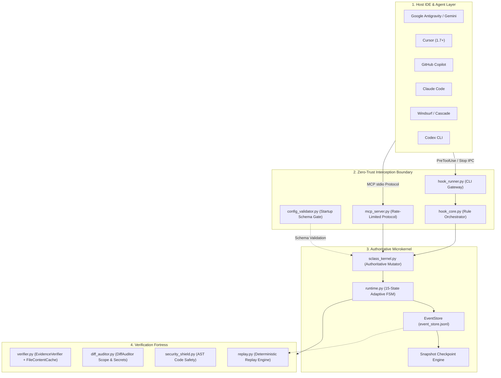
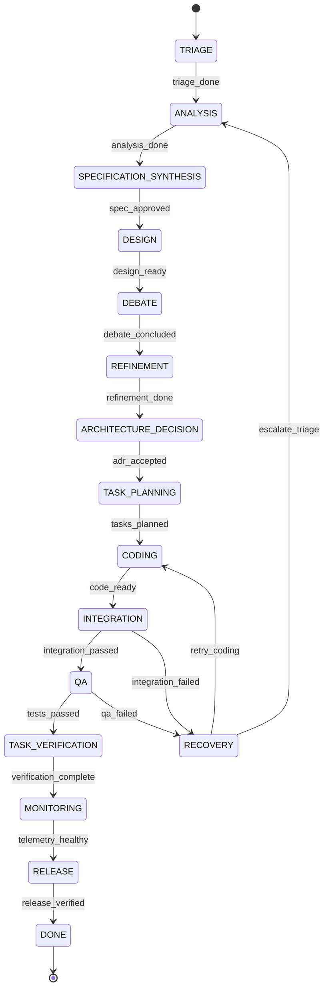
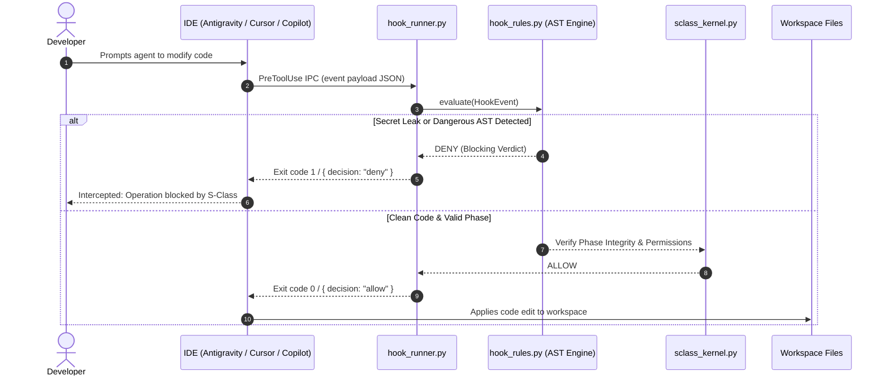
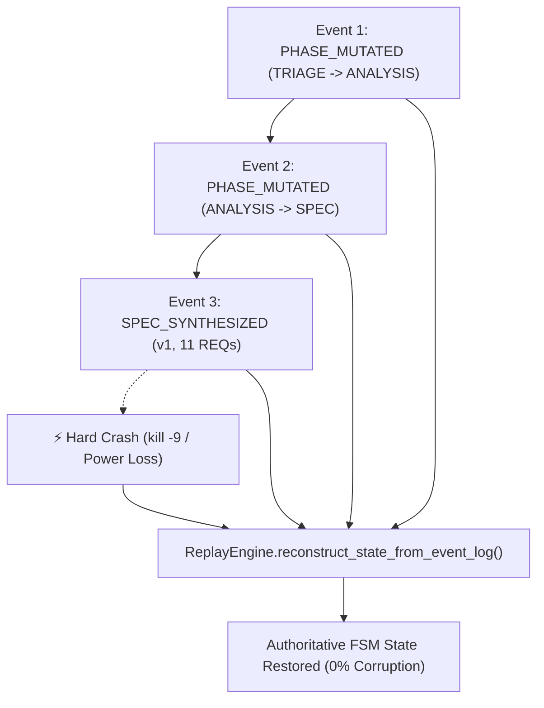
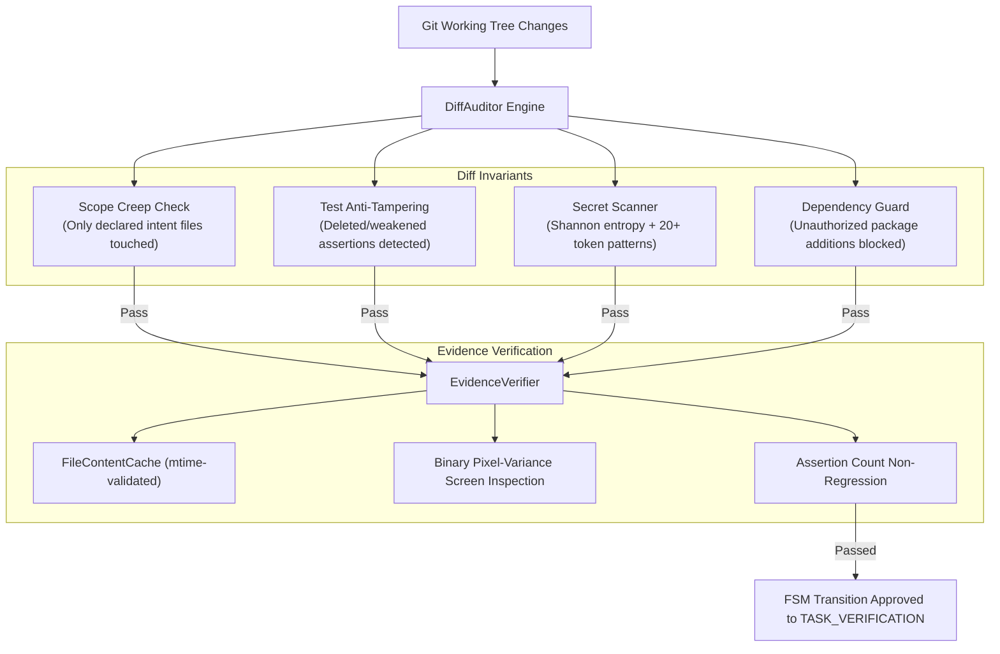

# S-Class v6: System Architecture & Technical Specification

> **Deterministic Control Plane, Zero-Trust Interception, and Verifiable Execution Fortress for AI Coding Agents**

---

## 1. Architectural Philosophy & Overview

S-Class v6 provides an **authoritative, local-first microkernel** that wraps around autonomous AI coding agents (Claude Code, Cursor, Copilot, Google Antigravity, Codex CLI, Windsurf). Rather than allowing probabilistic LLMs to self-evaluate completion or write unverified changes directly to repositories, S-Class enforces an epistemically grounded control plane.



### Core Design Principles
1. **Separation of Execution and Adjudication:** The agent doing the work cannot judge whether the work satisfies release invariants. Mutating FSM tools require controller authority.
2. **Deterministic State Machine:** All workflow transitions are governed by formal state graph transitions in `workflow.json`.
3. **Local-First & Zero-Cloud:** All static analysis (AST scans, entropy checks, dependency parsing, diff audits) runs 100% locally with zero cloud telemetry.
4. **Hardware Mutual Exclusion:** OS file-locking (`FileLock`) guarantees concurrency safety across parallel IDE windows and CLI executions.

---

## 2. Authoritative FSM Pipeline & Adaptive Profiles

The S-Class microkernel implements a **15-state deterministic finite state machine**. To prevent bureaucratic overhead for minor edits, the `MetaPlanner` and `TaskClassifier` dynamically select the optimal workflow profile based on goal intent, project domain, and blast radius.



### Adaptive Profiles Matrix

| Profile | Target Tasks | Pipeline States Traversed | Subagents Active | Evidence Gates Enforced |
| :--- | :--- | :---: | :---: | :---: |
| **MICRO** | Typo fixes, comments, single-line docs | 3 (TRIAGE $\rightarrow$ CODING $\rightarrow$ DONE) | 0 (Zero overhead) | Syntax compile check |
| **SMALL_FIX** | Localized styling, CSS tweaks, button colors | 5 states | 1 (Builder) | Build & DOM sanity |
| **BUG_FIX** | Regression repairs, crash fixes | 8 states | 2 (Builder, QA) | Assertion & Regression check |
| **CORE** | Library functions, internal algorithms | 7 states | 3 (Arch, Builder, QA) | Spec, assertions, unit tests |
| **REFACTOR** | Modular restructuring, decoupling | 11 states | 4 (Arch, Builder, QA, Reviewer) | Strict test non-regression |
| **FULL** | Auth systems, database migrations, greenfield | 15 states (Full pipeline) | 6 Composable roles | ADRs, Grill, QA, Screenshots, Diff Audit |
| **QUESTION** | Architecture inquiries, repo exploration | 1 state (Instant DONE) | 1 (Analyst) | Read-only; code writes denied |

> [!NOTE]
> Destructive keywords (e.g. `drop database`, `rm -rf`, `delete tests`, `force push`) automatically escalate tasks to **FULL** profile regardless of whether the goal contains the word "typo".

---

## 3. Multi-IDE Zero-Trust Interception Architecture

S-Class injects non-destructive, zero-trust interception hooks directly into IDE configuration files. Every intercepted action (file edits, terminal commands, MCP tool dispatches) is piped through `hook_runner.py` before execution is permitted.



### Installation Idempotency & Configuration Preservation
- **Non-Destructive Merging:** Adapters parse existing configuration files (stripping JSONC comments) and merge S-Class hooks using unique identity markers (`--platform <name>`).
- **Automated `.bak` Backups:** Before modifying `.agents/hooks.json`, `.cursor/hooks.json`, `.github/hooks/sclass.json`, or `.windsurf/hooks.json`, an untouched backup is stored.
- **Fail-Closed Protection:** If a configuration file contains unparseable syntax, installers refuse to overwrite it to prevent clobbering third-party tooling.
- **Platform Portability:** Generated hook scripts leverage `sys.executable` and normalized forward-slash paths, ensuring identical execution across Windows, Linux, and macOS.

---

## 4. Model Context Protocol (MCP) Server & Role Separation

S-Class exposes an official Model Context Protocol (MCP) server over `stdio` using FastMCP / official MCP SDK.

```mermaid
flowchart LR
    subgraph ClientRole ["Caller Identity"]
        AG_ROLE["Governed AI Agent (SCLASS_MCP_ROLE=agent)"]
        CT_ROLE["Human / Controller (SCLASS_MCP_ROLE=controller)"]
    end

    subgraph SecurityShieldMCP ["MCP Security Layer"]
        RL["ToolCallRateLimiter (120 calls/min, 30 burst)"]
        PC["Path Containment Guard (realpath + commonpath)"]
        RBAC["Role-Based Access Control Gate"]
    end

    subgraph ToolSurface ["Exposed MCP Tools"]
        RO_TOOLS["Read-Only Tools<br/>• sclass_get_state<br/>• sclass_memory_search<br/>• sclass_doctor<br/>• sclass_audit_replay<br/>• sclass_security_scan<br/>• sclass_strategy_planner<br/>• sclass_spec_synthesis"]
        MUT_TOOLS["Mutating Governance Tools<br/>• sclass_initialize<br/>• sclass_dispatch<br/>• sclass_reset_to_triage<br/>• sclass_advance_fsm<br/>• sclass_goal<br/>• sclass_boost<br/>• sclass_gc<br/>• sclass_learn"]
    end

    AG_ROLE --> RL
    CT_ROLE --> RL
    RL --> PC
    PC --> RBAC
    RBAC -->|Allow All| RO_TOOLS
    RBAC -->|Allow Controller Only| MUT_TOOLS
    RBAC -.->|Deny Agent Mutation (403)| MUT_TOOLS
```

### MCP Security Guardrails
1. **Path Containment:** Any argument attempting directory traversal (`../`, absolute paths outside workspace, symlink escapes) is rejected before execution.
2. **Role Separation (RBAC):** Governed agents are restricted to read-only introspection tools. State-mutating tools (`sclass_dispatch`, `sclass_reset_to_triage`, `sclass_advance_fsm`) require controller authority.
3. **Sliding-Window Rate Limiting:** MCP tool calls are throttled by `ToolCallRateLimiter` to prevent runaway agent loops or tool-flooding denial-of-service.
4. **API Protocol Versioning:** Every tool call response carries explicit `"api_version": "6.0.0"` and `"protocol_version": "2024-11-05"` metadata.

---

## 5. Event Sourcing, Crash Recovery & Replay Engine

All control plane transitions are recorded in an append-only canonical event log: `.agents/event_store.jsonl`.



### Retention & Checkpoint Compaction (ARCH-02)
To prevent disk exhaustion over long-running development sessions:
- `EventStore.create_checkpoint()` creates point-in-time snapshots (`event_store_snapshot.json`).
- `EventStore.compact_or_rotate()` automatically archives historical entries to `event_store.archive.jsonl` when the event count exceeds the configurable retention limit (default: 2,000 events), keeping active replay times bounded at $O(\Delta)$.

---

## 6. Deterministic Verification Fortress

Before the FSM can transition from `CODING` to `TASK_VERIFICATION` and `RELEASE`, the changes must pass through the **Deterministic Verification Fortress**:



### Key Verification Subsystems
- **`FileContentCache` (PERF-02):** Thread-safe in-memory cache validated against `(st_mtime, st_size)` timestamps, preventing control-plane I/O freezing during large workspace scans.
- **`DiffAuditor` (Item 39, N6):** Validates git diffs against declared `intent_contract.json`. Fails closed if the git diff cannot be extracted.
- **`SecurityShield` (SEC-01, SEC-02):** Combines zero-dependency AST parsing with pre-compiled regex pre-passes to eliminate dynamic `eval()`, `exec()`, `pickle.loads()`, and shell injection patterns.
- **Read-Only Verification (Item 34):** Verification engines never mutate user files, schemas, or `.env` configurations.

---

## 7. Directory Layout & Module Architecture

```
S-Class/
├── adapters/                    # Cross-platform IDE hook adapters
│   ├── antigravity.py           # Google Antigravity / Gemini native hooks
│   ├── cursor.py                # Cursor 1.7+ discrete event hooks
│   ├── copilot.py               # GitHub Copilot hooks & markdown context
│   ├── claude_code.py           # Claude Code non-destructive settings adapter
│   ├── codex_cli.py             # OpenAI Codex CLI adapter
│   ├── windsurf.py              # Windsurf/Cascade exit code 2 adapter
│   ├── common.py                # Shared comment stripping, backups & py_bin
│   └── state_sync.py            # IDE state synchronization & heartbeat
├── controller/                  # Dynamic control plane logic
├── instructions/                # Epistemic playbooks for agent roles
├── tests/                       # Comprehensive pytest suite (401+ tests)
│   └── integration/             # Live hook interception & crash recovery tests
├── sclass_kernel.py             # Minimal deterministic microkernel
├── runtime.py                   # 15-State FSM orchestration engine
├── verifier.py                  # EvidenceVerifier & FileContentCache
├── diff_auditor.py              # Scope creep, test tampering & secret auditor
├── security_shield.py           # AST-based static security analyzer
├── mcp_server.py                # FastMCP stdio server with RBAC & rate limiting
├── config_validator.py          # Strict startup JSON schema validator
├── replay.py                    # Event sourcing replay & crash reconstruction
├── task_classifier.py           # Goal classification & complexity inference
├── sclass_cli.py                # Typer CLI console entrypoint
└── pyproject.toml               # Package build manifest (PEP 517/621)
```
