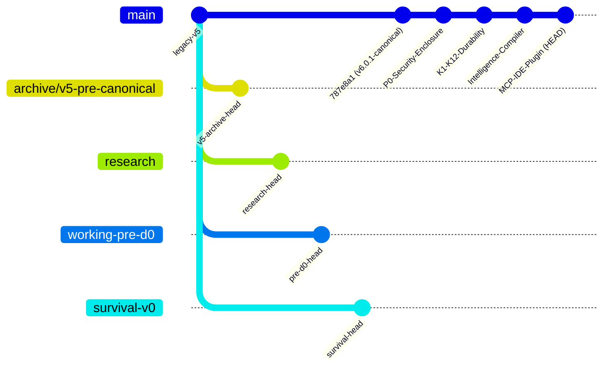

# S-Class: Universal Trust & Control Plane

> **Version**: v6.0.1 Canonical  
> **Status**: IMPLEMENTED (UNVERIFIED) — S0 through S5 + K1–K12 + IDE MCP Plugin (not independently qualified; external gates open)  
> **Normative Contract**: `00-SPEC/S-CLASS-v6.0.1-FINAL-FIXED-DESIGN.md`

S-Class is the universal trust and control plane between autonomous AI coding agents and developer workspaces. Operating as an IDE governance plugin, it enforces that AI model or user actions altering workspace state require verifiable authority, bounded execution leases, deterministic observation, independent multi-engine verification, and canonical event reduction.

---

## Branch Taxonomy & Repository Map

To avoid confusion when navigating the repository, branches are strictly divided into **Active Development Lines** and **Historical Archives**:



### 1. Active Development Branches
* **`main`** *(Primary / Default)*:  
  The development line for S-Class v6.0.1. Houses the runtime, fail-closed `ExecutionGate`, K1–K12 crash consistency engine, multi-engine verification plane, and the stdio MCP server for IDEs.
* **`v6.0.1-canonical`**:  
  The upstream-synchronized canonical reference branch tracking the frozen v6.0.1 specification line.

### 2. Historical & Archived Branches (Do Not Delete)
* **`archive/v5-pre-canonical`**:  
  Safety archive backing up the entire pre-v6 legacy `main` branch before the v6.0.1 canonical promotion. Preserves all past commit history and documentation.
* **`survival-v0`**:  
  Historical branch containing the early v5 survival-mode architecture prototype.
* **`working-pre-d0`**:  
  Historical branch containing early development prior to the D0 canonical event store milestones.
* **`research`**:  
  Historical exploratory research branch.
* **`audit/truth-and-authority-gate`**:  
  Local audit checkpoint from the September 25 DEFECT-07 compliance evaluation.

---

## Architecture Overview

S-Class replaces fragmented heuristics with a mathematically rigorous, fail-closed state machine architecture:

```text
IDE User / Plain English Prompt
    ↓
Intent-to-Engineering Compiler (04-INTELLIGENCE)
    ↓
Engineering World Model & ContextPackage Guardrails
    ↓
ActionRequest / WorkProposal
    ↓
Authority / Policy Conjunction
    ↓
Admission & Capability Token (14-Step Gate)
    ↓
Descriptor-Relative Snapshot Boundary & Quiescence Proof
    ↓
Runtime Execution (Subprocess / Patch Agent)
    ↓
Independent Observation Diff & Receipt Capture
    ↓
Multi-Engine Verifier (Pytest, Hypothesis, Ruff)
    ↓
Signed Evidence Closure
    ↓
Canonical Reducer & SQLite EventStore (WAL + FULL)
    ↓
Replay-Equivalence & Release Evaluation (ReleaseVerdict.READY)
```

---

## Repository Structure

The canonical v6.0.1 repository is organized into strict, decoupled layers:

```text
.
├── 00-SPEC/
│   └── S-CLASS-v6.0.1-FINAL-FIXED-DESIGN.md   # Active normative contract and formal specification
├── 10-CONFORMANCE/
│   ├── sclass_semantics_v6_0_1.py            # Canonical semantic kernel (260 types, 56 events, C1)
│   ├── test_sclass_v6_0_1_conformance.py      # Conformance & 24 adversarial gates
│   ├── test_sclass_v6_0_1_property.py         # Hypothesis property verification matrices
│   ├── c1-vectors.v6.0.1.json                 # C1 canonicalization test vectors
│   └── state-machines.v6.0.1.json             # Canonical state transition definitions
├── 20-RUNTIME/
│   ├── sclass_runtime_v6_0_1.py               # ExecutionGate, LinuxExecutionBoundary, ControlPlane
│   └── test_sclass_runtime_v6_0_1.py          # End-to-end runtime & verification lifecycle tests
├── src/sclass/
│   ├── __init__.py                            # Package facade
│   ├── client.py                              # SClassClient SDK (autonomous operating cycle)
│   ├── intelligence/                          # IntentCompiler & EngineeringWorldModelBuilder
│   ├── verification/                          # MultiEngineVerificationPlane (pytest, hypothesis, ruff)
│   └── workers/                               # WorkerHarness, SubprocessToolWorker, PatchAgentWorker
├── tests/
│   ├── adversarial/                           # ZV1–ZV10 Zero-Violation property tests
│   ├── benchmarks/                            # SLA & scale performance contract tests
│   ├── e2e/                                   # Golden vertical slice end-to-end tests
│   ├── errata/                                # ERR-001 through ERR-010 regression tests
│   ├── intelligence/                          # Intent compiler & world model tests
│   ├── interfaces/                            # MCP stdio JSON-RPC server tests
│   ├── stage_exit/                            # S1–S5 & K1–K12 crash consistency exit tests
│   ├── verification/                          # Verification engine & injection sanitization tests
│   └── workers/                               # Worker harness security & fail-closed tests
├── tools/
│   ├── cli/sclass.py                          # High-level CLI commands (sclass run, verify, release)
│   ├── mcp/sclass_mcp_server.py               # Production stdio MCP Server (JSON-RPC 2.0)
│   ├── promote_canonical.py                   # Canonical promotion tool
│   ├── run_all_s0_partitions.py               # S0 5-partition mutation runner
│   └── run_cr.py                              # Cosmic Ray mutation testing wrapper
├── pyproject.toml                             # Package build definition & test configuration
├── cosmic-ray.toml                            # Cosmic Ray mutation configuration
└── S0_CLOSURE_REPORT.md                       # Executable S0 certification evidence
```

---

## Verification & Test Execution

### 1. Run Complete Automated Test Suite (210 Tests)
```bash
python -m pytest tests/ 10-CONFORMANCE/ 20-RUNTIME/
```
*Result: 210 passed, 3 skipped (Linux OS shims on Windows).*

### 2. Verify Adversarial & Durability Properties
```bash
# ZV1 through ZV10 Zero-Violation Gates
python -m pytest tests/adversarial/

# K1 through K12 Full Crash Consistency Matrix
python -m pytest tests/stage_exit/test_s4_exit.py
```

### 3. Verify Spec Integrity & Linting
```bash
python 10-CONFORMANCE/spec_integrity.py
python -m ruff check src tests tools
```

---

## IDE Integration via MCP Server

To use S-Class as an autonomous Senior Staff co-pilot in **VS Code**, **Cursor**, **Windsurf**, or **Antigravity**, register the stdio server in your editor's MCP configuration (`mcpServers`):

```json
{
  "mcpServers": {
    "sclass": {
      "command": "python",
      "args": ["tools/mcp/sclass_mcp_server.py"],
      "env": {
        "PYTHONPATH": "."
      }
    }
  }
}
```

### Available Tools:
1. `sclass_guide_task(intent: str)`: Indexes repository symbols and returns structured architectural guardrails, constraints, and test obligations for the IDE model.
2. `sclass_validate_patch(patch: str, target_file: str)`: Runs the proposed diff through the sandboxed 14-step `ExecutionGate` and multi-engine verifiers before admitting changes.
3. `sclass_get_status()`: Inspects active obligations, budget allocations, and release readiness.

---

## License
Apache-2.0
