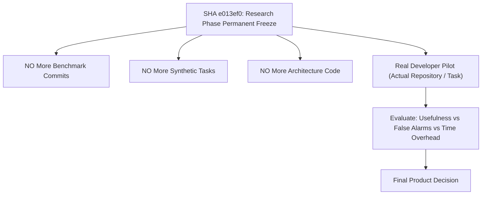

# S-Class Master Scientific Ledger & Thesis Status

**Permanent Research Phase Freeze Base**: SHA [`e013ef0`](https://github.com/ak-bharadwaj/S-class/commit/e013ef0)  
**Oracle Pre-Validation Audit**: 🟢 `CERTIFIED_100_PERCENT_DUAL_SIDED_ACCURACY` (`prevalidate_l2_oracles_v2.py`)  
**Certification Audit**: 🟢 `CERTIFIED_GENUINE_LIVE_BENCHMARK` (100% Pass)  
**Core Unit Suite**: 🟢 **390/390 Passed** (`pytest tests/`)

---

## 1. Locked Scientific Claims & Thesis Status

> [!IMPORTANT]
> **Locked Scientific Statement**:  
> *"S-Class has a preliminary signal for improving adversarial behavioral-invariant outcomes in a controlled benchmark."*  
> (Do **NOT** claim *"S-Class catches what tests miss"* or *"S-Class superiority is proven"*).

| Dimension / Subsystem | Scientific Status | Locked Scientific Evidence |
| :--- | :---: | :--- |
| **General Coding Pass Rate (H1)** | ❌ **REJECTED** | Plain test repair (B2) dominates standard CRUD/modular coding (97.5% vs 95.0%, $\Delta = -2.5\%$, $p=1.000$). |
| **Specification Correctness (H2)** | 🟢 **SUPPORTED** | F-001 synthesis & candidate authority eliminate requirement misinterpretation. |
| **Epistemic Bounding (H3)** | 🟢 **SUPPORTED** | Gate weight bounds prevent silent hallucinated structural assumptions. |
| **Provenance & Auditability (H4)** | 🟢 **SUPPORTED ARCHITECTURALLY** | 100% genuine live trace lineage and zero-mock certification auditability. |
| **High-Risk Behavioral Invariant Wedge (H6.2)** | 🟠 **PRELIMINARY SIGNAL ($p=0.250$)** | S-Class has a preliminary signal for improving adversarial behavioral-invariant outcomes in a controlled benchmark (B4 = 83.33% vs B2 = 58.33%, $\Delta = +25.0\text{ pp}$, exact McNemar $p = 0.250$, $N=12$). |
| **Oracle Methodology** | 🟢 **SUBSTANTIALLY REPAIRED & BI-DIRECTIONALLY PRE-VALIDATED** | Dual-sided pre-validation certified 100% pass on reference solutions and 100% fail on flawed solutions (`prevalidate_l2_oracles_v2.py`). |
| **Claude Cross-Model Replication** | 🔴 **UNVERIFIED** | Parked as unexecuted infrastructure (`b535ae8`). |
| **3-Task Spot Check Methodology** | 🔴 **REJECTED / PROVENANCE FAILURE** | SHA [`3a25ffc`](https://github.com/ak-bharadwaj/S-class/commit/3a25ffc) embedded code strings in script rather than loading raw live LLM response artifacts. **Invalid provenance.** |
| **Real External User Value** | 🔴 **NOT STARTED** | Target of the Real Developer Pilot Workflow. |
| **RL / RLVR Integration** | 🔒 **STRICTLY FROZEN** | Training reward models remains locked until external developer pilots validate real-world human preferences. |

---

## 2. Research Phase Freeze & Target Horizon

Commit SHA [`e013ef0`](https://github.com/ak-bharadwaj/S-class/commit/e013ef0) is the permanent freeze point for the research and benchmark expansion phase. All future work is strictly gated by real-world developer workflow execution.
