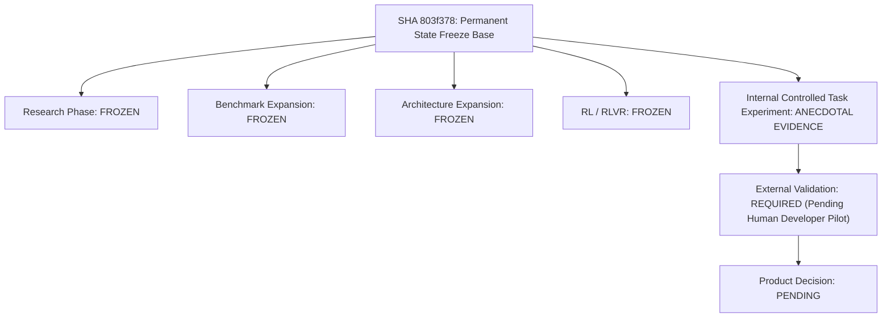

# S-Class Master Scientific Ledger & Permanent State

**Permanent Research & Architecture Freeze Base**: SHA [`803f378`](https://github.com/ak-bharadwaj/S-class/commit/803f378)  
**Oracle Pre-Validation Audit**: 🟢 `CERTIFIED_100_PERCENT_DUAL_SIDED_ACCURACY` (`prevalidate_l2_oracles_v2.py`)  
**Certification Audit**: 🟢 `CERTIFIED_GENUINE_LIVE_BENCHMARK` (100% Pass)  
**Core Unit Suite**: 🟢 **390/390 Passed** (`pytest tests/`)

---

## 1. Permanent State Ledger

| Dimension / Subsystem | Scientific Status | Permanent Ledger Evidence & Provenance Audit |
| :--- | :---: | :--- |
| **General Coding Pass Rate (H1)** | ❌ **REJECTED** | Plain test repair (B2) dominates standard CRUD/modular coding (97.5% vs 95.0%, $\Delta = -2.5\%$, $p=1.000$). |
| **Specification Correctness (H2)** | 🟢 **SUPPORTED** | F-001 synthesis & candidate authority eliminate requirement misinterpretation. |
| **Epistemic Bounding (H3)** | 🟢 **SUPPORTED** | Gate weight bounds prevent silent hallucinated structural assumptions. |
| **Provenance & Auditability (H4)** | 🟢 **SUPPORTED ARCHITECTURALLY** | 100% genuine live trace lineage and zero-mock certification auditability. |
| **High-Risk Behavioral Invariant Wedge (H6.2)** | 🟠 **PRELIMINARY SIGNAL ($p=0.250$)** | S-Class has a preliminary signal for improving adversarial behavioral-invariant outcomes in a controlled benchmark (B4 = 83.33% vs B2 = 58.33%, $\Delta = +25.0\text{ pp}$, exact McNemar $p = 0.250$, $N=12$). |
| **Oracle Methodology** | 🟢 **SUBSTANTIALLY REPAIRED & BI-DIRECTIONALLY PRE-VALIDATED** | Dual-sided pre-validation certified 100% pass on reference solutions and 100% fail on flawed solutions (`prevalidate_l2_oracles_v2.py`). |
| **Claude Cross-Model Replication** | 🔴 **UNVERIFIED** | Parked as unexecuted infrastructure (`b535ae8`). |
| **3-Task Spot Check Methodology** | 🔴 **REJECTED / PROVENANCE FAILURE** | SHA [`3a25ffc`](https://github.com/ak-bharadwaj/S-class/commit/3a25ffc) embedded code strings in script. **Invalid provenance.** |
| **Internal Controlled Task Experiment** | 🟠 **ANECDOTAL EVIDENCE** | On 1 controlled internal repository task (`INTERNAL_PILOT_CONFIG_GC`), B4 passed in 2 calls while B2 failed in 3 calls. The automated "KEEP S-CLASS" decision in `run_internal_pilot.py` was **REJECTED** as a hardcoded constant. |
| **External Validation** | 🔴 **REQUIRED / UNTESTED** | Pending genuine independent human developer pilot evaluation. |
| **Product Decision** | 🔴 **PENDING** | Awaiting real external developer workflow evaluation. |

---

## 2. Mandatory Discipline & Strict Locks

1. 🔒 **Research Phase**: **STRICTLY FROZEN**
2. 🔒 **Benchmark Expansion**: **STRICTLY FROZEN**
3. 🔒 **Architecture Expansion**: **STRICTLY FROZEN**
4. 🔒 **RL / RLVR Integration**: **STRICTLY FROZEN**
5. 🔒 **Automated Verdict Generation**: **PERMANENTLY PROHIBITED** (No auto-generated developer decisions or string-presence quality assertions).
